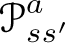
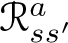

# Preface to the Second Edition

The twenty years since the publication of the first edition of this book have seen tremendous progress in artificial intelligence, propelled in large part by advances in machine learning, including advances in reinforcement learning. Although the impressive computational power that became available is responsible for some of these advances, new developments in theory and algorithms have been driving forces as well. In the face of this progress, a second edition of our 1998 book was long overdue, and we finally began the project in 2012. Our goal for the second edition was the same as our goal for the first: to provide a clear and simple account of the key ideas and algorithms of reinforcement learning that is accessible to readers in all the related disciplines. The edition remains an introduction, and we retain a focus on core, online learning algorithms. This edition includes some new topics that rose to importance over the intervening years, and we expanded coverage of topics that we now understand better. But we made no attempt to provide comprehensive coverage of the field, which has exploded in many different directions. We apologize for having to leave out all but a handful of these contributions.

As in the first edition, we chose not to produce a rigorous formal treatment of reinforcement learning, or to formulate it in the most general terms. However, our deeper understanding of some topics since the first edition required a bit more mathematics to explain; we have set off the more mathematical parts in shaded boxes that the non-mathematically-inclined may choose to skip. We also use a slightly different notation than was used in the first edition. In teaching, we have found that the new notation helps to address some common points of confusion. It emphasizes the difference between random variables, denoted with capital letters, and their instantiations, denoted in lower case. For example, the state, action, and reward at time step *t* are denoted *S**t*, *A**t*, and *R**t*, while their possible values might be denoted *s*, *a*, and *r*. Along with this, it is natural to use lower case for value functions (e.g., *vπ*) and restrict capitals to their tabular estimates (e.g., *Q**t*(*s, a*)). Approximate value functions are deterministic functions of random parameters and are thus also in lower case (e.g., (*s,* **w***t*) ≈ *vπ*(*s*)). Vectors, such as the weight vector **w***t* (formerly ***θ****t*) and the feature vector **x***t* (formerly ***ϕ****t*), are bold and written in lowercase even if they are random variables. Uppercase bold is reserved for matrices. In the first edition we used special notations,  and , for the transition probabilities and expected rewards. One weakness of that notation is that it still did not fully characterize the dynamics of the rewards, giving only their expectations, which is sufficient for dynamic programming but not for reinforcement learning. Another weakness is the excess of subscripts and superscripts. In this edition we use the explicit notation of *p*(*s*′*, r* | *s, a*) for the joint probability for the next state and reward given the current state and action. All the changes in notation are summarized in a table on page xix.

The second edition is significantly expanded, and its top-level organization has been changed. After the introductory first chapter, the second edition is divided into three new parts. The first part (Chapters 2–8) treats as much of reinforcement learning as possible without going beyond the tabular case for which exact solutions can be found. We cover both learning and planning methods for the tabular case, as well as their unification in *n*-step methods and in Dyna. Many algorithms presented in this part are new to the second edition, including UCB, Expected Sarsa, Double learning, tree-backup, *Q*(*σ*), RTDP, and MCTS. Doing the tabular case first, and thoroughly, enables core ideas to be developed in the simplest possible setting. The second part of the book (Chapters 9–13) is then devoted to extending the ideas to function approximation. It has new sections on artificial neural networks, the fourier basis, LSTD, kernel-based methods, Gradient-TD and Emphatic-TD methods, average-reward methods, true online TD(*λ*), and policy-gradient methods. The second edition significantly expands the treatment of off-policy learning, first for the tabular case in Chapters 5–7, then with function approximation in Chapters 11 and 12. Another change is that the second edition separates the forward-view idea of *n*-step bootstrapping (now treated more fully in Chapter 7) from the backward-view idea of eligibility traces (now treated independently in Chapter 12). The third part of the book has large new chapters on reinforcement learning’s relationships to psychology (Chapter 14) and neuroscience (Chapter 15), as well as an updated case-studies chapter including Atari game playing, Watson’s wagering strategy, and the Go playing programs AlphaGo and AlphaGo Zero (Chapter 16). Still, out of necessity we have included only a small subset of all that has been done in the field. Our choices reflect our long-standing interests in inexpensive model-free methods that should scale well to large applications. The final chapter now includes a discussion of the future societal impacts of reinforcement learning. For better or worse, the second edition is about twice as large as the first.

This book is designed to be used as the primary text for a one- or two-semester course on reinforcement learning. For a one-semester course, the first ten chapters should be covered in order and form a good core, to which can be added material from the other chapters, from other books such as Bertsekas and Tsitsiklis (1996), Wiering and van Otterlo (2012), and Szepesvári (2010), or from the literature, according to taste. Depending of the students’ background, some additional material on online supervised learning may be helpful. The ideas of options and option models are a natural addition (Sutton, Precup and Singh, 1999). A two-semester course can cover all the chapters as well as supplementary material. The book can also be used as part of broader courses on machine learning, artificial intelligence, or neural networks. In this case, it may be desirable to cover only a subset of the material. We recommend covering Chapter 1 for a brief overview, Chapter 2 through Section 2.4, Chapter 3, and then selecting sections from the remaining chapters according to time and interests. Chapter 6 is the most important for the subject and for the rest of the book. A course focusing on machine learning or neural networks should cover Chapters 9 and 10, and a course focusing on artificial intelligence or planning should cover Chapter 8. Throughout the book, sections and chapters that are more difficult and not essential to the rest of the book are marked with a \*. These can be omitted on first reading without creating problems later on. Some exercises are also marked with a \* to indicate that they are more advanced and not essential to understanding the basic material of the chapter.

Most chapters end with a section entitled “Bibliographical and Historical Remarks,” wherein we credit the sources of the ideas presented in that chapter, provide pointers to further reading and ongoing research, and describe relevant historical background. Despite our attempts to make these sections authoritative and complete, we have undoubtedly left out some important prior work. For that we again apologize, and we welcome corrections and extensions for incorporation into the electronic version of the book.

Like the first edition, this edition of the book is dedicated to the memory of A. Harry Klopf. It was Harry who introduced us to each other, and it was his ideas about the brain and artificial intelligence that launched our long excursion into reinforcement learning. Trained in neurophysiology and long interested in machine intelligence, Harry was a senior scientist affiliated with the Avionics Directorate of the Air Force Office of Scientific Research (AFOSR) at Wright-Patterson Air Force Base, Ohio. He was dissatisfied with the great importance attributed to equilibrium-seeking processes, including homeostasis and error-correcting pattern classification methods, in explaining natural intelligence and in providing a basis for machine intelligence. He noted that systems that try to maximize something (whatever that might be) are qualitatively different from equilibrium-seeking systems, and he argued that maximizing systems hold the key to understanding important aspects of natural intelligence and for building artificial intelligences. Harry was instrumental in obtaining funding from AFOSR for a project to assess the scientific merit of these and related ideas. This project was conducted in the late 1970s at the University of Massachusetts Amherst (UMass Amherst), initially under the direction of Michael Arbib, William Kilmer, and Nico Spinelli, professors in the Department of Computer and Information Science at UMass Amherst, and founding members of the Cybernetics Center for Systems Neuroscience at the University, a farsighted group focusing on the intersection of neuroscience and artificial intelligence. Barto, a recent Ph.D. from the University of Michigan, was hired as post doctoral researcher on the project. Meanwhile, Sutton, an undergraduate studying computer science and psychology at Stanford, had been corresponding with Harry regarding their mutual interest in the role of stimulus timing in classical conditioning. Harry suggested to the UMass group that Sutton would be a great addition to the project. Thus, Sutton became a UMass graduate student, whose Ph.D. was directed by Barto, who had become an Associate Professor. The study of reinforcement learning as presented in this book is rightfully an outcome of that project instigated by Harry and inspired by his ideas. Further, Harry was responsible for bringing us, the authors, together in what has been a long and enjoyable interaction. By dedicating this book to Harry we honor his essential contributions, not only to the field of reinforcement learning, but also to our collaboration. We also thank Professors Arbib, Kilmer, and Spinelli for the opportunity they provided to us to begin exploring these ideas. Finally, we thank AFOSR for generous support over the early years of our research, and the NSF for its generous support over many of the following years.

We have very many people to thank for their inspiration and help with this second edition. Everyone we acknowledged for their inspiration and help with the first edition deserve our deepest gratitude for this edition as well, which would not exist were it not for their contributions to edition number one. To that long list we must add many others who contributed specifically to the second edition. Our students over the many years that we have taught this material contributed in countless ways: exposing errors, offering fixes, and—not the least—being confused in places where we could have explained things better. We especially thank Martha Steenstrup for reading and providing detailed comments throughout. The chapters on psychology and neuroscience could not have been written without the help of many experts in those fields. We thank John Moore for his patient tutoring over many many years on animal learning experiments, theory, and neuroscience, and for his careful reading of multiple drafts of Chapters 14 and 15. We also thank Matt Botvinick, Nathaniel Daw, Peter Dayan, and Yael Niv for their penetrating comments on drafts of these chapter, their essential guidance through the massive literature, and their interception of many of our errors in early drafts. Of course, the remaining errors in these chapters—and there must still be some—are totally our own. We thank Phil Thomas for helping us make these chapters accessible to non-psychologists and non-neuroscientists, and we thank Peter Sterling for helping us improve the exposition. We are grateful to Jim Houk for introducing us to the subject of information processing in the basal ganglia and for alerting us to other relevant aspects of neuroscience. José Martínez, Terry Sejnowski, David Silver, Gerry Tesauro, Georgios Theocharous, and Phil Thomas generously helped us understand details of their reinforcement learning applications for inclusion in the case-studies chapter, and they provided helpful comments on drafts of these sections. Special thanks are owed to David Silver for helping us better understand Monte Carlo Tree Search and the DeepMind Go-playing programs. We thank George Konidaris for his help with the section on the Fourier basis. Emilio Cartoni, Thomas Cederborg, Stefan Dernbach, Clemens Rosenbaum, Patrick Taylor, Thomas Colin, and Pierre-Luc Bacon helped us in a number important ways for which we are most grateful.

Sutton would also like to thank the members of the Reinforcement Learning and Artificial Intelligence laboratory at the University of Alberta for contributions to the second edition. He owes a particular debt to Rupam Mahmood for essential contributions to the treatment of off-policy Monte Carlo methods in Chapter 5, to Hamid Maei for helping develop the perspective on off-policy learning presented in Chapter 11, to Eric Graves for conducting the experiments in Chapter 13, to Shangtong Zhang for replicating and thus verifying almost all the experimental results, to Kris De Asis for improving the new technical content of Chapters 7 and 12, and to Harm van Seijen for insights that led to the separation of *n*-step methods from eligibility traces and (along with Hado van Hasselt) for the ideas involving exact equivalence of forward and backward views of eligibility traces presented in Chapter 12. Sutton also gratefully acknowledges the support and freedom he was granted by the Government of Alberta and the National Science and Engineering Research Council of Canada throughout the period during which the second edition was conceived and written. In particular, he would like to thank Randy Goebel for creating a supportive and far-sighted environment for research in Alberta. He would also like to thank DeepMind their support in the last six months of writing the book.

Finally, we owe thanks to the many careful readers of drafts of the second edition that we posted on the internet. They found many errors that we had missed and alerted us to potential points of confusion.
