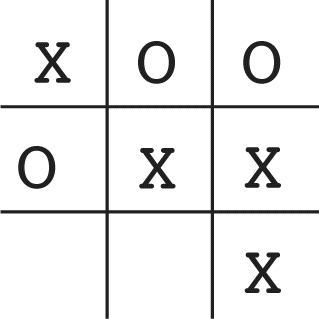
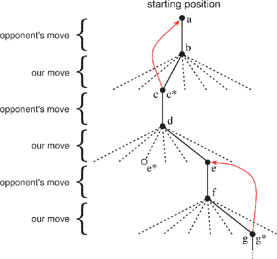

# 1.5  An Extended Example: Tic-Tac-Toe

To illustrate the general idea of reinforcement learning and contrast it with other approaches, we next consider a single example in more detail.

Consider the familiar child’s game of tic-tac-toe. Two players take turns playing on a three-by-three board. One player plays Xs and the other Os until one player wins by placing three marks in a row, horizontally, vertically, or diagonally, as the X player has in the game shown to the right. If the board fills up with neither player getting three in a row, then the game is a draw. Because a skilled player can play so as never to lose, let us assume that we are playing against an imperfect player, one whose play is sometimes incorrect and allows us to win. For the moment, in fact, let us consider draws and losses to be equally bad for us. How might we construct a player that will find the imperfections in its opponent’s play and learn to maximize its chances of winning?

Although this is a simple problem, it cannot readily be solved in a satisfactory way through classical techniques. For example, the classical “minimax” solution from game theory is not correct here because it assumes a particular way of playing by the opponent. For example, a minimax player would never reach a game state from which it could lose, even if in fact it always won from that state because of incorrect play by the opponent. Classical optimization methods for sequential decision problems, such as dynamic programming, can *compute* an optimal solution for any opponent, but require as input a complete specification of that opponent, including the probabilities with which the opponent makes each move in each board state. Let us assume that this information is not available a priori for this problem, as it is not for the vast majority of problems of practical interest. On the other hand, such information can be estimated from experience, in this case by playing many games against the opponent. About the best one can do on this problem is first to learn a model of the opponent’s behavior, up to some level of confidence, and then apply dynamic programming to compute an optimal solution given the approximate opponent model. In the end, this is not that different from some of the reinforcement learning methods we examine later in this book.

An evolutionary method applied to this problem would directly search the space of possible policies for one with a high probability of winning against the opponent. Here, a policy is a rule that tells the player what move to make for every state of the game—every possible configuration of Xs and Os on the three-by-three board. For each policy considered, an estimate of its winning probability would be obtained by playing some number of games against the opponent. This evaluation would then direct which policy or policies were considered next. A typical evolutionary method would hill-climb in policy space, successively generating and evaluating policies in an attempt to obtain incremental improvements. Or, perhaps, a genetic-style algorithm could be used that would maintain and evaluate a population of policies. Literally hundreds of different optimization methods could be applied.

Here is how the tic-tac-toe problem would be approached with a method making use of a value function. First we would set up a table of numbers, one for each possible state of the game. Each number will be the latest estimate of the probability of our winning from that state. We treat this estimate as the state’s *value*, and the whole table is the learned value function. State `A` has higher value than state `B`, or is considered “better” than state `B`, if the current estimate of the probability of our winning from `A` is higher than it is from `B`. Assuming we always play Xs, then for all states with three Xs in a row the probability of winning is 1, because we have already won. Similarly, for all states with three Os in a row, or that are filled up, the correct probability is 0, as we cannot win from them. We set the initial values of all the other states to 0.5, representing a guess that we have a 50% chance of winning.

We then play many games against the opponent. To select our moves we examine the states that would result from each of our possible moves (one for each blank space on the board) and look up their current values in the table. Most of the time we move *greedily*, selecting the move that leads to the state with greatest value, that is, with the highest estimated probability of winning. Occasionally, however, we select randomly from among the other moves instead. These are called *exploratory* moves because they cause us to experience states that we might otherwise never see. A sequence of moves made and considered during a game can be diagrammed as in [Figure 1.1](part0008_split_005.html#fig1-1).

[Figure 1.1](part0008_split_005.html#C_fig1-1): A sequence of tic-tac-toe moves. The solid black lines represent the moves taken during a game; the dashed lines represent moves that we (our reinforcement learning player) considered but did not make. Our second move was an exploratory move, meaning that it was taken even though another sibling move, the one leading to e\*, was ranked higher. Exploratory moves do not result in any learning, but each of our other moves does, causing updates as suggested by the red arrows in which estimated values are moved up the tree from later nodes to earlier nodes as detailed in the text.

While we are playing, we change the values of the states in which we find ourselves during the game. We attempt to make them more accurate estimates of the probabilities of winning. To do this, we “back up” the value of the state after each greedy move to the state before the move, as suggested by the arrows in [Figure 1.1](part0008_split_005.html#fig1-1). More precisely, the current value of the earlier state is updated to be closer to the value of the later state. This can be done by moving the earlier state’s value a fraction of the way toward the value of the later state. If we let *S**t* denote the state before the greedy move, and *S**t*+1 the state after the move, then the update to the estimated value of *S**t*, denoted *V*(*S**t*), can be written as

where *α* is a small positive fraction called the *step-size parameter*, which influences the rate of learning. This update rule is an example of a *temporal-difference* learning method, so called because its changes are based on a difference, *V*(*S**t*+1) − *V* (*S**t*), between estimates at two successive times.

The method described above performs quite well on this task. For example, if the step-size parameter is reduced properly over time, then this method converges, for any fixed opponent, to the true probabilities of winning from each state given optimal play by our player. Furthermore, the moves then taken (except on exploratory moves) are in fact the optimal moves against this (imperfect) opponent. In other words, the method converges to an optimal policy for playing the game against this opponent. If the step-size parameter is not reduced all the way to zero over time, then this player also plays well against opponents that slowly change their way of playing.

This example illustrates the differences between evolutionary methods and methods that learn value functions. To evaluate a policy an evolutionary method holds the policy fixed and plays many games against the opponent, or simulates many games using a model of the opponent. The frequency of wins gives an unbiased estimate of the probability of winning with that policy, and can be used to direct the next policy selection. But each policy change is made only after many games, and only the final outcome of each game is used: what happens *during* the games is ignored. For example, if the player wins, then *all* of its behavior in the game is given credit, independently of how specific moves might have been critical to the win. Credit is even given to moves that never occurred! Value function methods, in contrast, allow individual states to be evaluated. In the end, evolutionary and value function methods both search the space of policies, but learning a value function takes advantage of information available during the course of play.

This simple example illustrates some of the key features of reinforcement learning methods. First, there is the emphasis on learning while interacting with an environment, in this case with an opponent player. Second, there is a clear goal, and correct behavior requires planning or foresight that takes into account delayed effects of one’s choices. For example, the simple reinforcement learning player would learn to set up multi-move traps for a shortsighted opponent. It is a striking feature of the reinforcement learning solution that it can achieve the effects of planning and lookahead without using a model of the opponent and without conducting an explicit search over possible sequences of future states and actions.

While this example illustrates some of the key features of reinforcement learning, it is so simple that it might give the impression that reinforcement learning is more limited than it really is. Although tic-tac-toe is a two-person game, reinforcement learning also applies in the case in which there is no external adversary, that is, in the case of a “game against nature.” Reinforcement learning also is not restricted to problems in which behavior breaks down into separate episodes, like the separate games of tic-tac-toe, with reward only at the end of each episode. It is just as applicable when behavior continues indefinitely and when rewards of various magnitudes can be received at any time. Reinforcement learning is also applicable to problems that do not even break down into discrete time steps like the plays of tic-tac-toe. The general principles apply to continuous-time problems as well, although the theory gets more complicated and we omit it from this introductory treatment.

Tic-tac-toe has a relatively small, finite state set, whereas reinforcement learning can be used when the state set is very large, or even infinite. For example, Gerry Tesauro (1992, 1995) combined the algorithm described above with an artificial neural network to learn to play backgammon, which has approximately 1020 states. With this many states it is impossible ever to experience more than a small fraction of them. Tesauro’s program learned to play far better than any previous program and eventually better than the world’s best human players (see (Section 16.1)). The artificial neural network provides the program with the ability to generalize from its experience, so that in new states it selects moves based on information saved from similar states faced in the past, as determined by the network. How well a reinforcement learning system can work in problems with such large state sets is intimately tied to how appropriately it can generalize from past experience. It is in this role that we have the greatest need for supervised learning methods with reinforcement learning. Artificial neural networks and deep learning (Section 9.7) are not the only, or necessarily the best, way to do this.

In this tic-tac-toe example, learning started with no prior knowledge beyond the rules of the game, but reinforcement learning by no means entails a tabula rasa view of learning and intelligence. On the contrary, prior information can be incorporated into reinforcement learning in a variety of ways that can be critical for efficient learning (e.g., see Sections 9.5, 17.4, and 13.1). We also have access to the true state in the tic-tac-toe example, whereas reinforcement learning can also be applied when part of the state is hidden, or when different states appear to the learner to be the same.

Finally, the tic-tac-toe player was able to look ahead and know the states that would result from each of its possible moves. To do this, it had to have a model of the game that allowed it to foresee how its environment would change in response to moves that it might never make. Many problems are like this, but in others even a short-term model of the effects of actions is lacking. Reinforcement learning can be applied in either case. A model is not required, but models can easily be used if they are available or can be learned (Chapter 8).

On the other hand, there are reinforcement learning methods that do not need any kind of environment model at all. Model-free systems cannot even think about how their environments will change in response to a single action. The tic-tac-toe player is model-free in this sense with respect to its opponent: it has no model of its opponent of any kind. Because models have to be reasonably accurate to be useful, model-free methods can have advantages over more complex methods when the real bottleneck in solving a problem is the difficulty of constructing a sufficiently accurate environment model. Model-free methods are also important building blocks for model-based methods. In this book we devote several chapters to model-free methods before we discuss how they can be used as components of more complex model-based methods.

Reinforcement learning can be used at both high and low levels in a system. Although the tic-tac-toe player learned only about the basic moves of the game, nothing prevents reinforcement learning from working at higher levels where each of the “actions” may itself be the application of a possibly elaborate problem-solving method. In hierarchical learning systems, reinforcement learning can work simultaneously on several levels.

*Exercise 1.1: Self-Play* Suppose, instead of playing against a random opponent, the reinforcement learning algorithm described above played against itself, with both sides learning. What do you think would happen in this case? Would it learn a different policy for selecting moves?

□

*Exercise 1.2: Symmetries* Many tic-tac-toe positions appear different but are really the same because of symmetries. How might we amend the learning process described above to take advantage of this? In what ways would this change improve the learning process? Now think again. Suppose the opponent did not take advantage of symmetries. In that case, should we? Is it true, then, that symmetrically equivalent positions should necessarily have the same value?

□

*Exercise 1.3: Greedy Play* Suppose the reinforcement learning player was *greedy*, that is, it always played the move that brought it to the position that it rated the best. Might it learn to play better, or worse, than a nongreedy player? What problems might occur?

□

*Exercise 1.4: Learning from Exploration* Suppose learning updates occurred after *all* moves, including exploratory moves. If the step-size parameter is appropriately reduced over time (but not the tendency to explore), then the state values would converge to a different set of probabilities. What (conceptually) are the two sets of probabilities computed when we do, and when we do not, learn from exploratory moves? Assuming that we do continue to make exploratory moves, which set of probabilities might be better to learn? Which would result in more wins?

□

*Exercise 1.5: Other Improvements* Can you think of other ways to improve the reinforcement learning player? Can you think of any better way to solve the tic-tac-toe problem as posed?

□
