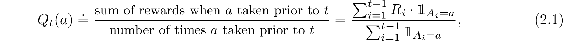
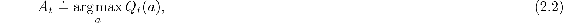

# 2.2  Action-value Methods

We begin by looking more closely at methods for estimating the values of actions and for using the estimates to make action selection decisions, which we collectively call *action-value methods*. Recall that the true value of an action is the mean reward when that action is selected. One natural way to estimate this is by averaging the rewards actually received:

where 𝟙*predicate* denotes the random variable that is 1 if *predicate* is true and 0 if it is not. If the denominator is zero, then we instead define *Q**t*(*a*) as some default value, such as 0. As the denominator goes to infinity, by the law of large numbers, *Q**t*(*a*) converges to *q*\*(*a*). We call this the *sample-average* method for estimating action values because each estimate is an average of the sample of relevant rewards. Of course this is just one way to estimate action values, and not necessarily the best one. Nevertheless, for now let us stay with this simple estimation method and turn to the question of how the estimates might be used to select actions.

The simplest action selection rule is to select one of the actions with the highest estimated value, that is, one of the greedy actions as defined in the previous section. If there is more than one greedy action, then a selection is made among them in some arbitrary way, perhaps randomly. We write this *greedy* action selection method as

where argmaxa denotes the action *a* for which the expression that follows is maximized (again, with ties broken arbitrarily). Greedy action selection always exploits current knowledge to maximize immediate reward; it spends no time at all sampling apparently inferior actions to see if they might really be better. A simple alternative is to behave greedily most of the time, but every once in a while, say with small probability *ε*, instead select randomly from among all the actions with equal probability, independently of the action-value estimates. We call methods using this near-greedy action selection rule *ε-greedy* methods. An advantage of these methods is that, in the limit as the number of steps increases, every action will be sampled an infinite number of times, thus ensuring that all the *Q**t*(*a*) converge to *q*\*(*a*). This of course implies that the probability of selecting the optimal action converges to greater than 1 − *ε*, that is, to near certainty. These are just asymptotic guarantees, however, and say little about the practical effectiveness of the methods.

*Exercise 2.1* In *ε*-greedy action selection, for the case of two actions and *ε* = 0.5, what is the probability that the greedy action is selected?

□
