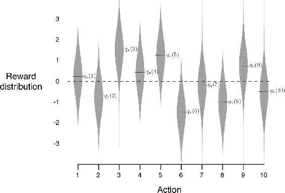
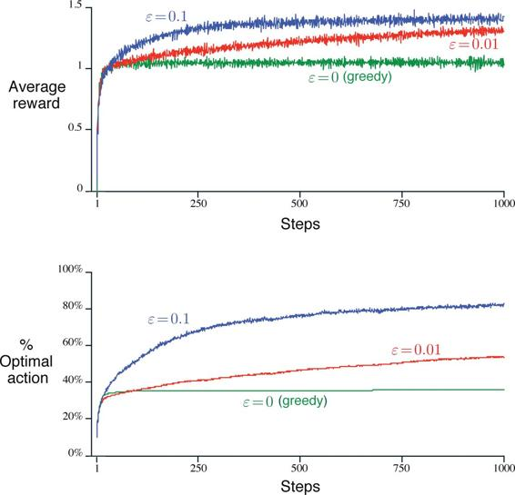

# 2.3  The 10-armed Testbed

To roughly assess the relative effectiveness of the greedy and *ε*-greedy action-value methods, we compared them numerically on a suite of test problems. This was a set of 2000 randomly generated *k*-armed bandit problems with *k* = 10. For each bandit problem, such as the one shown in [Figure 2.1](part0010_split_003.html#fig2-1), the action values, *q*\*(*a*), *a* = 1, …, 10, were selected according to a normal (Gaussian) distribution with mean 0 and variance 1. Then, when a learning method applied to that problem selected action *A**t* at time step *t*, the actual reward, *R**t*, was selected from a normal distribution with mean *q*\*(*A**t*) and variance 1. These distributions are shown in gray in [Figure 2.1](part0010_split_003.html#fig2-1). We call this suite of test tasks the *10-armed testbed*. For any learning method, we can measure its performance and behavior as it improves with experience over 1000 time steps when applied to one of the bandit problems. This makes up one *run*. Repeating this for 2000 independent runs, each with a different bandit problem, we obtained measures of the learning algorithm’s average behavior.

[Figure 2.1](part0010_split_003.html#C_fig2-1): An example bandit problem from the 10-armed testbed. The true value *q*\*(*a*) of each of the ten actions was selected according to a normal distribution with mean zero and unit variance, and then the actual rewards were selected according to a mean *q*\*(*a*) unit variance normal distribution, as suggested by these gray distributions.

[Figure 2.2](part0010_split_003.html#fig2-2) compares a greedy method with two *ε*-greedy methods (*ε* = 0.01 and *ε* = 0.1), as described above, on the 10-armed testbed. All the methods formed their action-value estimates using the sample-average technique. The upper graph shows the increase in expected reward with experience. The greedy method improved slightly faster than the other methods at the very beginning, but then leveled off at a lower level. It achieved a reward-per-step of only about 1, compared with the best possible of about 1.55 on this testbed. The greedy method performed significantly worse in the long run because it often got stuck performing suboptimal actions. The lower graph shows that the greedy method found the optimal action in only approximately one-third of the tasks. In the other two-thirds, its initial samples of the optimal action were disappointing, and it never returned to it. The *ε*-greedy methods eventually performed better because they continued to explore and to improve their chances of recognizing the optimal action. The *ε* = 0.1 method explored more, and usually found the optimal action earlier, but it never selected that action more than 91% of the time. The *ε* = 0.01 method improved more slowly, but eventually would perform better than the *ε* = 0.1 method on both performance measures shown in the figure. It is also possible to reduce *ε* over time to try to get the best of both high and low values.

[Figure 2.2](part0010_split_003.html#C_fig2-2): Average performance of *ε*-greedy action-value methods on the 10-armed testbed. These data are averages over 2000 runs with different bandit problems. All methods used sample averages as their action-value estimates.

The advantage of *ε*-greedy over greedy methods depends on the task. For example, suppose the reward variance had been larger, say 10 instead of 1. With noisier rewards it takes more exploration to find the optimal action, and *ε*-greedy methods should fare even better relative to the greedy method. On the other hand, if the reward variances were zero, then the greedy method would know the true value of each action after trying it once. In this case the greedy method might actually perform best because it would soon find the optimal action and then never explore. But even in the deterministic case there is a large advantage to exploring if we weaken some of the other assumptions. For example, suppose the bandit task were nonstationary, that is, the true values of the actions changed over time. In this case exploration is needed even in the deterministic case to make sure one of the nongreedy actions has not changed to become better than the greedy one. As we shall see in the next few chapters, nonstationarity is the case most commonly encountered in reinforcement learning. Even if the underlying task is stationary and deterministic, the learner faces a set of banditlike decision tasks each of which changes over time as learning proceeds and the agent’s decision-making policy changes. Reinforcement learning requires a balance between exploration and exploitation.

*Exercise 2.2: Bandit example* Consider a *k*-armed bandit problem with *k* = 4 actions, denoted 1, 2, 3, and 4. Consider applying to this problem a bandit algorithm using *ε*-greedy action selection, sample-average action-value estimates, and initial estimates of *Q*1(*a*) = 0, for all *a*. Suppose the initial sequence of actions and rewards is *A*1 = 1, *R*1 = 1, *A*2 = 2, *R*2 = 1, *A*3 = 2, *R*3 = 2, *A*4 = 2, *R*4 = 2, *A*5 = 3, *R*5 = 0. On some of these time steps the *ε* case may have occurred, causing an action to be selected at random. On which time steps did this definitely occur? On which time steps could this possibly have occurred?

□

*Exercise 2.3* In the comparison shown in [Figure 2.2](part0010_split_003.html#fig2-2), which method will perform best in the long run in terms of cumulative reward and probability of selecting the best action? How much better will it be? Express your answer quantitatively.

□
