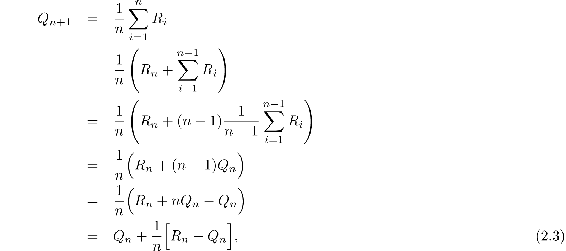
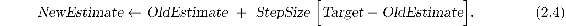
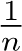
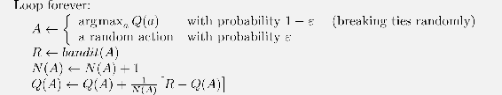

# 2.4  Incremental Implementation

The action-value methods we have discussed so far all estimate action values as sample averages of observed rewards. We now turn to the question of how these averages can be computed in a computationally efficient manner, in particular, with constant memory and constant per-time-step computation.

To simplify notation we concentrate on a single action. Let *R**i* now denote the reward received after the *i*th selection *of this action*, and let *Q**n* denote the estimate of its action value after it has been selected *n* − 1 times, which we can now write simply as

The obvious implementation would be to maintain a record of all the rewards and then perform this computation whenever the estimated value was needed. However, if this is done, then the memory and computational requirements would grow over time as more rewards are seen. Each additional reward would require additional memory to store it and additional computation to compute the sum in the numerator.

As you might suspect, this is not really necessary. It is easy to devise incremental formulas for updating averages with small, constant computation required to process each new reward. Given *Q**n* and the *n*th reward, *R**n*, the new average of all *n* rewards can be computed by

which holds even for *n* = 1, obtaining *Q*2 = *R*1 for arbitrary *Q*1. This implementation requires memory only for *Q**n* and *n*, and only the small computation (2.3) for each new reward.

This update rule (2.3) is of a form that occurs frequently throughout this book. The general form is

The expression [*Target* − *OldEstimate*] is an *error* in the estimate. It is reduced by taking a step toward the “Target.” The target is presumed to indicate a desirable direction in which to move, though it may be noisy. In the case above, for example, the target is the *n*th reward.

Note that the step-size parameter (*StepSize*) used in the incremental method (2.3) changes from time step to time step. In processing the *n*th reward for action *a*, the method uses the step-size parameter . In this book we denote the step-size parameter by *α* or, more generally, by *α**t*(*a*).

Pseudocode for a complete bandit algorithm using incrementally computed sample averages and *ε*-greedy action selection is shown in the box below. The function *bandit*(*a*) is assumed to take an action and return a corresponding reward.

**A simple bandit algorithm**

Initialize, for *a* = 1 to *k*:

*Q*(*a*) ← 0

*N*(*a*) ← 0

