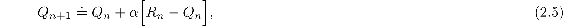
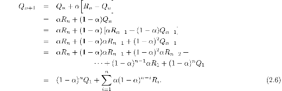
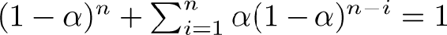
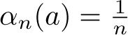
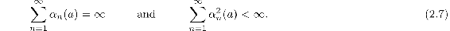

# 2.5  Tracking a Nonstationary Problem

The averaging methods discussed so far are appropriate for stationary bandit problems, that is, for bandit problems in which the reward probabilities do not change over time. As noted earlier, we often encounter reinforcement learning problems that are effectively nonstationary. In such cases it makes sense to give more weight to recent rewards than to long-past rewards. One of the most popular ways of doing this is to use a constant step-size parameter. For example, the incremental update rule (2.3) for updating an average *Q**n* of the *n* − 1 past rewards is modified to be

where the step-size parameter *α* ∈ (0, 1] is constant. This results in *Q**n*+1 being a weighted average of past rewards and the initial estimate *Q*1:

We call this a weighted average because the sum of the weights is , as you can check for yourself. Note that the weight, *α*(1 − *α*)*n* − *i*, given to the reward *R**i* depends on how many rewards ago, *n* − *i*, it was observed. The quantity 1 − *α* is less than 1, and thus the weight given to *R**i* decreases as the number of intervening rewards increases. In fact, the weight decays exponentially according to the exponent on 1 − *α*. (If 1 − *α* = 0, then all the weight goes on the very last reward, *R**n*, because of the convention that 00 = 1.) Accordingly, this is sometimes called an *exponential recency-weighted average*.

Sometimes it is convenient to vary the step-size parameter from step to step. Let *α**n*(*a*) denote the step-size parameter used to process the reward received after the *n*th selection of action *a*. As we have noted, the choice  results in the sample-average method, which is guaranteed to converge to the true action values by the law of large numbers. But of course convergence is not guaranteed for all choices of the sequence {*α**n*(*a*)}. A well-known result in stochastic approximation theory gives us the conditions required to assure convergence with probability 1:

The first condition is required to guarantee that the steps are large enough to eventually overcome any initial conditions or random fluctuations. The second condition guarantees that eventually the steps become small enough to assure convergence.

Note that both convergence conditions are met for the sample-average case, , but not for the case of constant step-size parameter, *α**n*(*a*) = *α*. In the latter case, the second condition is not met, indicating that the estimates never completely converge but continue to vary in response to the most recently received rewards. As we mentioned above, this is actually desirable in a nonstationary environment, and problems that are effectively nonstationary are the most common in reinforcement learning. In addition, sequences of step-size parameters that meet the conditions ([2.7](part0010_split_005.html#x1-20003r7)) often converge very slowly or need considerable tuning in order to obtain a satisfactory convergence rate. Although sequences of step-size parameters that meet these convergence conditions are often used in theoretical work, they are seldom used in applications and empirical research.

*Exercise 2.4* If the step-size parameters, *α**n*, are not constant, then the estimate *Q**n* is a weighted average of previously received rewards with a weighting different from that given by (2.6). What is the weighting on each prior reward for the general case, analogous to (2.6), in terms of the sequence of step-size parameters?

□

*Exercise 2.5 (programming)* Design and conduct an experiment to demonstrate the difficulties that sample-average methods have for nonstationary problems. Use a modified version of the 10-armed testbed in which all the *q*\*(*a*) start out equal and then take independent random walks (say by adding a normally distributed increment with mean zero and standard deviation 0.01 to all the *q*\*(*a*) on each step). Prepare plots like [Figure 2.2](part0010_split_003.html#fig2-2) for an action-value method using sample averages, incrementally computed, and another action-value method using a constant step-size parameter, *α* = 0.1. Use *ε* = 0.1 and longer runs, say of 10,000 steps.

□
