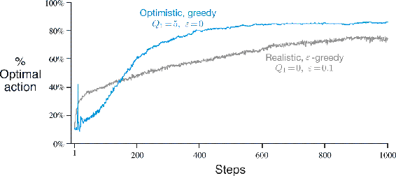

# 2.6  Optimistic Initial Values

All the methods we have discussed so far are dependent to some extent on the initial action-value estimates, *Q*1(*a*). In the language of statistics, these methods are *biased* by their initial estimates. For the sample-average methods, the bias disappears once all actions have been selected at least once, but for methods with constant *α*, the bias is permanent, though decreasing over time as given by (2.6). In practice, this kind of bias is usually not a problem and can sometimes be very helpful. The downside is that the initial estimates become, in effect, a set of parameters that must be picked by the user, if only to set them all to zero. The upside is that they provide an easy way to supply some prior knowledge about what level of rewards can be expected.

Initial action values can also be used as a simple way to encourage exploration. Suppose that instead of setting the initial action values to zero, as we did in the 10-armed testbed, we set them all to +5. Recall that the *q*\*(*a*) in this problem are selected from a normal distribution with mean 0 and variance 1. An initial estimate of +5 is thus wildly optimistic. But this optimism encourages action-value methods to explore. Whichever actions are initially selected, the reward is less than the starting estimates; the learner switches to other actions, being “disappointed” with the rewards it is receiving. The result is that all actions are tried several times before the value estimates converge. The system does a fair amount of exploration even if greedy actions are selected all the time.

[Figure 2.3](part0010_split_006.html#fig2-3) shows the performance on the 10-armed bandit testbed of a greedy method using *Q*1(*a*) = +5, for all *a*. For comparison, also shown is an *ε*-greedy method with *Q*1(*a*) = 0. Initially, the optimistic method performs worse because it explores more, but eventually it performs better because its exploration decreases with time. We call this technique for encouraging exploration *optimistic initial values*. We regard it as a simple trick that can be quite effective on stationary problems, but it is far from being a generally useful approach to encouraging exploration. For example, it is not well suited to nonstationary problems because its drive for exploration is inherently temporary. If the task changes, creating a renewed need for exploration, this method cannot help. Indeed, any method that focuses on the initial conditions in any special way is unlikely to help with the general nonstationary case. The beginning of time occurs only once, and thus we should not focus on it too much. This criticism applies as well to the sample-average methods, which also treat the beginning of time as a special event, averaging all subsequent rewards with equal weights. Nevertheless, all of these methods are very simple, and one of them—or some simple combination of them—is often adequate in practice. In the rest of this book we make frequent use of several of these simple exploration techniques.

[Figure 2.3](part0010_split_006.html#C_fig2-3): The effect of optimistic initial action-value estimates on the 10-armed testbed. Both methods used a constant step-size parameter, *α* = 0.1.

*Exercise 2.6: Mysterious Spikes* The results shown in [Figure 2.3](part0010_split_006.html#fig2-3) should be quite reliable because they are averages over 2000 individual, randomly chosen 10-armed bandit tasks. Why, then, are there oscillations and spikes in the early part of the curve for the optimistic method? In other words, what might make this method perform particularly better or worse, on average, on particular early steps?

□

*Exercise 2.7: Unbiased Constant-Step-Size Trick* In most of this chapter we have used sample averages to estimate action values because sample averages do not produce the initial bias that constant step sizes do (see the analysis in (2.6)). However, sample averages are not a completely satisfactory solution because they may perform poorly on nonstationary problems. Is it possible to avoid the bias of constant step sizes while retaining their advantages on nonstationary problems? One way is to use a step size of

to process the *n*th reward for a particular action, where *α >* 0 is a conventional constant step size, and *o**n* is a trace of one that starts at 0:

Carry out an analysis like that in (2.6) to show that *Q**n* is an exponential recency-weighted average *without initial bias*.

□
