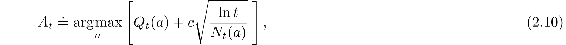
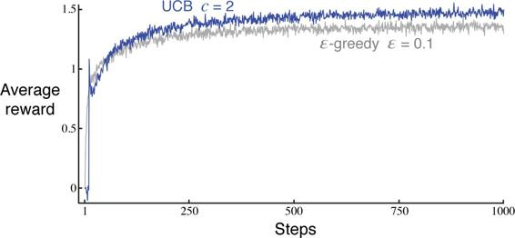

# 2.7  Upper-Confidence-Bound Action Selection

Exploration is needed because there is always uncertainty about the accuracy of the action-value estimates. The greedy actions are those that look best at present, but some of the other actions may actually be better. *ε*-greedy action selection forces the non-greedy actions to be tried, but indiscriminately, with no preference for those that are nearly greedy or particularly uncertain. It would be better to select among the non-greedy actions according to their potential for actually being optimal, taking into account both how close their estimates are to being maximal and the uncertainties in those estimates. One effective way of doing this is to select actions according to

where ln*t* denotes the natural logarithm of *t* (the number that *e* ≈ 2.71828 would have to be raised to in order to equal *t*), *N**t*(*a*) denotes the number of times that action *a* has been selected prior to time *t* (the denominator in ([2.1](part0010_split_002.html#x1-17001r1))), and the number *c >* 0 controls the degree of exploration. If *N**t*(*a*) = 0, then *a* is considered to be a maximizing action.

The idea of this *upper confidence bound* (UCB) action selection is that the square-root term is a measure of the uncertainty or variance in the estimate of *a*’s value. The quantity being max’ed over is thus a sort of upper bound on the possible true value of action *a*, with *c* determining the confidence level. Each time *a* is selected the uncertainty is presumably reduced: *N**t*(*a*) increments, and, as it appears in the denominator, the uncertainty term decreases. On the other hand, each time an action other than *a* is selected, *t* increases but *N**t*(*a*) does not; because *t* appears in the numerator, the uncertainty estimate increases. The use of the natural logarithm means that the increases get smaller over time, but are unbounded; all actions will eventually be selected, but actions with lower value estimates, or that have already been selected frequently, will be selected with decreasing frequency over time.

Results with UCB on the 10-armed testbed are shown in [Figure 2.4](part0010_split_007.html#fig2-4). UCB often performs well, as shown here, but is more difficult than *ε*-greedy to extend beyond bandits to the more general reinforcement learning settings considered in the rest of this book. One difficulty is in dealing with nonstationary problems; methods more complex than those presented in Section 2.5 would be needed. Another difficulty is dealing with large state spaces, particularly when using function approximation as developed in Part II of this book. In these more advanced settings the idea of UCB action selection is usually not practical.

[Figure 2.4](part0010_split_007.html#C_fig2-4): Average performance of UCB action selection on the 10-armed testbed. As shown, UCB generally performs better than *ε*-greedy action selection, except in the first *k* steps, when it selects randomly among the as-yet-untried actions.

*Exercise 2.8: UCB Spikes* In [Figure 2.4](part0010_split_007.html#fig2-4) the UCB algorithm shows a distinct spike in performance on the 11th step. Why is this? Note that for your answer to be fully satisfactory it must explain both why the reward increases on the 11th step and why it decreases on the subsequent steps. Hint: if *c* = 1, then the spike is less prominent.

□
