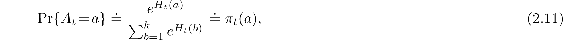
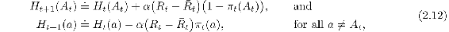
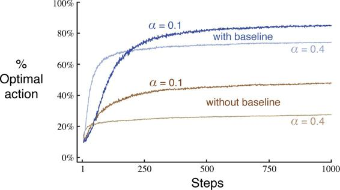
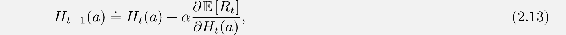
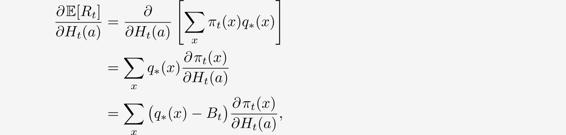
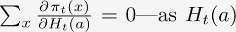
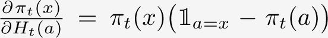
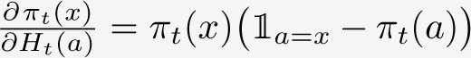
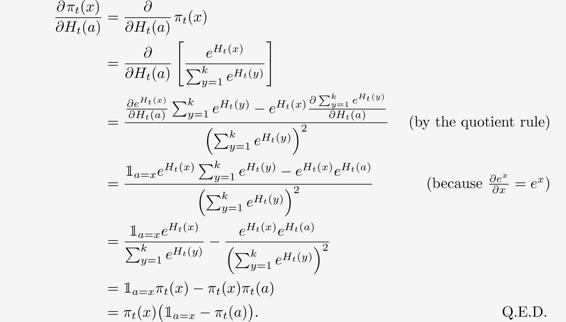

# 2.8  Gradient Bandit Algorithms

So far in this chapter we have considered methods that estimate action values and use those estimates to select actions. This is often a good approach, but it is not the only one possible. In this section we consider learning a numerical *preference* for each action *a*, which we denote *H**t*(*a*). The larger the preference, the more often that action is taken, but the preference has no interpretation in terms of reward. Only the relative preference of one action over another is important; if we add 1000 to all the action preferences there is no effect on the action probabilities, which are determined according to a *soft-max distribution* (i.e., Gibbs or Boltzmann distribution) as follows:

where here we have also introduced a useful new notation, *π**t*(*a*), for the probability of taking action *a* at time *t*. Initially all action preferences are the same (e.g., *H*1(*a*) = 0, for all *a*) so that all actions have an equal probability of being selected.

*Exercise 2.9* Show that in the case of two actions, the soft-max distribution is the same as that given by the logistic, or sigmoid, function often used in statistics and artificial neural networks.

□

There is a natural learning algorithm for this setting based on the idea of stochastic gradient ascent. On each step, after selecting action *A**t* and receiving the reward *R**t*, the action preferences are updated by:

where *α >* 0 is a step-size parameter, and *R**t* ∈ ℝ is the average of all the rewards up through and including time *t*, which can be computed incrementally as described in Section 2.4 (or Section 2.5 if the problem is nonstationary). The *R**t* term serves as a baseline with which the reward is compared. If the reward is higher than the baseline, then the probability of taking *A**t* in the future is increased, and if the reward is below baseline, then probability is decreased. The non-selected actions move in the opposite direction.

[Figure 2.5](part0010_split_008.html#fig2-5) shows results with the gradient bandit algorithm on a variant of the 10-armed testbed in which the true expected rewards were selected according to a normal distribution with a mean of + 4 instead of zero (and with unit variance as before). This shifting up of all the rewards has absolutely no effect on the gradient bandit algorithm because of the reward baseline term, which instantaneously adapts to the new level. But if the baseline were omitted (that is, if *R**t* was taken to be constant zero in ([2.12](part0010_split_008.html#x1-23002r12))), then performance would be significantly degraded, as shown in the figure.

[Figure 2.5](part0010_split_008.html#C_fig2-5): Average performance of the gradient bandit algorithm with and without a reward baseline on the 10-armed testbed when the *q*\*(*a*) are chosen to be near + 4 rather than near zero.

**The Bandit Gradient Algorithm as Stochastic Gradient Ascent**

One can gain a deeper insight into the gradient bandit algorithm by understanding it as a stochastic approximation to gradient ascent. In exact *gradient ascent*, each action preference *H**t*(*a*) would be incremented proportional to the increment’s effect on performance:

where the measure of performance here is the expected reward:

and the measure of the increment’s effect is the *partial derivative* of this performance measure with respect to the action preference. Of course, it is not possible to implement gradient ascent exactly in our case because by assumption we do not know the *q*\*(*x*), but in fact the updates of our algorithm ([2.12](part0010_split_008.html#x1-23002r12)) are equal to ([2.13](part0010_split_008.html#x1-23004r13)) in expected value, making the algorithm an instance of *stochastic gradient ascent*. The calculations showing this require only beginning calculus, but take several steps. First we take a closer look at the exact performance gradient:

where *B**t*, called the *baseline*, can be any scalar that does not depend on *x*. We can include a baseline here without changing the equality because the gradient sums to zero over all the actions,  is changed, some actions’ probabilities go up and some go down, but the sum of the changes must be zero because the sum of the probabilities is always one.

Next we multiply each term of the sum by *π**t*(*x*)*/π**t*(*x*):

The equation is now in the form of an expectation, summing over all possible values *x* of the random variable *A**t*, then multiplying by the probability of taking those values. Thus:

where here we have chosen the baseline *B**t* = *R**t* and substituted *R**t* for *q*\*(*A**t*), which is permitted because 𝔼[*R**t*|*A**t*] = *q*\*(*A**t*). Shortly we will establish that , where 𝟙*a*=*x* is defined to be 1 if *a* = *x*, else 0. Assuming that for now, we have

Recall that our plan has been to write the performance gradient as an expectation of something that we can sample on each step, as we have just done, and then update on each step proportional to the sample. Substituting a sample of the expectation above for the performance gradient in ([2.13](part0010_split_008.html#x1-23004r13)) yields:

which you may recognize as being equivalent to our original algorithm ([2.12](part0010_split_008.html#x1-23002r12)).

Thus it remains only to show that , as we assumed. Recall the standard quotient rule for derivatives:

Using this, we can write

We have just shown that the expected update of the gradient bandit algorithm is equal to the gradient of expected reward, and thus that the algorithm is an instance of stochastic gradient ascent. This assures us that the algorithm has robust convergence properties.

Note that we did not require any properties of the reward baseline other than that it does not depend on the selected action. For example, we could have set it to zero, or to 1000, and the algorithm would still be an instance of stochastic gradient ascent. The choice of the baseline does not affect the expected update of the algorithm, but it does affect the variance of the update and thus the rate of convergence (as shown, for example, in [Figure 2.5](part0010_split_008.html#fig2-5)). Choosing it as the average of the rewards may not be the very best, but it is simple and works well in practice.
