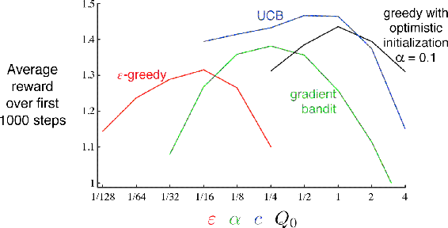

# 2.10  Summary

We have presented in this chapter several simple ways of balancing exploration and exploitation. The *ε*-greedy methods choose randomly a small fraction of the time, whereas UCB methods choose deterministically but achieve exploration by subtly favoring at each step the actions that have so far received fewer samples. Gradient bandit algorithms estimate not action values, but action preferences, and favor the more preferred actions in a graded, probabilistic manner using a soft-max distribution. The simple expedient of initializing estimates optimistically causes even greedy methods to explore significantly.

It is natural to ask which of these methods is best. Although this is a difficult question to answer in general, we can certainly run them all on the 10-armed testbed that we have used throughout this chapter and compare their performances. A complication is that they all have a parameter; to get a meaningful comparison we have to consider their performance as a function of their parameter. Our graphs so far have shown the course of learning over time for each algorithm and parameter setting, to produce a *learning curve* for that algorithm and parameter setting. If we plotted learning curves for all algorithms and all parameter settings, then the graph would be too complex and crowded to make clear comparisons. Instead we summarize a complete learning curve by its average value over the 1000 steps; this value is proportional to the area under the learning curve. [Figure 2.6](part0010_split_010.html#fig2-6) shows this measure for the various bandit algorithms from this chapter, each as a function of its own parameter shown on a single scale on the x-axis. This kind of graph is called a *parameter study*. Note that the parameter values are varied by factors of two and presented on a log scale. Note also the characteristic inverted-U shapes of each algorithm’s performance; all the algorithms perform best at an intermediate value of their parameter, neither too large nor too small. In assessing a method, we should attend not just to how well it does at its best parameter setting, but also to how sensitive it is to its parameter value. All of these algorithms are fairly insensitive, performing well over a range of parameter values varying by about an order of magnitude. Overall, on this problem, UCB seems to perform best.

[Figure 2.6](part0010_split_010.html#C_fig2-6): A parameter study of the various bandit algorithms presented in this chapter. Each point is the average reward obtained over 1000 steps with a particular algorithm at a particular setting of its parameter.

Despite their simplicity, in our opinion the methods presented in this chapter can fairly be considered the state of the art. There are more sophisticated methods, but their complexity and assumptions make them impractical for the full reinforcement learning problem that is our real focus. Starting in Chapter 5 we present learning methods for solving the full reinforcement learning problem that use in part the simple methods explored in this chapter.

Although the simple methods explored in this chapter may be the best we can do at present, they are far from a fully satisfactory solution to the problem of balancing exploration and exploitation.

One well-studied approach to balancing exploration and exploitation in *k*-armed bandit problems is to compute a special kind of action value called a *Gittins index*. In certain important special cases, this computation is tractable and leads directly to optimal solutions, although it does require complete knowledge of the prior distribution of possible problems, which we generally assume is not available. In addition, neither the theory nor the computational tractability of this approach appear to generalize to the full reinforcement learning problem that we consider in the rest of the book.

The Gittins-index approach is an instance of *Bayesian* methods, which assume a known initial distribution over the action values and then update the distribution exactly after each step (assuming that the true action values are stationary). In general, the update computations can be very complex, but for certain special distributions (called *conjugate priors*) they are easy. One possibility is to then select actions at each step according to their posterior probability of being the best action. This method, sometimes called *posterior sampling* or *Thompson sampling*, often performs similarly to the best of the distribution-free methods we have presented in this chapter.

In the Bayesian setting it is even conceivable to compute the *optimal* balance between exploration and exploitation. One can compute for any possible action the probability of each possible immediate reward and the resultant posterior distributions over action values. This evolving distribution becomes the *information state* of the problem. Given a horizon, say of 1000 steps, one can consider all possible actions, all possible resulting rewards, all possible next actions, all next rewards, and so on for all 1000 steps. Given the assumptions, the rewards and probabilities of each possible chain of events can be determined, and one need only pick the best. But the tree of possibilities grows extremely rapidly; even if there were only two actions and two rewards, the tree would have 22000 leaves. It is generally not feasible to perform this immense computation exactly, but perhaps it could be approximated efficiently. This approach would effectively turn the bandit problem into an instance of the full reinforcement learning problem. In the end, we may be able to use approximate reinforcement learning methods such as those presented in Part II of this book to approach this optimal solution. But that is a topic for research and beyond the scope of this introductory book.

*Exercise 2.11 (programming)* Make a figure analogous to [Figure 2.6](part0010_split_010.html#fig2-6) for the nonstationary case outlined in [Exercise 2.5](part0010_split_005.html#sec1-12) . Include the constant-step-size *ε*-greedy algorithm with *α* = 0.1. Use runs of 200,000 steps and, as a performance measure for each algorithm and parameter setting, use the average reward over the last 100,000 steps.

□
