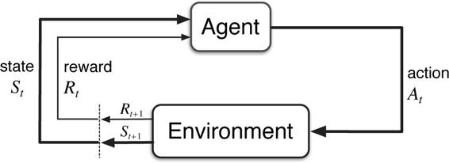
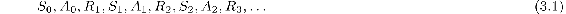
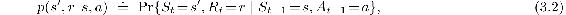
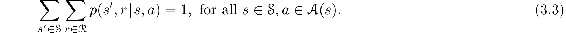
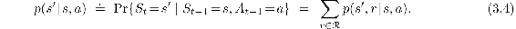
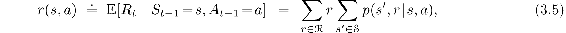
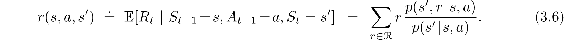
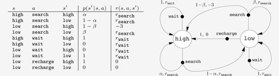

# 3.1  The Agent–Environment Interface

MDPs are meant to be a straightforward framing of the problem of learning from interaction to achieve a goal. The learner and decision maker is called the *agent*. The thing it interacts with, comprising everything outside the agent, is called the *environment*. These interact continually, the agent selecting actions and the environment responding to these actions and presenting new situations to the agent.[1](part0011_split_010.html#fn1x4) The environment also gives rise to rewards, special numerical values that the agent seeks to maximize over time through its choice of actions.

Figure 3.1: The agent–environment interaction in a Markov decision process.

More specifically, the agent and environment interact at each of a sequence of discrete time steps, *t* = 0, 1, 2, 3*, …*.[2](part0011_split_010.html#fn2x4) At each time step *t*, the agent receives some representation of the environment’s *state*, *S**t* ∈ 𝒮, and on that basis selects an *action*, *A**t* ∈ 𝒜(*s*).[3](part0011_split_010.html#fn3x4) One time step later, in part as a consequence of its action, the agent receives a numerical *reward*, *R**t*+1 ∈ ℛ ⊂ ℝ, and finds itself in a new state, *S**t*+1.[4](part0011_split_010.html#fn4x4) The MDP and agent together thereby give rise to a sequence or *trajectory* that begins like this:

In a *finite* MDP, the sets of states, actions, and rewards (𝒮, 𝒜, and ℛ) all have a finite number of elements. In this case, the random variables *R**t* and *S**t* have well defined discrete probability distributions dependent only on the preceding state and action. That is, for particular values of these random variables, *s*′ ∈ 𝒮 and *r* ∈ ℛ, there is a probability of those values occurring at time *t*, given particular values of the preceding state and action:

for all *s*′*, s* ∈ 𝒮, *r* ∈ ℛ, and *a* ∈ 𝒜(*s*). The function *p* defines the *dynamics* of the MDP. The dot over the equals sign in the equation reminds us that it is a definition (in this case of the function *p*) rather than a fact that follows from previous definitions. The dynamics function *p* : 𝒮 × ℛ × 𝒮 × 𝒜 *→* [0, 1] is an ordinary deterministic function of four arguments. The ‘|’ in the middle of it comes from the notation for conditional probability, but here it just reminds us that *p* specifies a probability distribution for each choice of *s* and *a*, that is, that

In a *Markov* decision process, the probabilities given by *p* completely characterize the environment’s dynamics. That is, the probability of each possible value for *S**t* and *R**t* depends only on the immediately preceding state and action, *S**t*−1 and *A**t*−1, and, given them, not at all on earlier states and actions. This is best viewed a restriction not on the decision process, but on the *state*. The state must include information about all aspects of the past agent–environment interaction that make a difference for the future. If it does, then the state is said to have the *Markov property*. We will assume the Markov property throughout this book, though starting in Part II we will consider approximation methods that do not rely on it, and in Chapter 17 we consider how a Markov state can be learned and constructed from non-Markov observations.

From the four-argument dynamics function, *p*, one can compute anything else one might want to know about the environment, such as the *state-transition probabilities* (which we denote, with a slight abuse of notation, as a three-argument function *p* : 𝒮 × 𝒮 × 𝒜 *→* [0, 1]),

We can also compute the expected rewards for state–action pairs as a two-argument function *r* : 𝒮 × 𝒜 *→* ℝ:

and the expected rewards for state–action–next-state triples as a three-argument function *r* : 𝒮 × 𝒜 × 𝒮 *→* ℝ,

In this book, we usually use the four-argument *p* function ([3.2](part0011_split_001.html#x1-28007r2)), but each of these other notations are also occasionally convenient.

The MDP framework is abstract and flexible and can be applied to many different problems in many different ways. For example, the time steps need not refer to fixed intervals of real time; they can refer to arbitrary successive stages of decision making and acting. The actions can be low-level controls, such as the voltages applied to the motors of a robot arm, or high-level decisions, such as whether or not to have lunch or to go to graduate school. Similarly, the states can take a wide variety of forms. They can be completely determined by low-level sensations, such as direct sensor readings, or they can be more high-level and abstract, such as symbolic descriptions of objects in a room. Some of what makes up a state could be based on memory of past sensations or even be entirely mental or subjective. For example, an agent could be in the state of not being sure where an object is, or of having just been surprised in some clearly defined sense. Similarly, some actions might be totally mental or computational. For example, some actions might control what an agent chooses to think about, or where it focuses its attention. In general, actions can be any decisions we want to learn how to make, and the states can be anything we can know that might be useful in making them.

In particular, the boundary between agent and environment is typically not the same as the physical boundary of robot’s or animal’s body. Usually, the boundary is drawn closer to the agent than that. For example, the motors and mechanical linkages of a robot and its sensing hardware should usually be considered parts of the environment rather than parts of the agent. Similarly, if we apply the MDP framework to a person or animal, the muscles, skeleton, and sensory organs should be considered part of the environment. Rewards, too, presumably are computed inside the physical bodies of natural and artificial learning systems, but are considered external to the agent.

The general rule we follow is that anything that cannot be changed arbitrarily by the agent is considered to be outside of it and thus part of its environment. We do not assume that everything in the environment is unknown to the agent. For example, the agent often knows quite a bit about how its rewards are computed as a function of its actions and the states in which they are taken. But we always consider the reward computation to be external to the agent because it defines the task facing the agent and thus must be beyond its ability to change arbitrarily. In fact, in some cases the agent may know *everything* about how its environment works and still face a difficult reinforcement learning task, just as we may know exactly how a puzzle like Rubik’s cube works, but still be unable to solve it. The agent–environment boundary represents the limit of the agent’s *absolute control*, not of its knowledge.

The agent–environment boundary can be located at different places for different purposes. In a complicated robot, many different agents may be operating at once, each with its own boundary. For example, one agent may make high-level decisions which form part of the states faced by a lower-level agent that implements the high-level decisions. In practice, the agent–environment boundary is determined once one has selected particular states, actions, and rewards, and thus has identified a specific decision making task of interest.

The MDP framework is a considerable abstraction of the problem of goal-directed learning from interaction. It proposes that whatever the details of the sensory, memory, and control apparatus, and whatever objective one is trying to achieve, any problem of learning goal-directed behavior can be reduced to three signals passing back and forth between an agent and its environment: one signal to represent the choices made by the agent (the actions), one signal to represent the basis on which the choices are made (the states), and one signal to define the agent’s goal (the rewards). This framework may not be sufficient to represent all decision-learning problems usefully, but it has proved to be widely useful and applicable.

Of course, the particular states and actions vary greatly from task to task, and how they are represented can strongly affect performance. In reinforcement learning, as in other kinds of learning, such representational choices are at present more art than science. In this book we offer some advice and examples regarding good ways of representing states and actions, but our primary focus is on general principles for learning how to behave once the representations have been selected.

**Example 3.1: Bioreactor** Suppose reinforcement learning is being applied to determine moment-by-moment temperatures and stirring rates for a bioreactor (a large vat of nutrients and bacteria used to produce useful chemicals). The actions in such an application might be target temperatures and target stirring rates that are passed to lower-level control systems that, in turn, directly activate heating elements and motors to attain the targets. The states are likely to be thermocouple and other sensory readings, perhaps filtered and delayed, plus symbolic inputs representing the ingredients in the vat and the target chemical. The rewards might be moment-by-moment measures of the rate at which the useful chemical is produced by the bioreactor. Notice that here each state is a list, or vector, of sensor readings and symbolic inputs, and each action is a vector consisting of a target temperature and a stirring rate. It is typical of reinforcement learning tasks to have states and actions with such structured representations. Rewards, on the other hand, are always single numbers.

■

**Example 3.2: Pick-and-Place Robot** Consider using reinforcement learning to control the motion of a robot arm in a repetitive pick-and-place task. If we want to learn movements that are fast and smooth, the learning agent will have to control the motors directly and have low-latency information about the current positions and velocities of the mechanical linkages. The actions in this case might be the voltages applied to each motor at each joint, and the states might be the latest readings of joint angles and velocities. The reward might be +1 for each object successfully picked up and placed. To encourage smooth movements, on each time step a small, negative reward can be given as a function of the moment-to-moment “jerkiness” of the motion.

■

*Exercise 3.1* Devise three example tasks of your own that fit into the MDP framework, identifying for each its states, actions, and rewards. Make the three examples as *different* from each other as possible. The framework is abstract and flexible and can be applied in many different ways. Stretch its limits in some way in at least one of your examples.

□

*Exercise 3.2* Is the MDP framework adequate to usefully represent *all* goal-directed learning tasks? Can you think of any clear exceptions?

□

*Exercise 3.3* Consider the problem of driving. You could define the actions in terms of the accelerator, steering wheel, and brake, that is, where your body meets the machine. Or you could define them farther out—say, where the rubber meets the road, considering your actions to be tire torques. Or you could define them farther in—say, where your brain meets your body, the actions being muscle twitches to control your limbs. Or you could go to a really high level and say that your actions are your choices of *where* to drive. What is the right level, the right place to draw the line between agent and environment? On what basis is one location of the line to be preferred over another? Is there any fundamental reason for preferring one location over another, or is it a free choice?

□

Example 3.3 Recycling Robot

A mobile robot has the job of collecting empty soda cans in an office environment. It has sensors for detecting cans, and an arm and gripper that can pick them up and place them in an onboard bin; it runs on a rechargeable battery. The robot’s control system has components for interpreting sensory information, for navigating, and for controlling the arm and gripper. High-level decisions about how to search for cans are made by a reinforcement learning agent based on the current charge level of the battery. To make a simple example, we assume that only two charge levels can be distinguished, comprising a small state set 𝒮 = {high, low}. In each state, the agent can decide whether to (1) actively search for a can for a certain period of time, (2) remain stationary and wait for someone to bring it a can, or (3) head back to its home base to recharge its battery. When the energy level is high, recharging would always be foolish, so we do not include it in the action set for this state. The action sets are then 𝒜(high) = {search, wait} and 𝒜(low) = {search, wait, recharge}.

The rewards are zero most of the time, but become positive when the robot secures an empty can, or large and negative if the battery runs all the way down. The best way to find cans is to actively search for them, but this runs down the robot’s battery, whereas waiting does not. Whenever the robot is searching, the possibility exists that its battery will become depleted. In this case the robot must shut down and wait to be rescued (producing a low reward). If the energy level is high, then a period of active search can always be completed without risk of depleting the battery. A period of searching that begins with a high energy level leaves the energy level high with probability *α* and reduces it to low with probability 1 − *α*. On the other hand, a period of searching undertaken when the energy level is low leaves it low with probability *β* and depletes the battery with probability 1 − *β*. In the latter case, the robot must be rescued, and the battery is then recharged back to high. Each can collected by the robot counts as a unit reward, whereas a reward of − 3 results whenever the robot has to be rescued. Let *r*search and *r*wait, with *r*search *> r*wait, respectively denote the expected number of cans the robot will collect (and hence the expected reward) while searching and while waiting. Finally, suppose that no cans can be collected during a run home for recharging, and that no cans can be collected on a step in which the battery is depleted. This system is then a finite MDP, and we can write down the transition probabilities and the expected rewards, with dynamics as indicated in the table on the left:

Note that there is a row in the table for each possible combination of current state, *s*, action, *a* ∈ 𝒜(*s*), and next state, *s*′. Another useful way of summarizing the dynamics of a finite MDP is as a *transition graph* as shown above on the right. There are two kinds of nodes: *state nodes* and *action nodes*. There is a state node for each possible state (a large open circle labeled by the name of the state), and an action node for each state–action pair (a small solid circle labeled by the name of the action and connected by a line to the state node). Starting in state *s* and taking action *a* moves you along the line from state node *s* to action node (*s, a*). Then the environment responds with a transition to the next state’s node via one of the arrows leaving action node (*s, a*). Each arrow corresponds to a triple (*s, s*′*, a*), where *s*′ is the next state, and we label the arrow with the transition probability, *p*(*s*′ | *s, a*), and the expected reward for that transition, *r*(*s, a, s*′). Note that the transition probabilities labeling the arrows leaving an action node always sum to 1.

*Exercise 3.4* Give a table analogous to that in [Example 3.3](part0011_split_001.html#sec1-18), but for *p*(*s*′*, r* | *s, a*). It should have columns for *s*, *a*, *s*′, *r*, and *p*(*s*′*, r* | *s, a*), and a row for every 4-tuple for which *p*(*s*′*, r* | *s, a*) > 0.

□
