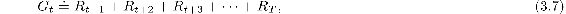
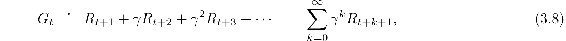
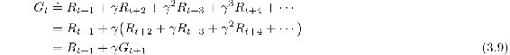
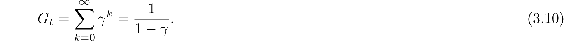
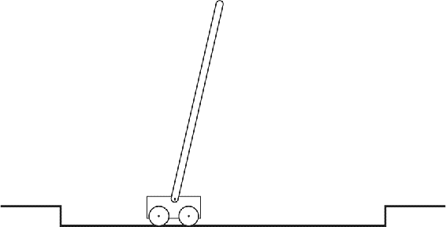

# 3.3  Returns and Episodes

So far we have discussed the objective of learning informally. We have said that the agent’s goal is to maximize the cumulative reward it receives in the long run. How might this be defined formally? If the sequence of rewards received after time step *t* is denoted *R**t*+1, *R**t*+2, *R**t*+3,…, then what precise aspect of this sequence do we wish to maximize? In general, we seek to maximize the *expected return*, where the return, denoted *G**t*, is defined as some specific function of the reward sequence. In the simplest case the return is the sum of the rewards:

where *T* is a final time step. This approach makes sense in applications in which there is a natural notion of final time step, that is, when the agent–environment interaction breaks naturally into subsequences, which we call *episodes*,[7](part0011_split_010.html#fn7x4) such as plays of a game, trips through a maze, or any sort of repeated interaction. Each episode ends in a special state called the *terminal state*, followed by a reset to a standard starting state or to a sample from a standard distribution of starting states. Even if you think of episodes as ending in different ways, such as winning and losing a game, the next episode begins independently of how the previous one ended. Thus the episodes can all be considered to end in the same terminal state, with different rewards for the different outcomes. Tasks with episodes of this kind are called *episodic tasks*. In episodic tasks we sometimes need to distinguish the set of all nonterminal states, denoted 𝒮, from the set of all states plus the terminal state, denoted 𝒮+. The time of termination, *T*, is a random variable that normally varies from episode to episode.

On the other hand, in many cases the agent–environment interaction does not break naturally into identifiable episodes, but goes on continually without limit. For example, this would be the natural way to formulate an on-going process-control task, or an application to a robot with a long life span. We call these *continuing tasks*. The return formulation ([3.7](part0011_split_003.html#x1-30001r7)) is problematic for continuing tasks because the final time step would be *T* = ∞, and the return, which is what we are trying to maximize, could itself easily be infinite. (For example, suppose the agent receives a reward of +1 at each time step.) Thus, in this book we usually use a definition of return that is slightly more complex conceptually but much simpler mathematically.

The additional concept that we need is that of *discounting*. According to this approach, the agent tries to select actions so that the sum of the discounted rewards it receives over the future is maximized. In particular, it chooses *A**t* to maximize the expected *discounted return*:

where *γ* is a parameter, 0 ≤ *γ* ≤ 1, called the *discount rate*.

The discount rate determines the present value of future rewards: a reward received *k* time steps in the future is worth only *γ**k* −1 times what it would be worth if it were received immediately. If *γ <* 1, the infinite sum in ([3.8](part0011_split_003.html#x1-30003r8)) has a finite value as long as the reward sequence {*R**k*} is bounded. If *γ* = 0, the agent is “myopic” in being concerned only with maximizing immediate rewards: its objective in this case is to learn how to choose *A**t* so as to maximize only *R**t*+1. If each of the agent’s actions happened to influence only the immediate reward, not future rewards as well, then a myopic agent could maximize ([3.8](part0011_split_003.html#x1-30003r8)) by separately maximizing each immediate reward. But in general, acting to maximize immediate reward can reduce access to future rewards so that the return is reduced. As *γ* approaches 1, the return objective takes future rewards into account more strongly; the agent becomes more farsighted.

Returns at successive time steps are related to each other in a way that is important for the theory and algorithms of reinforcement learning:

Note that this works for all time steps *t < T*, even if termination occurs at *t* + 1, if we define G*T* = 0. This often makes it easy to compute returns from reward sequences.

Note that although the return ([3.8](part0011_split_003.html#x1-30003r8)) is a sum of an infinite number of terms, it is still finite if the reward is nonzero and constant—if *γ <* 1. For example, if the reward is a constant +1, then the return is

*Exercise 3.5* The equations in Section 3.1 are for the continuing case and need to be modified (very slightly) to apply to episodic tasks. Show that you know the modifications needed by giving the modified version of ([3.3](part0011_split_001.html#x1-28008r3)).

□

**Example 3.4: Pole-Balancing** The objective in this task is to apply forces to a cart moving along a track so as to keep a pole hinged to the cart from falling over: A failure is said to occur if the pole falls past a given angle from vertical or if the cart runs off the track. The pole is reset to vertical after each failure. This task could be treated as episodic, where the natural episodes are the repeated attempts to balance the pole. The reward in this case could be +1 for every time step on which failure did not occur, so that the return at each time would be the number of steps until failure. In this case, successful balancing forever would mean a return of infinity. Alternatively, we could treat pole-balancing as a continuing task, using discounting. In this case the reward would be −1 on each failure and zero at all other times. The return at each time would then be related to −*γ**K*, where *K* is the number of time steps before failure. In either case, the return is maximized by keeping the pole balanced for as long as possible.

*Exercise 3.6* Suppose you treated pole-balancing as an episodic task but also used discounting, with all rewards zero except for −1 upon failure. What then would the return be at each time? How does this return differ from that in the discounted, continuing formulation of this task?

□

*Exercise 3.7* Imagine that you are designing a robot to run a maze. You decide to give it a reward of +1 for escaping from the maze and a reward of zero at all other times. The task seems to break down naturally into episodes—the successive runs through the maze—so you decide to treat it as an episodic task, where the goal is to maximize expected total reward ([3.7](part0011_split_003.html#x1-30001r7)). After running the learning agent for a while, you find that it is showing no improvement in escaping from the maze. What is going wrong? Have you effectively communicated to the agent what you want it to achieve?

□

*Exercise 3.8* Suppose *γ* = 0.5 and the following sequence of rewards is received *R*1 = −1, *R*2 = 2, *R*3 = 6, *R*4 = 3, and *R*5 = 2, with *T* = 5. What are *G*0, *G*1, …, *G*5? Hint: Work backwards.

□

*Exercise 3.9* Suppose *γ* = 0.9 and the reward sequence is *R*1 = 2 followed by an infinite sequence of 7s. What are *G*1 and *G*0?

□

*Exercise 3.10* Prove the second inequality in ([3.10](part0011_split_003.html#x1-30005r10)).

□
