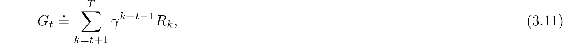

# 3.4  Unified Notation for Episodic and Continuing Tasks

In the preceding section we described two kinds of reinforcement learning tasks, one in which the agent–environment interaction naturally breaks down into a sequence of separate episodes (episodic tasks), and one in which it does not (continuing tasks). The former case is mathematically easier because each action affects only the finite number of rewards subsequently received during the episode. In this book we consider sometimes one kind of problem and sometimes the other, but often both. It is therefore useful to establish one notation that enables us to talk precisely about both cases simultaneously.

To be precise about episodic tasks requires some additional notation. Rather than one long sequence of time steps, we need to consider a series of episodes, each of which consists of a finite sequence of time steps. We number the time steps of each episode starting anew from zero. Therefore, we have to refer not just to *S**t*, the state representation at time *t*, but to *S**t, i*, the state representation at time *t* of episode *i* (and similarly for *A**t, i*, *R**t, i*, *π**t, i*, *T**i*, etc.). However, it turns out that when we discuss episodic tasks we almost never have to distinguish between different episodes. We are almost always considering a particular single episode, or stating something that is true for all episodes. Accordingly, in practice we almost always abuse notation slightly by dropping the explicit reference to episode number. That is, we write *S**t* to refer to *S**t, i*, and so on.

We need one other convention to obtain a single notation that covers both episodic and continuing tasks. We have defined the return as a sum over a finite number of terms in one case ([3.7](part0011_split_003.html#x1-30001r7)) and as a sum over an infinite number of terms in the other ([3.8](part0011_split_003.html#x1-30003r8)). These two can be unified by considering episode termination to be the entering of a special *absorbing state* that transitions only to itself and that generates only rewards of zero. For example, consider the state transition diagram:

Here the solid square represents the special absorbing state corresponding to the end of an episode. Starting from *S*0, we get the reward sequence +1, +1, +1, 0, 0, 0*, …*. Summing these, we get the same return whether we sum over the first *T* rewards (here *T* = 3) or over the full infinite sequence. This remains true even if we introduce discounting. Thus, we can define the return, in general, according to ([3.8](part0011_split_003.html#x1-30003r8)), using the convention of omitting episode numbers when they are not needed, and including the possibility that *γ* = 1 if the sum remains defined (e.g., because all episodes terminate). Alternatively, we can write

including the possibility that *T* = ∞ or *γ* = 1 (but not both). We use these conventions throughout the rest of the book to simplify notation and to express the close parallels between episodic and continuing tasks. (Later, in Chapter 10, we will introduce a formulation that is both continuing and undiscounted.)
