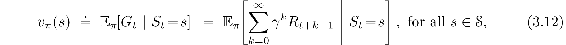
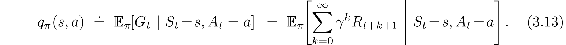
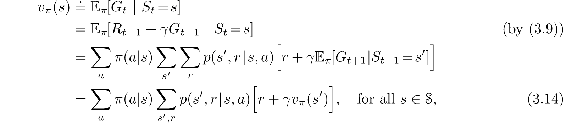
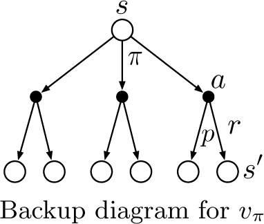
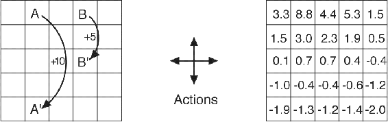
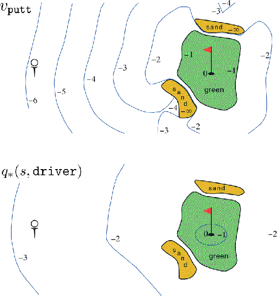
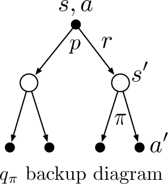

# 3.5  Policies and Value Functions

Almost all reinforcement learning algorithms involve estimating *value functions*—functions of states (or of state–action pairs) that estimate *how good* it is for the agent to be in a given state (or how good it is to perform a given action in a given state). The notion of “how good” here is defined in terms of future rewards that can be expected, or, to be precise, in terms of expected return. Of course the rewards the agent can expect to receive in the future depend on what actions it will take. Accordingly, value functions are defined with respect to particular ways of acting, called policies.

Formally, a *policy* is a mapping from states to probabilities of selecting each possible action. If the agent is following policy *π* at time *t*, then *π*(*a*|*s*) is the probability that *A**t* = *a* if *S**t* = *s*. Like *p*, *π* is an ordinary function; the “|” in the middle of *π*(*a*|*s*) merely reminds that it defines a probability distribution over *a* ∈ 𝒜(*s*) for each *s* ∈ 𝒮. Reinforcement learning methods specify how the agent’s policy is changed as a result of its experience.

*Exercise 3.11* If the current state is *S**t*, and actions are selected according to stochastic policy *π*, then what is the expectation of *R**t*+1 in terms of *π* and the four-argument function *p* ([3.2](part0011_split_001.html#x1-28007r2))?

□

The *value function* of a state *s* under a policy *π*, denoted *vπ*(*s*), is the expected return when starting in *s* and following *π* thereafter. For MDPs, we can define *vπ* formally by

where 𝔼*π* [·] denotes the expected value of a random variable given that the agent follows policy *π*, and *t* is any time step. Note that the value of the terminal state, if any, is always zero. We call the function *vπ* the *state-value function for policy π*.

Similarly, we define the value of taking action *a* in state *s* under a policy *π*, denoted *qπ*(*s, a*), as the expected return starting from *s*, taking the action *a*, and thereafter following policy *π*:

We call *qπ* the *action-value function for policy π*.

*Exercise 3.12* Give an equation for *vπ* in terms of *qπ* and *π*.

□

*Exercise 3.13* Give an equation for *qπ* in terms of *vπ* and the four-argument *p*.

□

The value functions *vπ* and *qπ* can be estimated from experience. For example, if an agent follows policy *π* and maintains an average, for each state encountered, of the actual returns that have followed that state, then the average will converge to the state’s value, *vπ*(*s*), as the number of times that state is encountered approaches infinity. If separate averages are kept for each action taken in each state, then these averages will similarly converge to the action values, *qπ*(*s, a*). We call estimation methods of this kind *Monte Carlo methods* because they involve averaging over many random samples of actual returns. These kinds of methods are presented in Chapter 5. Of course, if there are very many states, then it may not be practical to keep separate averages for each state individually. Instead, the agent would have to maintain *vπ* and *qπ* as parameterized functions (with fewer parameters than states) and adjust the parameters to better match the observed returns. This can also produce accurate estimates, although much depends on the nature of the parameterized function approximator. These possibilities are discussed in Part II of the book.

A fundamental property of value functions used throughout reinforcement learning and dynamic programming is that they satisfy recursive relationships similar to that which we have already established for the return ([3.9](part0011_split_003.html#x1-30004r9)). For any policy *π* and any state *s*, the following consistency condition holds between the value of *s* and the value of its possible successor states:

where it is implicit that the actions, *a*, are taken from the set 𝒜(*s*), that the next states, *s*′, are taken from the set 𝒮 (or from 𝒮+ in the case of an episodic problem), and that the rewards, *r*, are taken from the set ℛ. Note also how in the last equation we have merged the two sums, one over all the values of *s*′ and the other over all the values of *r*, into one sum over all the possible values of both. We use this kind of merged sum often to simplify formulas. Note how the final expression can be read easily as an expected value. It is really a sum over all values of the three variables, *a*, *s*′, and *r*. For each triple, we compute its probability, *π*(*a*|*s*)*p*(*s*′*, r* | *s, a*), weight the quantity in brackets by that probability, then sum over all possibilities to get an expected value.

Equation ([3.14](part0011_split_005.html#x1-32005r14)) is the *Bellman equation for vπ*. It expresses a relationship between the value of a state and the values of its successor states. Think of looking ahead from a state to its possible successor states, as suggested by the diagram to the right. Each open circle represents a state and each solid circle represents a state–action pair. Starting from state *s*, the root node at the top, the agent could take any of some set of actions—three are shown in the diagram—based on its policy *π*. From each of these, the environment could respond with one of several next states, *s*′ (two are shown in the figure), along with a reward, *r*, depending on its dynamics given by the function *p*. The Bellman equation ([3.14](part0011_split_005.html#x1-32005r14)) averages over all the possibilities, weighting each by its probability of occurring. It states that the value of the start state must equal the (discounted) value of the expected next state, plus the reward expected along the way.

The value function *vπ* is the unique solution to its Bellman equation. We show in subsequent chapters how this Bellman equation forms the basis of a number of ways to compute, approximate, and learn *vπ*. We call diagrams like that above *backup diagrams* because they diagram relationships that form the basis of the update or *backup* operations that are at the heart of reinforcement learning methods. These operations transfer value information *back* to a state (or a state–action pair) from its successor states (or state–action pairs). We use backup diagrams throughout the book to provide graphical summaries of the algorithms we discuss. (Note that, unlike transition graphs, the state nodes of backup diagrams do not necessarily represent distinct states; for example, a state might be its own successor.)

**Example 3.5: Gridworld** [Figure 3.2](part0011_split_005.html#fig3-2) (left) shows a rectangular gridworld representation of a simple finite MDP. The cells of the grid correspond to the states of the environment. At each cell, four actions are possible: north, south, east, and west, which deterministically cause the agent to move one cell in the respective direction on the grid. Actions that would take the agent off the grid leave its location unchanged, but also result in a reward of −1. Other actions result in a reward of 0, except those that move the agent out of the special states `A` and `B`. From state `A`, all four actions yield a reward of +10 and take the agent to `A′`. From state `B`, all actions yield a reward of +5 and take the agent to `B′`.

[Figure 3.2](part0011_split_005.html#C_fig3-2): Gridworld example: exceptional reward dynamics (left) and state-value function for the equiprobable random policy (right).

Suppose the agent selects all four actions with equal probability in all states. [Figure 3.2](part0011_split_005.html#fig3-2) (right) shows the value function, *vπ*, for this policy, for the discounted reward case with *γ* = 0.9. This value function was computed by solving the system of linear equations ([3.14](part0011_split_005.html#x1-32005r14)). Notice the negative values near the lower edge; these are the result of the high probability of hitting the edge of the grid there under the random policy. State `A` is the best state to be in under this policy, but its expected return is less than 10, its immediate reward, because from `A` the agent is taken to `A′`, from which it is likely to run into the edge of the grid. State `B`, on the other hand, is valued more than 5, its immediate reward, because from `B` the agent is taken to `B′`, which has a positive value. From `B′` the expected penalty (negative reward) for possibly running into an edge is more than compensated for by the expected gain for possibly stumbling onto `A` or `B`.

■

*Exercise 3.14* The Bellman equation ([3.14](part0011_split_005.html#x1-32005r14)) must hold for each state for the value function *vπ* shown in [Figure 3.2](part0011_split_005.html#fig3-2) (right) of [Example 3.5](part0011_split_005.html#sec1-22) . Show numerically that this equation holds for the center state, valued at +0.7, with respect to its four neighboring states, valued at +2.3, +0.4, −0.4, and +0.7. (These numbers are accurate only to one decimal place.)

□

*Exercise 3.15* In the gridworld example, rewards are positive for goals, negative for running into the edge of the world, and zero the rest of the time. Are the signs of these rewards important, or only the intervals between them? Prove, using ([3.8](part0011_split_003.html#x1-30003r8)), that adding a constant *c* to all the rewards adds a constant, *v**c*, to the values of all states, and thus does not affect the relative values of any states under any policies. What is *v**c* in terms of *c* and *γ*?

□

*Exercise 3.16* Now consider adding a constant *c* to all the rewards in an episodic task, such as maze running. Would this have any effect, or would it leave the task unchanged as in the continuing task above? Why or why not? Give an example.

□

**Example 3.6: Golf** To formulate playing a hole of golf as a reinforcement learning task, we count a penalty (negative reward) of −1 for each stroke until we hit the ball into the hole. The state is the location of the ball. The value of a state is the negative of the number of strokes to the hole from that location. Our actions are how we aim and swing at the ball, of course, and which club we select. Let us take the former as given and consider just the choice of club, which we assume is either a putter or a driver. The upper part of [Figure 3.3](part0011_split_005.html#fig3-3) shows a possible state-value function, *v*putt(*s*), for the policy that always uses the putter. The terminal state *in-the-hole* has a value of 0. From anywhere on the green we assume we can make a putt; these states have value −1. Off the green we cannot reach the hole by putting, and the value is greater. If we can reach the green from a state by putting, then that state must have value one less than the green’s value, that is, −2. For simplicity, let us assume we can putt very precisely and deterministically, but with a limited range. This gives us the sharp contour line labeled −2 in the figure; all locations between that line and the green require exactly two strokes to complete the hole. Similarly, any location within putting range of the −2 contour line must have a value of −3, and so on to get all the contour lines shown in the figure. Putting doesn’t get us out of sand traps, so they have a value of −∞. Overall, it takes us six strokes to get from the tee to the hole by putting.

[Figure 3.3](part0011_split_005.html#C_fig3-3): A golf example: the state-value function for putting (upper) and the optimal action-value function for using the driver (lower).

■

*Exercise 3.17* What is the Bellman equation for action values, that is, for *qπ*? It must give the action value *qπ*(*s, a*) in terms of the action values, *qπ*(*s*′*, a*′), of possible successors to the state–action pair (*s, a*). Hint: the backup diagram to the right corresponds to this equation. Show the sequence of equations analogous to ([3.14](part0011_split_005.html#x1-32005r14)), but for action values.

□

*Exercise 3.18* The value of a state depends on the values of the actions possible in that state and on how likely each action is to be taken under the current policy. We can think of this in terms of a small backup diagram rooted at the state and considering each possible action:

Give the equation corresponding to this intuition and diagram for the value at the root node, *vπ*(*s*), in terms of the value at the expected leaf node, *qπ*(*s, a*), given *S**t* = *s*. This equation should include an expectation conditioned on following the policy, *π*. Then give a second equation in which the expected value is written out explicitly in terms of *π*(*a*|*s*) such that no expected value notation appears in the equation.

□

*Exercise 3.19* The value of an action, *qπ*(*s, a*), depends on the expected next reward and the expected sum of the remaining rewards. Again we can think of this in terms of a small backup diagram, this one rooted at an action (state–action pair) and branching to the possible next states:

Give the equation corresponding to this intuition and diagram for the action value, *q**π*(*s, a*), in terms of the expected next reward, *R**t*+1, and the expected next state value, *vπ*(*S**t*+1), given that *S**t* = *s* and *A**t* = *a*. This equation should include an expectation but *not* one conditioned on following the policy. Then give a second equation, writing out the expected value explicitly in terms of *p*(*s*′*, r* | *s, a*) defined by ([3.2](part0011_split_001.html#x1-28007r2)), such that no expected value notation appears in the equation.

□
