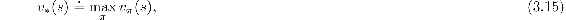
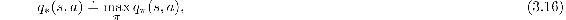
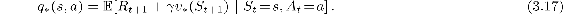
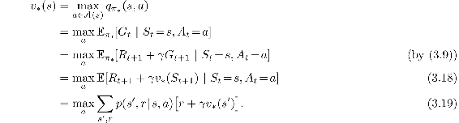
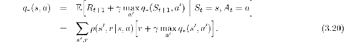
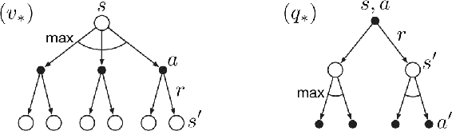
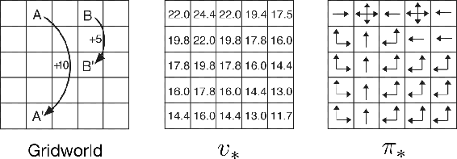
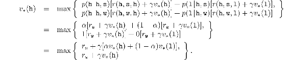
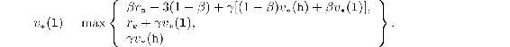
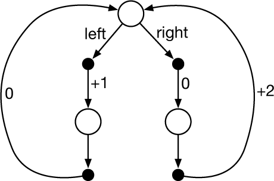

# 3.6  Optimal Policies and Optimal Value Functions

Solving a reinforcement learning task means, roughly, finding a policy that achieves a lot of reward over the long run. For finite MDPs, we can precisely define an optimal policy in the following way. Value functions define a partial ordering over policies. A policy *π* is defined to be better than or equal to a policy *π*′ if its expected return is greater than or equal to that of *π*′ for all states. In other words, *π* ≥ *π*′ if and only if *vπ*(*s*) ≥ *v**π*′(*s*) for all *s* ∈ 𝒮. There is always at least one policy that is better than or equal to all other policies. This is an *optimal policy*. Although there may be more than one, we denote all the optimal policies by *π*\*. They share the same state-value function, called the *optimal state-value function*, denoted *v*\*, and defined as

for all *s* ∈ 𝒮.

Optimal policies also share the same *optimal action-value function*, denoted *q*\*, and defined as

for all *s* ∈ 𝒮 and *a* ∈ 𝒜(*s*). For the state–action pair (*s, a*), this function gives the expected return for taking action *a* in state *s* and thereafter following an optimal policy. Thus, we can write *q*\* in terms of *v*\* as follows:

**Example 3.7: Optimal Value Functions for Golf** The lower part of [Figure 3.3](part0011_split_005.html#fig3-3) shows the contours of a possible optimal action-value function *q*\*(*s,* driver). These are the values of each state if we first play a stroke with the driver and afterward select either the driver or the putter, whichever is better. The driver enables us to hit the ball farther, but with less accuracy. We can reach the hole in one shot using the driver only if we are already very close; thus the −1 contour for *q*\*(*s,* driver) covers only a small portion of the green. If we have two strokes, however, then we can reach the hole from much farther away, as shown by the −2 contour. In this case we don’t have to drive all the way to within the small −1 contour, but only to anywhere on the green; from there we can use the putter. The optimal action-value function gives the values after committing to a particular *first* action, in this case, to the driver, but afterward using whichever actions are best. The −3 contour is still farther out and includes the starting tee. From the tee, the best sequence of actions is two drives and one putt, sinking the ball in three strokes.

■

Because *v*\* is the value function for a policy, it must satisfy the self-consistency condition given by the Bellman equation for state values ([3.14](part0011_split_005.html#x1-32005r14)). Because it is the optimal value function, however, *v*\*’s consistency condition can be written in a special form without reference to any specific policy. This is the Bellman equation for *v*\*, or the *Bellman optimality equation*. Intuitively, the Bellman optimality equation expresses the fact that the value of a state under an optimal policy must equal the expected return for the best action from that state:

The last two equations are two forms of the Bellman optimality equation for *v*\*. The Bellman optimality equation for *q*\* is

The backup diagrams in the figure below show graphically the spans of future states and actions considered in the Bellman optimality equations for *v*\* and *q*\*. These are the same as the backup diagrams for *vπ* and *qπ* presented earlier except that arcs have been added at the agent’s choice points to represent that the maximum over that choice is taken rather than the expected value given some policy. The backup diagram on the left graphically represents the Bellman optimality equation ([3.19](part0011_split_006.html#x1-33007r19)) and the backup diagram on the right graphically represents (3.20).

Figure 3.4: Backup diagrams for *v*\* and *q*\*

For finite MDPs, the Bellman optimality equation for *vπ* ([3.19](part0011_split_006.html#x1-33007r19)) has a unique solution independent of the policy. The Bellman optimality equation is actually a system of equations, one for each state, so if there are *n* states, then there are *n* equations in *n* unknowns. If the dynamics *p* of the environment are known, then in principle one can solve this system of equations for *v*\* using any one of a variety of methods for solving systems of nonlinear equations. One can solve a related set of equations for *q*\*.

Once one has *v*\*, it is relatively easy to determine an optimal policy. For each state *s*, there will be one or more actions at which the maximum is obtained in the Bellman optimality equation. Any policy that assigns nonzero probability only to these actions is an optimal policy. You can think of this as a one-step search. If you have the optimal value function, *v*\*, then the actions that appear best after a one-step search will be optimal actions. Another way of saying this is that any policy that is *greedy* with respect to the optimal evaluation function *v*\* is an optimal policy. The term greedy is used in computer science to describe any search or decision procedure that selects alternatives based only on local or immediate considerations, without considering the possibility that such a selection may prevent future access to even better alternatives. Consequently, it describes policies that select actions based only on their short-term consequences. The beauty of *v*\* is that if one uses it to evaluate the short-term consequences of actions—specifically, the one-step consequences—then a greedy policy is actually optimal in the long-term sense in which we are interested because *v*\* already takes into account the reward consequences of all possible future behavior. By means of *v*\*, the optimal expected long-term return is turned into a quantity that is locally and immediately available for each state. Hence, a one-step-ahead search yields the long-term optimal actions.

Having *q*\* makes choosing optimal actions even easier. With *q*\*, the agent does not even have to do a one-step-ahead search: for any state *s*, it can simply find any action that maximizes *q*\*(*s, a*). The action-value function effectively caches the results of all one-step-ahead searches. It provides the optimal expected long-term return as a value that is locally and immediately available for each state–action pair. Hence, at the cost of representing a function of state–action pairs, instead of just of states, the optimal action-value function allows optimal actions to be selected without having to know anything about possible successor states and their values, that is, without having to know anything about the environment’s dynamics.

**Example 3.8: Solving the Gridworld** Suppose we solve the Bellman equation for *v*\* for the simple grid task introduced in [Example 3.5](part0011_split_005.html#sec1-22)  and shown again in [Figure 3.5](part0011_split_006.html#fig3-5) (left). Recall that state `A` is followed by a reward of +10 and transition to state `A′`, while state `B` is followed by a reward of +5 and transition to state `B′`. [Figure 3.5](part0011_split_006.html#fig3-5) (middle) shows the optimal value function, and [Figure 3.5](part0011_split_006.html#fig3-5) (right) shows the corresponding optimal policies. Where there are multiple arrows in a cell, all of the corresponding actions are optimal.

[Figure 3.5](part0011_split_006.html#C_fig3-5): Optimal solutions to the gridworld example.

■

**Example 3.9: Bellman Optimality Equations for the Recycling Robot** Using ([3.19](part0011_split_006.html#x1-33007r19)), we can explicitly give the Bellman optimality equation for the recycling robot example. To make things more compact, we abbreviate the states high and low, and the actions search, wait, and recharge respectively by h, l, s, w, and re. Because there are only two states, the Bellman optimality equation consists of two equations. The equation for *v*\*(h) can be written as follows:

Following the same procedure for *v*\*(l) yields the equation

For any choice of *r*s, *r*w, *α*, *β*, and *γ*, with 0 ≤ *γ <* 1, 0 ≤ *α, β* ≤ 1, there is exactly one pair of numbers, *v*\*(h) and *v*\*(l), that simultaneously satisfy these two nonlinear equations.

■

Explicitly solving the Bellman optimality equation provides one route to finding an optimal policy, and thus to solving the reinforcement learning problem. However, this solution is rarely directly useful. It is akin to an exhaustive search, looking ahead at all possibilities, computing their probabilities of occurrence and their desirabilities in terms of expected rewards. This solution relies on at least three assumptions that are rarely true in practice: (1) we accurately know the dynamics of the environment; (2) we have enough computational resources to complete the computation of the solution; and (3) the Markov property. For the kinds of tasks in which we are interested, one is generally not able to implement this solution exactly because various combinations of these assumptions are violated. For example, although the first and third assumptions present no problems for the game of backgammon, the second is a major impediment. Because the game has about 1020 states, it would take thousands of years on today’s fastest computers to solve the Bellman equation for *v*\*, and the same is true for finding *q*\*. In reinforcement learning one typically has to settle for approximate solutions.

Many different decision-making methods can be viewed as ways of approximately solving the Bellman optimality equation. For example, heuristic search methods can be viewed as expanding the right-hand side of ([3.19](part0011_split_006.html#x1-33007r19)) several times, up to some depth, forming a “tree” of possibilities, and then using a heuristic evaluation function to approximate *v*\* at the “leaf” nodes. (Heuristic search methods such as A\* are almost always based on the episodic case.) The methods of dynamic programming can be related even more closely to the Bellman optimality equation. Many reinforcement learning methods can be clearly understood as approximately solving the Bellman optimality equation, using actual experienced transitions in place of knowledge of the expected transitions. We consider a variety of such methods in the following chapters.

*Exercise 3.20* Draw or describe the optimal state-value function for the golf example.

□

*Exercise 3.21* Draw or describe the contours of the optimal action-value function for putting, *q*\*(*s,* putter), for the golf example.

□

*Exercise 3.22* Consider the continuing MDP shown on to the right. The only decision to be made is that in the top state, where two actions are available, `left` and `right`. The numbers show the rewards that are received deterministically after each action. There are exactly two deterministic policies, *π*`left` and *π*`right`. What policy is optimal if *γ* = 0? If *γ* = 0.9? If *γ* = 0.5?

□

*Exercise 3.23* Give the Bellman equation for *q*\* for the recycling robot.

□

*Exercise 3.24* [Figure 3.5](part0011_split_006.html#fig3-5) gives the optimal value of the best state of the gridworld as 24.4, to one decimal place. Use your knowledge of the optimal policy and ([3.8](part0011_split_003.html#x1-30003r8)) to express this value symbolically, and then to compute it to three decimal places.

□

*Exercise 3.25* Give an equation for *v*\* in terms of *q*\*.

□

*Exercise 3.26* Give an equation for *q*\* in terms of *v*\* and the four-argument *p*.

□

*Exercise 3.27* Give an equation for *π*\* in terms of *q*\*.

□

*Exercise 3.28* Give an equation for *π*\* in terms of *v*\* and the four-argument *p*.

□

*Exercise 3.29* Rewrite the four Bellman equations for the four value functions (*vπ*, *v*\*, *qπ*, and *q*\*) in terms of the three argument function *p* ([3.4](part0011_split_001.html#x1-28009r4)) and the two-argument function *r* ([3.5](part0011_split_001.html#x1-28010r5)).

□
