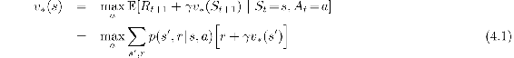
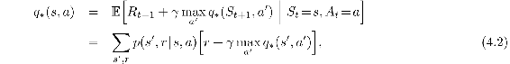

# Chapter 4

# Dynamic Programming

The term dynamic programming (DP) refers to a collection of algorithms that can be used to compute optimal policies given a perfect model of the environment as a Markov decision process (MDP). Classical DP algorithms are of limited utility in reinforcement learning both because of their assumption of a perfect model and because of their great computational expense, but they are still important theoretically. DP provides an essential foundation for the understanding of the methods presented in the rest of this book. In fact, all of these methods can be viewed as attempts to achieve much the same effect as DP, only with less computation and without assuming a perfect model of the environment.

Starting with this chapter, we usually assume that the environment is a finite MDP. That is, we assume that its state, action, and reward sets, 𝒮, 𝒜, and ℛ, are finite, and that its dynamics are given by a set of probabilities *p*(*s*′*, r* | *s, a*), for all *s* ∈ 𝒮, *a* ∈ 𝒜(*s*), *r* ∈ ℛ, and *s*′ ∈ 𝒮+ (𝒮+ is 𝒮 plus a terminal state if the problem is episodic). Although DP ideas can be applied to problems with continuous state and action spaces, exact solutions are possible only in special cases. A common way of obtaining approximate solutions for tasks with continuous states and actions is to quantize the state and action spaces and then apply finite-state DP methods. The methods we explore in Chapter 9 are applicable to continuous problems and are a significant extension of that approach.

The key idea of DP, and of reinforcement learning generally, is the use of value functions to organize and structure the search for good policies. In this chapter we show how DP can be used to compute the value functions defined in Chapter 3. As discussed there, we can easily obtain optimal policies once we have found the optimal value functions, *v*\* or *q*\*, which satisfy the Bellman optimality equations:

or

for all *s* ∈ 𝒮, *a* ∈ 𝒜(*s*), and *s*′ ∈ 𝒮+. As we shall see, DP algorithms are obtained by turning Bellman equations such as these into assignments, that is, into update rules for improving approximations of the desired value functions.
