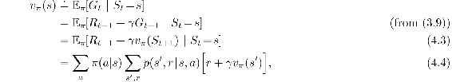
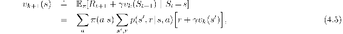
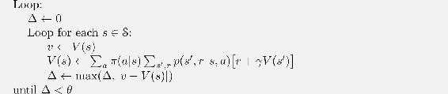
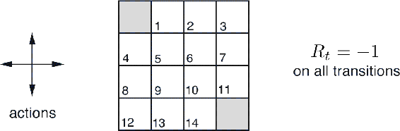
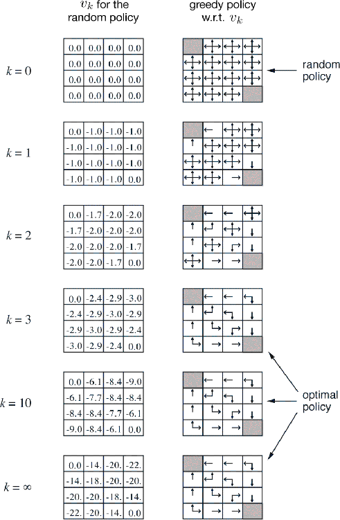

# 4.1  Policy Evaluation (Prediction)

First we consider how to compute the state-value function *vπ* for an arbitrary policy *π*. This is called *policy evaluation* in the DP literature. We also refer to it as the *prediction problem*. Recall from Chapter 3 that, for all *s* ∈ 𝒮,

where *π*(*a*|*s*) is the probability of taking action *a* in state *s* under policy *π*, and the expectations are subscripted by *π* to indicate that they are conditional on *π* being followed. The existence and uniqueness of *vπ* are guaranteed as long as either *γ <* 1 or eventual termination is guaranteed from all states under the policy *π*.

If the environment’s dynamics are completely known, then ([4.4](part0012_split_001.html#x1-38004r4)) is a system of |𝒮| simultaneous linear equations in |𝒮| unknowns (the *vπ*(*s*), *s* ∈ 𝒮). In principle, its solution is a straightforward, if tedious, computation. For our purposes, iterative solution methods are most suitable. Consider a sequence of approximate value functions *v*0*, v*1*, v*2*, …*, each mapping 𝒮+ to ℝ (the real numbers). The initial approximation, *v*0, is chosen arbitrarily (except that the terminal state, if any, must be given value 0), and each successive approximation is obtained by using the Bellman equation for *vπ* ([4.4](part0012_split_001.html#x1-38004r4)) as an update rule:

for all *s* ∈ 𝒮. Clearly, *v**k* = *vπ* is a fixed point for this update rule because the Bellman equation for *vπ* assures us of equality in this case. Indeed, the sequence {*v**k*} can be shown in general to converge to *vπ* as *k →* ∞ under the same conditions that guarantee the existence of *vπ*. This algorithm is called *iterative policy evaluation*.

To produce each successive approximation, *v**k*+1 from *v**k*, iterative policy evaluation applies the same operation to each state *s*: it replaces the old value of *s* with a new value obtained from the old values of the successor states of *s*, and the expected immediate rewards, along all the one-step transitions possible under the policy being evaluated. We call this kind of operation an *expected update*. Each iteration of iterative policy evaluation updates the value of every state once to produce the new approximate value function *v**k*+1. There are several different kinds of expected updates, depending on whether a state (as here) or a state–action pair is being updated, and depending on the precise way the estimated values of the successor states are combined. All the updates done in DP algorithms are called *expected* updates because they are based on an expectation over all possible next states rather than on a sample next state. The nature of an update can be expressed in an equation, as above, or in a backup diagram like those introduced in Chapter 3. For example, the backup diagram corresponding to the expected update used in iterative policy evaluation is shown on page 59.

To write a sequential computer program to implement iterative policy evaluation as given by (4.5) you would have to use two arrays, one for the old values, *v**k*(*s*), and one for the new values, *v**k*+1(*s*). With two arrays, the new values can be computed one by one from the old values without the old values being changed. Of course it is easier to use one array and update the values “in place,” that is, with each new value immediately overwriting the old one. Then, depending on the order in which the states are updated, sometimes new values are used instead of old ones on the right-hand side of (4.5). This in-place algorithm also converges to *vπ*; in fact, it usually converges faster than the two-array version, as you might expect, because it uses new data as soon as they are available. We think of the updates as being done in a *sweep* through the state space. For the in-place algorithm, the order in which states have their values updated during the sweep has a significant influence on the rate of convergence. We usually have the in-place version in mind when we think of DP algorithms.

A complete in-place version of iterative policy evaluation is shown in pseudocode in the box below. Note how it handles termination. Formally, iterative policy evaluation converges only in the limit, but in practice it must be halted short of this. The pseudocode tests the quantity max*s*∈𝒮 |*v**k*+1(*s*) − *v**k*(*s*)| after each sweep and stops when it is sufficiently small.

**Iterative Policy Evaluation, for estimating *V*≈ *vπ***

Input *π*, the policy to be evaluated

Algorithm parameter: a small threshold *θ >* 0 determining accuracy of estimation

Initialize *V*(*s*), for all *s* ∈ 𝒮+, arbitrarily except that *V*(*terminal*) = 0

**Example 4.1** Consider the 4 × 4 gridworld shown below.

The nonterminal states are 𝒮 = {1, 2*, …*, 14}. There are four actions possible in each state, 𝒜 = {up, down, right, left}, which deterministically cause the corresponding state transitions, except that actions that would take the agent off the grid in fact leave the state unchanged. Thus, for instance, *p*(6, − 1 | 5*, right*) = 1, *p*(7, − 1 | 7*, right*) = 1, and *p*(10*, r* | 5*, right*) = 0 for all *r* ∈ ℛ. This is an undiscounted, episodic task. The reward is − 1 on all transitions until the terminal state is reached. The terminal state is shaded in the figure (although it is shown in two places, it is formally one state). The expected reward function is thus *r*(*s, a, s*′) = −1 for all states *s, s*′ and actions *a*. Suppose the agent follows the equiprobable random policy (all actions equally likely). The left side of [Figure 4.1](part0012_split_001.html#fig4-1) shows the sequence of value functions {*v**k*} computed by iterative policy evaluation. The final estimate is in fact *vπ*, which in this case gives for each state the negation of the expected number of steps from that state until termination.

[Figure 4.1](part0012_split_001.html#C_fig4-1): Convergence of iterative policy evaluation on a small gridworld. The left column is the sequence of approximations of the state-value function for the random policy (all actions equally likely). The right column is the sequence of greedy policies corresponding to the value function estimates (arrows are shown for all actions achieving the maximum, and the numbers shown are rounded to two significant digits). The last policy is guaranteed only to be an improvement over the random policy, but in this case it, and all policies after the third iteration, are optimal.

■

*Exercise 4.1* In [Example 4.1](part0012_split_001.html#sec1-26), if *π* is the equiprobable random policy, what is *qπ*(11, down)? What is *qπ*(7, down)?

□

*Exercise 4.2* In [Example 4.1](part0012_split_001.html#sec1-26), suppose a new state 15 is added to the gridworld just below state 13, and its actions, left, up, right, and down, take the agent to states 12, 13, 14, and 15, respectively. Assume that the transitions *from* the original states are unchanged. What, then, is *vπ*(15) for the equiprobable random policy? Now suppose the dynamics of state 13 are also changed, such that action down from state 13 takes the agent to the new state 15. What is *vπ*(15) for the equiprobable random policy in this case?

□

*Exercise 4.3* What are the equations analogous to ([4.3](part0012_split_001.html#x1-38003r3)), ([4.4](part0012_split_001.html#x1-38004r4)), and ([4.5](part0012_split_001.html#x1-38005r5)) for the action-value function *qπ* and its successive approximation by a sequence of functions *q*0*, q*1, *q*2*, …*?

□
