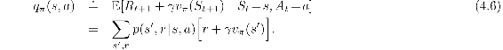
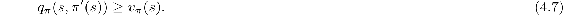
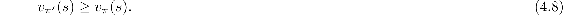
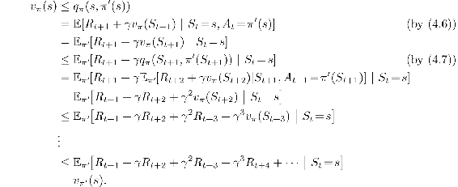
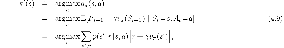
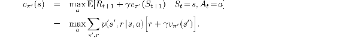

# 4.2  Policy Improvement

Our reason for computing the value function for a policy is to help find better policies. Suppose we have determined the value function *vπ* for an arbitrary deterministic policy *π*. For some state *s* we would like to know whether or not we should change the policy to deterministically choose an action *a* ≠ *π*(*s*). We know how good it is to follow the current policy from *s*—that is *vπ*(*s*)—but would it be better or worse to change to the new policy? One way to answer this question is to consider selecting *a* in *s* and thereafter following the existing policy, *π*. The value of this way of behaving is

The key criterion is whether this is greater than or less than *vπ*(*s*). If it is greater—that is, if it is better to select *a* once in *s* and thereafter follow *π* than it would be to follow *π* all the time—then one would expect it to be better still to select *a* every time *s* is encountered, and that the new policy would in fact be a better one overall.

That this is true is a special case of a general result called the *policy improvement theorem*. Let *π* and *π*′ be any pair of deterministic policies such that, for all *s* ∈ 𝒮,

Then the policy *π*′ must be as good as, or better than, *π*. That is, it must obtain greater or equal expected return from all states *s* ∈ 𝒮:

Moreover, if there is strict inequality of ([4.7](part0012_split_002.html#x1-39002r7)) at any state, then there must be strict inequality of ([4.8](part0012_split_002.html#x1-39003r8)) at at least one state. This result applies in particular to the two policies that we considered in the previous paragraph, an original deterministic policy, *π*, and a changed policy, *π*′, that is identical to *π* except that *π*′(*s*) = *a* ≠ *π*(*s*). Obviously, ([4.7](part0012_split_002.html#x1-39002r7)) holds at all states other than *s*. Thus, if *qπ*(*s, a*) *> vπ*(*s*), then the changed policy is indeed better than *π*.

The idea behind the proof of the policy improvement theorem is easy to understand. Starting from ([4.7](part0012_split_002.html#x1-39002r7)), we keep expanding the *qπ* side with (4.6) and reapplying ([4.7](part0012_split_002.html#x1-39002r7)) until we get *vπ*′(*s*):

So far we have seen how, given a policy and its value function, we can easily evaluate a change in the policy at a single state to a particular action. It is a natural extension to consider changes at *all* states and to *all* possible actions, selecting at each state the action that appears best according to *qπ*(*s, a*). In other words, to consider the new *greedy* policy, *π*′, given by

where arg max*a* denotes the value of *a* at which the expression that follows is maximized (with ties broken arbitrarily). The greedy policy takes the action that looks best in the short term—after one step of lookahead—according to *vπ*. By construction, the greedy policy meets the conditions of the policy improvement theorem ([4.7](part0012_split_002.html#x1-39002r7)), so we know that it is as good as, or better than, the original policy. The process of making a new policy that improves on an original policy, by making it greedy with respect to the value function of the original policy, is called *policy improvement*.

Suppose the new greedy policy, *π*′, is as good as, but not better than, the old policy *π*. Then *vπ* = *vπ′*, and from ([4.9](part0012_split_002.html#x1-39003r9)) it follows that for all *s* ∈ 𝒮:

But this is the same as the Bellman optimality equation ([4.1](part0012_split_000.html#x1-38004r1)), and therefore, *vπ′* must be *v*\*, and both *π* and *π*′ must be optimal policies. Policy improvement thus must give us a strictly better policy except when the original policy is already optimal.

So far in this section we have considered the special case of deterministic policies. In the general case, a stochastic policy *π* specifies probabilities, *π*(*a*|*s*), for taking each action, *a*, in each state, *s*. We will not go through the details, but in fact all the ideas of this section extend easily to stochastic policies. In particular, the policy improvement theorem carries through as stated for the stochastic case. In addition, if there are ties in policy improvement steps such as (4.9)—that is, if there are several actions at which the maximum is achieved—then in the stochastic case we need not select a single action from among them. Instead, each maximizing action can be given a portion of the probability of being selected in the new greedy policy. Any apportioning scheme is allowed as long as all submaximal actions are given zero probability.

The last row of [Figure 4.1](part0012_split_001.html#fig4-1) shows an example of policy improvement for stochastic policies. Here the original policy, *π*, is the equiprobable random policy, and the new policy, *π*′, is greedy with respect to *vπ*. The value function *vπ* is shown in the bottom-left diagram and the set of possible *π*′ is shown in the bottom-right diagram. The states with multiple arrows in the *π*′ diagram are those in which several actions achieve the maximum in (4.9); any apportionment of probability among these actions is permitted. The value function of any such policy, *vπ′*(*s*), can be seen by inspection to be either − 1, − 2, or − 3 at all states, *s* ∈ 𝒮, whereas *vπ*(*s*) is at most − 14. Thus, *vπ′*(*s*) ≥ *vπ*(*s*), for all *s* ∈ 𝒮, illustrating policy improvement. Although in this case the new policy *π*′ happens to be optimal, in general only an improvement is guaranteed.
