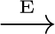
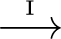
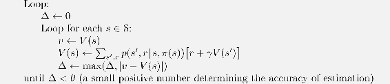
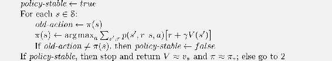
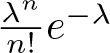
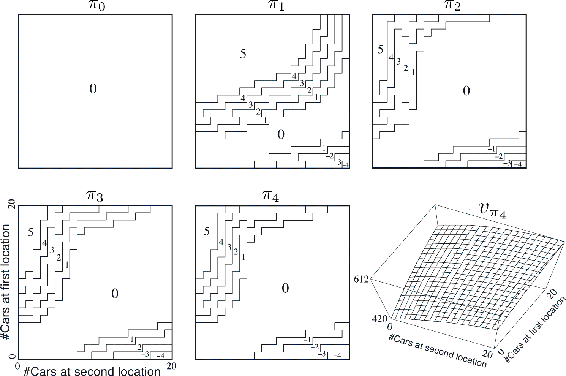

# 4.3  Policy Iteration

Once a policy, *π*, has been improved using *vπ* to yield a better policy, *π*′, we can then compute *vπ′* and improve it again to yield an even better *π*′′. We can thus obtain a sequence of monotonically improving policies and value functions:

where  denotes a policy *evaluation* and  denotes a policy *improvement*. Each policy is guaranteed to be a strict improvement over the previous one (unless it is already optimal). Because a finite MDP has only a finite number of policies, this process must converge to an optimal policy and optimal value function in a finite number of iterations.

This way of finding an optimal policy is called *policy iteration*. A complete algorithm is given in the box below. Note that each policy evaluation, itself an iterative computation, is started with the value function for the previous policy. This typically results in a great increase in the speed of convergence of policy evaluation (presumably because the value function changes little from one policy to the next).

**Policy Iteration (using iterative policy evaluation) for estimating *π* ≈ *π*\***

1. Initialization

*V*(*s*) ∈ ℝ and *π*(*s*) ∈ 𝒜(*s*) arbitrarily for all *s* ∈ 𝒮

2. Policy Evaluation

3. Policy Improvement

Jack manages two locations for a nationwide car rental company. Each day, some number of customers arrive at each location to rent cars. If Jack has a car available, he rents it out and is credited $10 by the national company. If he is out of cars at that location, then the business is lost. Cars become available for renting the day after they are returned. To help ensure that cars are available where they are needed, Jack can move them between the two locations overnight, at a cost of $2 per car moved. We assume that the number of cars requested and returned at each location are Poisson random variables, meaning that the probability that the number is *n* is , where *λ* is the expected number. Suppose *λ* is 3 and 4 for rental requests at the first and second locations and 3 and 2 for returns. To simplify the problem slightly, we assume that there can be no more than 20 cars at each location (any additional cars are returned to the nationwide company, and thus disappear from the problem) and a maximum of five cars can be moved from one location to the other in one night. We take the discount rate to be *γ* = 0.9 and formulate this as a continuing finite MDP, where the time steps are days, the state is the number of cars at each location at the end of the day, and the actions are the net numbers of cars moved between the two locations overnight. [Figure 4.2](part0012_split_003.html#fig4-2) shows the sequence of policies found by policy iteration starting from the policy that never moves any cars. Policy iteration often converges in surprisingly few iterations, as the example of Jack’s car rental illustrates, and as is also illustrated by the example in [Figure 4.1](part0012_split_001.html#fig4-1). The bottom-left diagram of [Figure 4.1](part0012_split_001.html#fig4-1) shows the value function for the equiprobable random policy, and the bottom-right diagram shows a greedy policy for this value function. The policy improvement theorem assures us that these policies are better than the original random policy. In this case, however, these policies are not just better, but optimal, proceeding to the terminal states in the minimum number of steps. In this example, policy iteration would find the optimal policy after just one iteration.

[Figure 4.2](part0012_split_003.html#C_fig4-2): The sequence of policies found by policy iteration on Jack’s car rental problem, and the final state-value function. The first five diagrams show, for each number of cars at each location at the end of the day, the number of cars to be moved from the first location to the second (negative numbers indicate transfers from the second location to the first). Each successive policy is a strict improvement over the previous policy, and the last policy is optimal.

■

*Exercise 4.4* The policy iteration algorithm on page 80 has a subtle bug in that it may never terminate if the policy continually switches between two or more policies that are equally good. This is ok for pedagogy, but not for actual use. Modify the pseudocode so that convergence is guaranteed.

□

*Exercise 4.5* How would policy iteration be defined for action values? Give a complete algorithm for computing *q*\*, analogous to that on page 80 for computing *v*\*. Please pay special attention to this exercise, because the ideas involved will be used throughout the rest of the book.

□

*Exercise 4.6* Suppose you are restricted to considering only policies that are *ε-soft*, meaning that the probability of selecting each action in each state, *s*, is at least *ε/*|𝒜(*s*)|. Describe qualitatively the changes that would be required in each of the steps 3, 2, and 1, in that order, of the policy iteration algorithm for *v*\* on page 80.

□

*Exercise 4.7 (programming)* Write a program for policy iteration and re-solve Jack’s car rental problem with the following changes. One of Jack’s employees at the first location rides a bus home each night and lives near the second location. She is happy to shuttle one car to the second location for free. Each additional car still costs $2, as do all cars moved in the other direction. In addition, Jack has limited parking space at each location. If more than 10 cars are kept overnight at a location (after any moving of cars), then an additional cost of $4 must be incurred to use a second parking lot (independent of how many cars are kept there). These sorts of nonlinearities and arbitrary dynamics often occur in real problems and cannot easily be handled by optimization methods other than dynamic programming. To check your program, first replicate the results given for the original problem.

□
