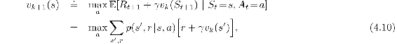
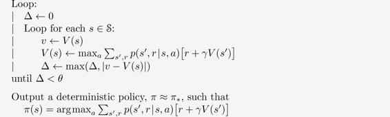
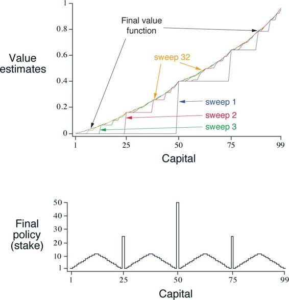

# 4.4  Value Iteration

One drawback to policy iteration is that each of its iterations involves policy evaluation, which may itself be a protracted iterative computation requiring multiple sweeps through the state set. If policy evaluation is done iteratively, then convergence exactly to *vπ* occurs only in the limit. Must we wait for exact convergence, or can we stop short of that? The example in [Figure 4.1](part0012_split_001.html#fig4-1) certainly suggests that it may be possible to truncate policy evaluation. In that example, policy evaluation iterations beyond the first three have no effect on the corresponding greedy policy.

In fact, the policy evaluation step of policy iteration can be truncated in several ways without losing the convergence guarantees of policy iteration. One important special case is when policy evaluation is stopped after just one sweep (one update of each state). This algorithm is called *value iteration*. It can be written as a particularly simple update operation that combines the policy improvement and truncated policy evaluation steps:

for all *s* ∈ 𝒮. For arbitrary *v*0, the sequence {*v**k*} can be shown to converge to *v*\* under the same conditions that guarantee the existence of *v*\*.

Another way of understanding value iteration is by reference to the Bellman optimality equation ([4.1](part0012_split_000.html#x1-38004r1)). Note that value iteration is obtained simply by turning the Bellman optimality equation into an update rule. Also note how the value iteration update is identical to the policy evaluation update (4.5) except that it requires the maximum to be taken over all actions. Another way of seeing this close relationship is to compare the backup diagrams for these algorithms on page 59 (policy evaluation) and on the left of [Figure 3.4](part0011_split_006.html#fig3-4) (value iteration). These two are the natural backup operations for computing *vπ* and *v*\*.

Finally, let us consider how value iteration terminates. Like policy evaluation, value iteration formally requires an infinite number of iterations to converge exactly to *v*\*. In practice, we stop once the value function changes by only a small amount in a sweep. The box below shows a complete algorithm with this kind of termination condition.

**Value Iteration, for estimating *π* ≈ *π*\***

Algorithm parameter: a small threshold *θ >* 0 determining accuracy of estimation

Initialize *V*(*s*), for all *s* ∈ 𝒮+, arbitrarily except that *V*(*terminal*) = 0

Value iteration effectively combines, in each of its sweeps, one sweep of policy evaluation and one sweep of policy improvement. Faster convergence is often achieved by interposing multiple policy evaluation sweeps between each policy improvement sweep. In general, the entire class of truncated policy iteration algorithms can be thought of as sequences of sweeps, some of which use policy evaluation updates and some of which use value iteration updates. Because the max operation in (4.10) is the only difference between these updates, this just means that the max operation is added to some sweeps of policy evaluation. All of these algorithms converge to an optimal policy for discounted finite MDPs.

**Example 4.2: Gambler’s Problem** A gambler has the opportunity to make bets on the outcomes of a sequence of coin flips. If the coin comes up heads, he wins as many dollars as he has staked on that flip; if it is tails, he loses his stake. The game ends when the gambler wins by reaching his goal of $100, or loses by running out of money. On each flip, the gambler must decide what portion of his capital to stake, in integer numbers of dollars. This problem can be formulated as an undiscounted, episodic, finite MDP. The state is the gambler’s capital, *s* ∈ {1, 2*, …*, 99} and the actions are stakes, *a* ∈ {0, 1*, …*, min(*s,* 100 − *s*)}. The reward is zero on all transitions except those on which the gambler reaches his goal, when it is +1. The state-value function then gives the probability of winning from each state. A policy is a mapping from levels of capital to stakes. The optimal policy maximizes the probability of reaching the goal. Let *p**h* denote the probability of the coin coming up heads. If *p**h* is known, then the entire problem is known and it can be solved, for instance, by value iteration. [Figure 4.3](part0012_split_004.html#fig4-3) shows the change in the value function over successive sweeps of value iteration, and the final policy found, for the case of *p**h* = 0.4. This policy is optimal, but not unique. In fact, there is a whole family of optimal policies, all corresponding to ties for the argmax action selection with respect to the optimal value function. Can you guess what the entire family looks like?

[Figure 4.3](part0012_split_004.html#C_fig4-3): The solution to the gambler’s problem for *p**h* = 0.4. The upper graph shows the value function found by successive sweeps of value iteration. The lower graph shows the final policy.

■

*Exercise 4.8* Why does the optimal policy for the gambler’s problem have such a curious form? In particular, for capital of 50 it bets it all on one flip, but for capital of 51 it does not. Why is this a good policy?

□

*Exercise 4.9 (programming)* Implement value iteration for the gambler’s problem and solve it for *p**h* = 0.25 and *p**h* = 0.55. In programming, you may find it convenient to introduce two dummy states corresponding to termination with capital of 0 and 100, giving them values of 0 and 1 respectively. Show your results graphically, as in [Figure 4.3](part0012_split_004.html#fig4-3). Are your results stable as *θ →* 0?

□

*Exercise 4.10* What is the analog of the value iteration update ([4.10](part0012_split_004.html#x1-39004r10)) for action values, *q**k*+1(*s, a*)?

□
