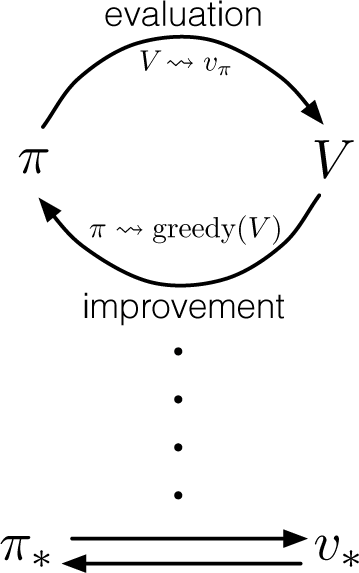
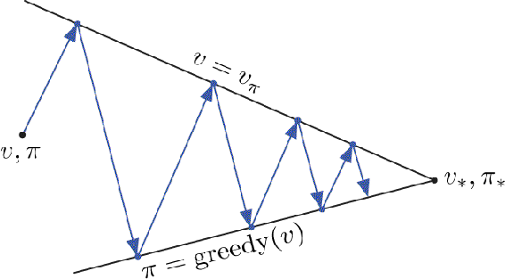

# 4.6  Generalized Policy Iteration

Policy iteration consists of two simultaneous, interacting processes, one making the value function consistent with the current policy (policy evaluation), and the other making the policy greedy with respect to the current value function (policy improvement). In policy iteration, these two processes alternate, each completing before the other begins, but this is not really necessary. In value iteration, for example, only a single iteration of policy evaluation is performed in between each policy improvement. In asynchronous DP methods, the evaluation and improvement processes are interleaved at an even finer grain. In some cases a single state is updated in one process before returning to the other. As long as both processes continue to update all states, the ultimate result is typically the same—convergence to the optimal value function and an optimal policy.

We use the term *generalized policy iteration* (GPI) to refer to the general idea of letting policy-evaluation and policy-improvement processes interact, independent of the granularity and other details of the two processes. Almost all reinforcement learning methods are well described as GPI. That is, all have identifiable policies and value functions, with the policy always being improved with respect to the value function and the value function always being driven toward the value function for the policy, as suggested by the diagram to the right. It is easy to see that if both the evaluation process and the improvement process stabilize, that is, no longer produce changes, then the value function and policy must be optimal. The value function stabilizes only when it is consistent with the current policy, and the policy stabilizes only when it is greedy with respect to the current value function. Thus, both processes stabilize only when a policy has been found that is greedy with respect to its own evaluation function. This implies that the Bellman optimality equation ([4.1](part0012_split_000.html#x1-38004r1)) holds, and thus that the policy and the value function are optimal.

The evaluation and improvement processes in GPI can be viewed as both competing and cooperating. They compete in the sense that they pull in opposing directions. Making the policy greedy with respect to the value function typically makes the value function incorrect for the changed policy, and making the value function consistent with the policy typically causes that policy no longer to be greedy. In the long run, however, these two processes interact to find a single joint solution: the optimal value function and an optimal policy.

One might also think of the interaction between the evaluation and improvement processes in GPI in terms of two constraints or goals—for example, as two lines in two-dimensional space as suggested by the diagram to the right. Although the real geometry is much more complicated than this, the diagram suggests what happens in the real case. Each process drives the value function or policy toward one of the lines representing a solution to one of the two goals. The goals interact because the two lines are not orthogonal. Driving directly toward one goal causes some movement away from the other goal. Inevitably, however, the joint process is brought closer to the overall goal of optimality. The arrows in this diagram correspond to the behavior of policy iteration in that each takes the system all the way to achieving one of the two goals completely. In GPI one could also take smaller, incomplete steps toward each goal. In either case, the two processes together achieve the overall goal of optimality even though neither is attempting to achieve it directly.

