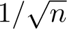
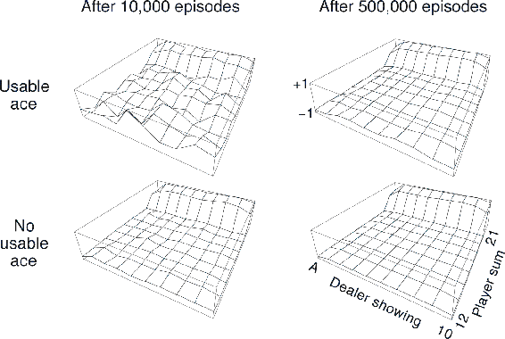
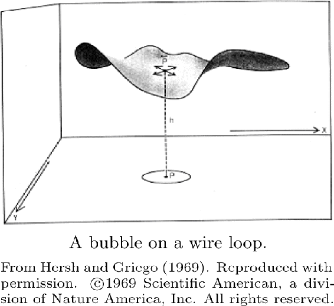

# 5.1  Monte Carlo Prediction

We begin by considering Monte Carlo methods for learning the state-value function for a given policy. Recall that the value of a state is the expected return—expected cumulative future discounted reward—starting from that state. An obvious way to estimate it from experience, then, is simply to average the returns observed after visits to that state. As more returns are observed, the average should converge to the expected value. This idea underlies all Monte Carlo methods.

In particular, suppose we wish to estimate *vπ*(*s*), the value of a state *s* under policy *π*, given a set of episodes obtained by following *π* and passing through *s*. Each occurrence of state *s* in an episode is called a *visit* to *s*. Of course, *s* may be visited multiple times in the same episode; let us call the first time it is visited in an episode the *first visit* to *s*. The *first-visit MC method* estimates *vπ*(*s*) as the average of the returns following first visits to *s*, whereas the *every-visit MC method* averages the returns following all visits to *s*. These two Monte Carlo (MC) methods are very similar but have slightly different theoretical properties. First-visit MC has been most widely studied, dating back to the 1940s, and is the one we focus on in this chapter. Every-visit MC extends more naturally to function approximation and eligibility traces, as discussed in Chapters 9 and 12. First-visit MC is shown in procedural form in the box. Every-visit MC would be the same except without the check for *S**t* having occurred earlier in the episode.

**First-visit MC prediction, for estimating *V*≈ *vπ***

Input: a policy *π* to be evaluated

Initialize:

*V*(*s*) ∈ ℝ, arbitrarily, for all *s* ∈ 𝒮

*Returns*(*s*) ← an empty list, for all *s* ∈ 𝒮

Loop forever (for each episode):

Generate an episode following *π*: *S*0*, A*0*, R*1*, S*1*, A*1*, R*2*, …, S**T*−1*, A**T*−1*, R**T*

*G* ← 0

Loop for each step of episode, *t* = *T* − 1*, T* − 2*, …*, 0:

*G* ← *γG* + *R**t*+1

Unless *S**t* appears in *S*0*, S*1*, …, S**t*−1:

Append *G* to *Returns*(*S**t*)

*V*(*S**t*) ← average(*Returns*(*S**t*))

Both first-visit MC and every-visit MC converge to *vπ*(*s*) as the number of visits (or first visits) to *s* goes to infinity. This is easy to see for the case of first-visit MC. In this case each return is an independent, identically distributed estimate of *vπ*(*s*) with finite variance. By the law of large numbers the sequence of averages of these estimates converges to their expected value. Each average is itself an unbiased estimate, and the standard deviation of its error falls as , where *n* is the number of returns averaged. Every-visit MC is less straightforward, but its estimates also converge quadratically to *vπ*(*s*) (Singh and Sutton, 1996).

The use of Monte Carlo methods is best illustrated through an example.

**Example 5.1: Blackjack** The object of the popular casino card game of *blackjack* is to obtain cards the sum of whose numerical values is as great as possible without exceeding 21. All face cards count as 10, and an ace can count either as 1 or as 11. We consider the version in which each player competes independently against the dealer. The game begins with two cards dealt to both dealer and player. One of the dealer’s cards is face up and the other is face down. If the player has 21 immediately (an ace and a 10-card), it is called a *natural*. He then wins unless the dealer also has a natural, in which case the game is a draw. If the player does not have a natural, then he can request additional cards, one by one (*hits*), until he either stops (*sticks*) or exceeds 21 (*goes bust*). If he goes bust, he loses; if he sticks, then it becomes the dealer’s turn. The dealer hits or sticks according to a fixed strategy without choice: he sticks on any sum of 17 or greater, and hits otherwise. If the dealer goes bust, then the player wins; otherwise, the outcome—win, lose, or draw—is determined by whose final sum is closer to 21.

Playing blackjack is naturally formulated as an episodic finite MDP. Each game of blackjack is an episode. Rewards of +1, −1, and 0 are given for winning, losing, and drawing, respectively. All rewards within a game are zero, and we do not discount (*γ* = 1); therefore these terminal rewards are also the returns. The player’s actions are to hit or to stick. The states depend on the player’s cards and the dealer’s showing card. We assume that cards are dealt from an infinite deck (i.e., with replacement) so that there is no advantage to keeping track of the cards already dealt. If the player holds an ace that he could count as 11 without going bust, then the ace is said to be *usable*. In this case it is always counted as 11 because counting it as 1 would make the sum 11 or less, in which case there is no decision to be made because, obviously, the player should always hit. Thus, the player makes decisions on the basis of three variables: his current sum (12–21), the dealer’s one showing card (ace–10), and whether or not he holds a usable ace. This makes for a total of 200 states.

Consider the policy that sticks if the player’s sum is 20 or 21, and otherwise hits. To find the state-value function for this policy by a Monte Carlo approach, one simulates many blackjack games using the policy and averages the returns following each state. In this way, we obtained the estimates of the state-value function shown in [Figure 5.1](part0013_split_001.html#fig5-1). The estimates for states with a usable ace are less certain and less regular because these states are less common. In any event, after 500,000 games the value function is very well approximated.

[Figure 5.1](part0013_split_001.html#C_fig5-1): Approximate state-value functions for the blackjack policy that sticks only on 20 or 21, computed by Monte Carlo policy evaluation.

■

*Exercise 5.1* Consider the diagrams on the right in [Figure 5.1](part0013_split_001.html#fig5-1). Why does the estimated value function jump up for the last two rows in the rear? Why does it drop off for the whole last row on the left? Why are the frontmost values higher in the upper diagrams than in the lower?

□

*Exercise 5.2* Suppose every-visit MC was used instead of first-visit MC on the blackjack task. Would you expect the results to be very different? Why or why not?

□

Although we have complete knowledge of the environment in the blackjack task, it would not be easy to apply DP methods to compute the value function. DP methods require the distribution of next events—in particular, they require the environments dynamics as given by the four-argument function *p*—and it is not easy to determine this for blackjack. For example, suppose the player’s sum is 14 and he chooses to stick. What is his probability of terminating with a reward of +1 as a function of the dealer’s showing card? All of the probabilities must be computed *before* DP can be applied, and such computations are often complex and error-prone. In contrast, generating the sample games required by Monte Carlo methods is easy. This is the case surprisingly often; the ability of Monte Carlo methods to work with sample episodes alone can be a significant advantage even when one has complete knowledge of the environment’s dynamics.

Can we generalize the idea of backup diagrams to Monte Carlo algorithms? The general idea of a backup diagram is to show at the top the root node to be updated and to show below all the transitions and leaf nodes whose rewards and estimated values contribute to the update. For Monte Carlo estimation of *vπ*, the root is a state node, and below it is the entire trajectory of transitions along a particular single episode, ending at the terminal state, as shown to the right. Whereas the DP diagram (page 59) shows all possible transitions, the Monte Carlo diagram shows only those sampled on the one episode. Whereas the DP diagram includes only one-step transitions, the Monte Carlo diagram goes all the way to the end of the episode. These differences in the diagrams accurately reflect the fundamental differences between the algorithms.

An important fact about Monte Carlo methods is that the estimates for each state are independent. The estimate for one state does not build upon the estimate of any other state, as is the case in DP. In other words, Monte Carlo methods do not *bootstrap* as we defined it in the previous chapter.

In particular, note that the computational expense of estimating the value of a single state is independent of the number of states. This can make Monte Carlo methods particularly attractive when one requires the value of only one or a subset of states. One can generate many sample episodes starting from the states of interest, averaging returns from only these states, ignoring all others. This is a third advantage Monte Carlo methods can have over DP methods (after the ability to learn from actual experience and from simulated experience).

**Example 5.2: Soap Bubble** Suppose a wire frame forming a closed loop is dunked in soapy water to form a soap surface or bubble conforming at its edges to the wire frame. If the geometry of the wire frame is irregular but known, how can you compute the shape of the surface? The shape has the property that the total force on each point exerted by neighboring points is zero (or else the shape would change). This means that the surface’s height at any point is the average of its heights at points in a small circle around that point. In addition, the surface must meet at its boundaries with the wire frame. The usual approach to problems of this kind is to put a grid over the area covered by the surface and solve for its height at the grid points by an iterative computation. Grid points at the boundary are forced to the wire frame, and all others are adjusted toward the average of the heights of their four nearest neighbors. This process then iterates, much like DP’s iterative policy evaluation, and ultimately converges to a close approximation to the desired surface.

This is similar to the kind of problem for which Monte Carlo methods were originally designed. Instead of the iterative computation described above, imagine standing on the surface and taking a random walk, stepping randomly from grid point to neighboring grid point, with equal probability, until you reach the boundary. It turns out that the expected value of the height at the boundary is a close approximation to the height of the desired surface at the starting point (in fact, it is exactly the value computed by the iterative method described above). Thus, one can closely approximate the height of the surface at a point by simply averaging the boundary heights of many walks started at the point. If one is interested in only the value at one point, or any fixed small set of points, then this Monte Carlo method can be far more efficient than the iterative method based on local consistency.

■
