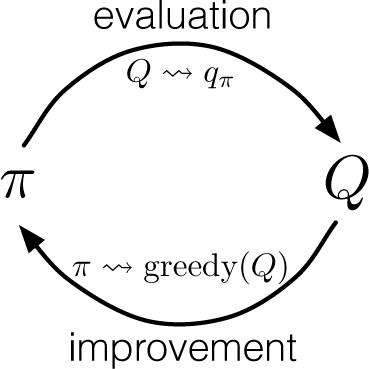
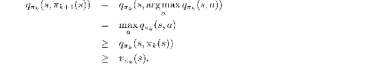
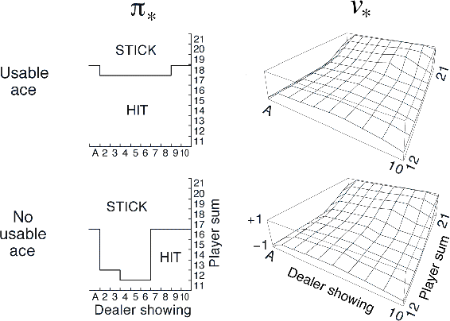

# 5.3  Monte Carlo Control

We are now ready to consider how Monte Carlo estimation can be used in control, that is, to approximate optimal policies. The overall idea is to proceed according to the same pattern as in the DP chapter, that is, according to the idea of generalized policy iteration (GPI). In GPI one maintains both an approximate policy and an approximate value function. The value function is repeatedly altered to more closely approximate the value function for the current policy, and the policy is repeatedly improved with respect to the current value function, as suggested by the diagram to the right. These two kinds of changes work against each other to some extent, as each creates a moving target for the other, but together they cause both policy and value function to approach optimality.

To begin, let us consider a Monte Carlo version of classical policy iteration. In this method, we perform alternating complete steps of policy evaluation and policy improvement, beginning with an arbitrary policy *π*0 and ending with the optimal policy and optimal action-value function:

where  denotes a complete policy evaluation and  denotes a complete policy improvement. Policy evaluation is done exactly as described in the preceding section. Many episodes are experienced, with the approximate action-value function approaching the true function asymptotically. For the moment, let us assume that we do indeed observe an infinite number of episodes and that, in addition, the episodes are generated with exploring starts. Under these assumptions, the Monte Carlo methods will compute each *q**π**k* exactly, for arbitrary *π**k*.

Policy improvement is done by making the policy greedy with respect to the current value function. In this case we have an *action*-value function, and therefore no model is needed to construct the greedy policy. For any action-value function *q*, the corresponding greedy policy is the one that, for each *s* ∈ 𝒮, deterministically chooses an action with maximal action-value:

Policy improvement then can be done by constructing each *π**k*+1 as the greedy policy with respect to *q**π**k*. The policy improvement theorem (Section 4.2) then applies to *π**k* and *π**k*+1 because, for all *s* ∈ 𝒮,

As we discussed in the previous chapter, the theorem assures us that each *π**k*+1 is uniformly better than *π**k*, or just as good as *π**k*, in which case they are both optimal policies. This in turn assures us that the overall process converges to the optimal policy and optimal value function. In this way Monte Carlo methods can be used to find optimal policies given only sample episodes and no other knowledge of the environment’s dynamics.

We made two unlikely assumptions above in order to easily obtain this guarantee of convergence for the Monte Carlo method. One was that the episodes have exploring starts, and the other was that policy evaluation could be done with an infinite number of episodes. To obtain a practical algorithm we will have to remove both assumptions. We postpone consideration of the first assumption until later in this chapter.

For now we focus on the assumption that policy evaluation operates on an infinite number of episodes. This assumption is relatively easy to remove. In fact, the same issue arises even in classical DP methods such as iterative policy evaluation, which also converge only asymptotically to the true value function. In both DP and Monte Carlo cases there are two ways to solve the problem. One is to hold firm to the idea of approximating *q**π**k* in each policy evaluation. Measurements and assumptions are made to obtain bounds on the magnitude and probability of error in the estimates, and then sufficient steps are taken during each policy evaluation to assure that these bounds are sufficiently small. This approach can probably be made completely satisfactory in the sense of guaranteeing correct convergence up to some level of approximation. However, it is also likely to require far too many episodes to be useful in practice on any but the smallest problems.

There is a second approach to avoiding the infinite number of episodes nominally required for policy evaluation, in which we give up trying to complete policy evaluation before returning to policy improvement. On each evaluation step we move the value function *toward q**π**k*, but we do not expect to actually get close except over many steps. We used this idea when we first introduced the idea of GPI in Section 4.6. One extreme form of the idea is value iteration, in which only one iteration of iterative policy evaluation is performed between each step of policy improvement. The in-place version of value iteration is even more extreme; there we alternate between improvement and evaluation steps for single states.

For Monte Carlo policy evaluation it is natural to alternate between evaluation and improvement on an episode-by-episode basis. After each episode, the observed returns are used for policy evaluation, and then the policy is improved at all the states visited in the episode. A complete simple algorithm along these lines, which we call *Monte Carlo ES*, for Monte Carlo with Exploring Starts, is given in pseudocode in the box on the next page.

**Monte Carlo ES (Exploring Starts), for estimating *π* ≈ *π*\***

Initialize:

*π*(*s*) ∈ 𝒜(*s*) (arbitrarily), for all *s* ∈ 𝒮

*Q*(*s, a*) ∈ ℝ (arbitrarily), for all *s* ∈ 𝒮, *a* ∈ 𝒜(*s*)

*Returns*(*s, a*) ← empty list, for all *s* ∈ 𝒮, *a* ∈ 𝒜(*s*)

Loop forever (for each episode):

Choose *S*0 ∈ 𝒮, *A*0 ∈ 𝒜(*S*0) randomly such that all pairs have probability > 0

Generate an episode from *S*0*, A*0, following *π*: *S*0*, A*0*, R*1*, …, S**T*−1*, A**T*−1*, R**T*

*G* ← 0

Loop for each step of episode, *t* = *T* − 1*, T* − 2*, …*, 0:

*G*← *γ**G* + *R**t*+1

Unless the pair *S**t**, A**t* appears in *S*0*, A*0*, S*1*, A*1…*, S**t*−1*, A**t*−1:

Append *G* to *Returns*(*S**t**, A**t*)

*Q*(*S**t**, A**t*) ← average(*Returns*(*S**t**, A**t*))

*π*(*S**t*) ← arg max*a**Q*(*S**t**, a*)

*Exercise 5.4* The pseudocode for Monte Carlo ES is inefficient because, for each state–action pair, it maintains a list of all returns and repeatedly calculates their mean. It would be more efficient to use techniques similar to those explained in Section 2.4 to maintain just the mean and a count (for each state–action pair) and update them incrementally. Describe how the pseudocode would be altered to achieve this.

□

In Monte Carlo ES, all the returns for each state–action pair are accumulated and averaged, irrespective of what policy was in force when they were observed. It is easy to see that Monte Carlo ES cannot converge to any suboptimal policy. If it did, then the value function would eventually converge to the value function for that policy, and that in turn would cause the policy to change. Stability is achieved only when both the policy and the value function are optimal. Convergence to this optimal fixed point seems inevitable as the changes to the action-value function decrease over time, but has not yet been formally proved. In our opinion, this is one of the most fundamental open theoretical questions in reinforcement learning (for a partial solution, see Tsitsiklis, 2002).

**Example 5.3: Solving Blackjack** It is straightforward to apply Monte Carlo ES to blackjack. Because the episodes are all simulated games, it is easy to arrange for exploring starts that include all possibilities. In this case one simply picks the dealer’s cards, the player’s sum, and whether or not the player has a usable ace, all at random with equal probability. As the initial policy we use the policy evaluated in the previous blackjack example, that which sticks only on 20 or 21. The initial action-value function can be zero for all state–action pairs. [Figure 5.2](part0013_split_003.html#fig5-2) shows the optimal policy for blackjack found by Monte Carlo ES. This policy is the same as the “basic” strategy of Thorp (1966) with the sole exception of the leftmost notch in the policy for a usable ace, which is not present in Thorp’s strategy. We are uncertain of the reason for this discrepancy, but confident that what is shown here is indeed the optimal policy for the version of blackjack we have described.

[Figure 5.2](part0013_split_003.html#C_fig5-2): The optimal policy and state-value function for blackjack, found by Monte Carlo ES. The state-value function shown was computed from the action-value function found by Monte Carlo ES.

■
