# 5.4  Monte Carlo Control without Exploring Starts

How can we avoid the unlikely assumption of exploring starts? The only general way to ensure that all actions are selected infinitely often is for the agent to continue to select them. There are two approaches to ensuring this, resulting in what we call *on-policy* methods and *off-policy* methods. On-policy methods attempt to evaluate or improve the policy that is used to make decisions, whereas off-policy methods evaluate or improve a policy different from that used to generate the data. The Monte Carlo ES method developed above is an example of an on-policy method. In this section we show how an on-policy Monte Carlo control method can be designed that does not use the unrealistic assumption of exploring starts. Off-policy methods are considered in the next section.

In on-policy control methods the policy is generally *soft*, meaning that *π*(*a*|*s*) > 0 for all *s* ∈ 𝒮 and all *a* ∈ 𝒜(*s*), but gradually shifted closer and closer to a deterministic optimal policy. Many of the methods discussed in Chapter 2 provide mechanisms for this. The on-policy method we present in this section uses *ε-greedy* policies, meaning that most of the time they choose an action that has maximal estimated action value, but with probability *ε* they instead select an action at random. That is, all nongreedy actions are given the minimal probability of selection, 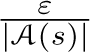, and the remaining bulk of the probability, 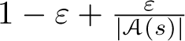, is given to the greedy action. The *ε*-greedy policies are examples of *ε-soft* policies, defined as policies for which 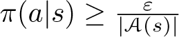 for all states and actions, for some *ε >* 0. Among *ε*-soft policies, *ε*-greedy policies are in some sense those that are closest to greedy.

The overall idea of on-policy Monte Carlo control is still that of GPI. As in Monte Carlo ES, we use first-visit MC methods to estimate the action-value function for the current policy. Without the assumption of exploring starts, however, we cannot simply improve the policy by making it greedy with respect to the current value function, because that would prevent further exploration of nongreedy actions. Fortunately, GPI does not require that the policy be taken all the way to a greedy policy, only that it be moved *toward* a greedy policy. In our on-policy method we will move it only to an *ε*-greedy policy. For any *ε*-soft policy, *π*, any *ε*-greedy policy with respect to *qπ* is guaranteed to be better than or equal to *π*. The complete algorithm is given in the box below.

**On-policy first-visit MC control (for *ε*-soft policies), estimates *π* ≈ *π*\***

Algorithm parameter: small *ε >* 0

Initialize:

*π* ← an arbitrary *ε*-soft policy

*Q*(*s, a*) ∈ ℝ (arbitrarily), for all *s* ∈ 𝒮, *a* ∈ 𝒜(*s*)

*Returns*(*s, a*) ← empty list, for all *s* ∈ 𝒮, *a* ∈ 𝒜(*s*)

Repeat forever (for each episode):

Generate an episode following *π*: *S*0*, A*0*, R*1*, …, S**T*−1*, A**T*−1*, R**T*

*G* ← 0

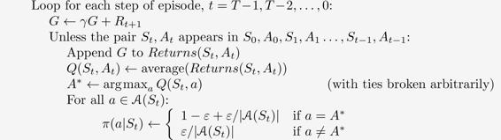

That any *ε*-greedy policy with respect to *qπ* is an improvement over any *ε*-soft policy *π* is assured by the policy improvement theorem. Let *π*′ be the *ε*-greedy policy. The conditions of the policy improvement theorem apply because for any *s* ∈ 𝒮:

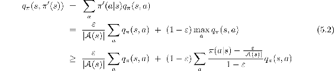

(the sum is a weighted average with nonnegative weights summing to 1, and as such it must be less than or equal to the largest number averaged)

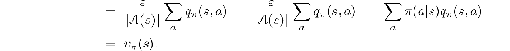

Thus, by the policy improvement theorem, *π*′ ≥ *π* (i.e., *vπ*′(*s*) ≥ *vπ*(*s*), for all *s* ∈ 𝒮). We now prove that equality can hold only when both *π*′ and *π* are optimal among the *ε*-soft policies, that is, when they are better than or equal to all other *ε*-soft policies.

Consider a new environment that is just like the original environment, except with the requirement that policies be *ε*-soft “moved inside” the environment. The new environment has the same action and state set as the original and behaves as follows. If in state *s* and taking action *a*, then with probability 1 − *ε* the new environment behaves exactly like the old environment. With probability *ε* it repicks the action at random, with equal probabilities, and then behaves like the old environment with the new, random action. The best one can do in this new environment with general policies is the same as the best one could do in the original environment with *ε*-soft policies. Let 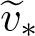 and 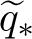 denote the optimal value functions for the new environment. Then a policy *π* is optimal among *ε*-soft policies if and only if 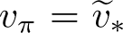. From the definition of  we know that it is the unique solution to

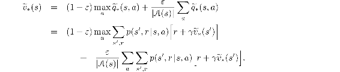

When equality holds and the *ε*-soft policy *π* is no longer improved, then we also know, from ([5.2](part0013_split_004.html#x1-51001r2)), that

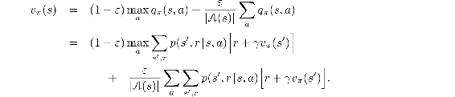

However, this equation is the same as the previous one, except for the substitution of *vπ* for . Because  is the unique solution, it must be that .

In essence, we have shown in the last few pages that policy iteration works for *ε*-soft policies. Using the natural notion of greedy policy for *ε*-soft policies, one is assured of improvement on every step, except when the best policy has been found among the *ε*-soft policies. This analysis is independent of how the action-value functions are determined at each stage, but it does assume that they are computed exactly. This brings us to roughly the same point as in the previous section. Now we only achieve the best policy among the *ε*-soft policies, but on the other hand, we have eliminated the assumption of exploring starts.
