# 5.5  Off-policy Prediction via Importance Sampling

All learning control methods face a dilemma: They seek to learn action values conditional on subsequent *optimal* behavior, but they need to behave non-optimally in order to explore all actions (to *find* the optimal actions). How can they learn about the optimal policy while behaving according to an exploratory policy? The on-policy approach in the preceding section is actually a compromise—it learns action values not for the optimal policy, but for a near-optimal policy that still explores. A more straightforward approach is to use two policies, one that is learned about and that becomes the optimal policy, and one that is more exploratory and is used to generate behavior. The policy being learned about is called the *target policy*, and the policy used to generate behavior is called the *behavior policy*. In this case we say that learning is from data “off” the target policy, and the overall process is termed *off-policy learning*.

Throughout the rest of this book we consider both on-policy and off-policy methods. On-policy methods are generally simpler and are considered first. Off-policy methods require additional concepts and notation, and because the data is due to a different policy, off-policy methods are often of greater variance and are slower to converge. On the other hand, off-policy methods are more powerful and general. They include on-policy methods as the special case in which the target and behavior policies are the same. Off-policy methods also have a variety of additional uses in applications. For example, they can often be applied to learn from data generated by a conventional non-learning controller, or from a human expert. Off-policy learning is also seen by some as key to learning multi-step predictive models of the world’s dynamics (see Section 17.2; Sutton, 2009; Sutton et al., 2011).

In this section we begin the study of off-policy methods by considering the *prediction* problem, in which both target and behavior policies are fixed. That is, suppose we wish to estimate *vπ* or *qπ*, but all we have are episodes following another policy *b*, where *b* ≠ *π*. In this case, *π* is the target policy, *b* is the behavior policy, and both policies are considered fixed and given.

In order to use episodes from *b* to estimate values for *π*, we require that every action taken under *π* is also taken, at least occasionally, under *b*. That is, we require that *π*(*a*|*s*) > 0 implies *b*(*a*|*s*) > 0. This is called the assumption of *coverage*. It follows from coverage that *b* must be stochastic in states where it is not identical to *π*. The target policy *π*, on the other hand, may be deterministic, and, in fact, this is a case of particular interest in control applications. In control, the target policy is typically the deterministic greedy policy with respect to the current estimate of the action-value function. This policy becomes a deterministic optimal policy while the behavior policy remains stochastic and more exploratory, for example, an *ε*-greedy policy. In this section, however, we consider the prediction problem, in which *π* is unchanging and given.

Almost all off-policy methods utilize *importance sampling*, a general technique for estimating expected values under one distribution given samples from another. We apply importance sampling to off-policy learning by weighting returns according to the relative probability of their trajectories occurring under the target and behavior policies, called the *importance-sampling ratio*. Given a starting state *S**t*, the probability of the subsequent state–action trajectory, *A**t**, S**t*+1*, A**t*+1*, …, S**T*, occurring under any policy *π* is

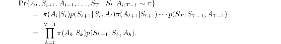

where *p* here is the state-transition probability function defined by ([3.4](part0011_split_001.html#x1-28009r4)). Thus, the relative probability of the trajectory under the target and behavior policies (the importance-sampling ratio) is

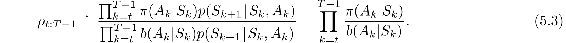

Although the trajectory probabilities depend on the MDP’s transition probabilities, which are generally unknown, they appear identically in both the numerator and denominator, and thus cancel. The importance sampling ratio ends up depending only on the two policies and the sequence, not on the MDP.

Recall that we wish to estimate the expected returns (values) under the target
policy, but all we have are returns G*t* due to the behavior policy. These returns have the wrong expectation 𝔼G*t*|*S**t* = *s* = *v**b*(*s*) and so cannot be averaged to obtain *vπ*. This is where importance sampling comes in. The ratio *ρ**t*:*T*−1 transforms the returns to have the right expected value:

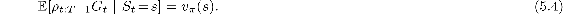

Now we are ready to give a Monte Carlo algorithm that averages returns from a batch of observed episodes following policy *b* to estimate *vπ*(*s*). It is convenient here to number time steps in a way that increases across episode boundaries. That is, if the first episode of the batch ends in a terminal state at time 100, then the next episode begins at time *t* = 101. This enables us to use time-step numbers to refer to particular steps in particular episodes. In particular, we can define the set of all time steps in which state *s* is visited, denoted 𝒯 (*s*). This is for an every-visit method; for a first-visit method, 𝒯 (*s*) would only include time steps that were first visits to *s* within their episodes. Also, let *T*(*t*) denote the first time of termination following time *t*, and G*t* denote the return after *t* up through *T*(*t*). Then 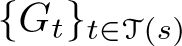 are the returns that pertain to state *s*, and 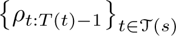 are the corresponding importance-sampling ratios. To estimate *vπ*(*s*), we simply scale the returns by the ratios and average the results:

When importance sampling is done as a simple average in this way it is called *ordinary importance sampling*.

An important alternative is *weighted importance sampling*, which uses a *weighted* average, defined as

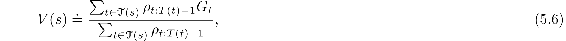

or zero if the denominator is zero. To understand these two varieties of importance sampling, consider the estimates of their first-visit methods after observing a single return from state *s*. In the weighted-average estimate, the ratio *ρ**t*:*T*(*t*)−1 for the single return cancels in the numerator and denominator, so that the estimate is equal to the observed return independent of the ratio (assuming the ratio is nonzero). Given that this return was the only one observed, this is a reasonable estimate, but its expectation is *v**b*(*s*) rather than *vπ*(*s*), and in this statistical sense it is biased. In contrast, the first-visit version of the ordinary importance-sampling estimator ([5.5](part0013_split_005.html#x1-52003r5)) is always *vπ*(*s*) in expectation (it is unbiased), but it can be extreme. Suppose the ratio were ten, indicating that the trajectory observed is ten times as likely under the target policy as under the behavior policy. In this case the ordinary importance-sampling estimate would be *ten times* the observed return. That is, it would be quite far from the observed return even though the episode’s trajectory is considered very representative of the target policy.

Formally, the difference between the first-visit methods of the two kinds of importance sampling is expressed in their biases and variances. Ordinary importance sampling is unbiased whereas weighted importance sampling is biased (though the bias converges asymptotically to zero). On the other hand, the variance of ordinary importance sampling is in general unbounded because the variance of the ratios can be unbounded, whereas in the weighted estimator the largest weight on any single return is one. In fact, assuming bounded returns, the variance of the weighted importance-sampling estimator converges to zero even if the variance of the ratios themselves is infinite (Precup, Sutton, and Dasgupta 2001). In practice, the weighted estimator usually has dramatically lower variance and is strongly preferred. Nevertheless, we will not totally abandon ordinary importance sampling as it is easier to extend to the approximate methods using function approximation that we explore in the second part of this book.

The every-visit methods for ordinary and weighed importance sampling are both biased, though, again, the bias falls asymptotically to zero as the number of samples increases. In practice, every-visit methods are often preferred because they remove the need to keep track of which states have been visited and because they are much easier to extend to approximations. A complete every-visit MC algorithm for off-policy policy evaluation using weighted importance sampling is given in the next section on page 110.

*Exercise 5.5* Consider an MDP with a single nonterminal state and a single action that transitions back to the nonterminal state with probability *p* and transitions to the terminal state with probability 1 −*p*. Let the reward be +1 on all transitions, and let *γ* = 1. Suppose you observe one episode that lasts 10 steps, with a return of 10. What are the first-visit and every-visit estimators of the value of the nonterminal state?

□

**Example 5.4: Off-policy Estimation of a Blackjack State Value** We applied both ordinary and weighted importance-sampling methods to estimate the value of a single blackjack state from off-policy data. Recall that one of the advantages of Monte Carlo methods is that they can be used to evaluate a single state without forming estimates for any other states. In this example, we evaluated the state in which the dealer is showing a deuce, the sum of the player’s cards is 13, and the player has a usable ace (that is, the player holds an ace and a deuce, or equivalently three aces). The data was generated by starting in this state then choosing to hit or stick at random with equal probability (the behavior policy). The target policy was to stick only on a sum of 20 or 21, as in [Example 5.1](part0013_split_001.html#sec1-34) . The value of this state under the target policy is approximately −0.27726 (this was determined by separately generating one-hundred million episodes using the target policy and averaging their returns). Both off-policy methods closely approximated this value after 1000 off-policy episodes using the random policy. To make sure they did this reliably, we performed 100 independent runs, each starting from estimates of zero and learning for 10,000 episodes. [Figure 5.3](part0013_split_005.html#fig5-3) shows the resultant learning curves—the squared error of the estimates of each method as a function of number of episodes, averaged over the 100 runs. The error approaches zero for both algorithms, but the weighted importance-sampling method has much lower error at the beginning, as is typical in practice.

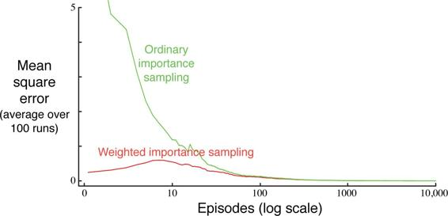

[Figure 5.3](part0013_split_005.html#C_fig5-3): Weighted importance sampling produces lower error estimates of the value of a single blackjack state from off-policy episodes.

■

**Example 5.5: Infinite Variance** The estimates of ordinary importance sampling will typically have infinite variance, and thus unsatisfactory convergence properties, whenever the scaled returns have infinite variance—and this can easily happen in off-policy learning when trajectories contain loops. A simple example is shown inset in [Figure 5.4](part0013_split_005.html#fig5-4). There is only one nonterminal state *s* and two actions, `right` and `left`. The `right` action causes a deterministic transition to termination, whereas the `left` action transitions, with probability 0.9, back to *s* or, with probability 0.1, on to termination. The rewards are +1 on the latter transition and otherwise zero. Consider the target policy that always selects `left`. All episodes under this policy consist of some number (possibly zero) of transitions back to *s* followed by termination with a reward and return of +1. Thus the value of *s* under the target policy is 1 (*γ* = 1). Suppose we are estimating this value from off-policy data using the behavior policy that selects `right` and `left` with equal probability.

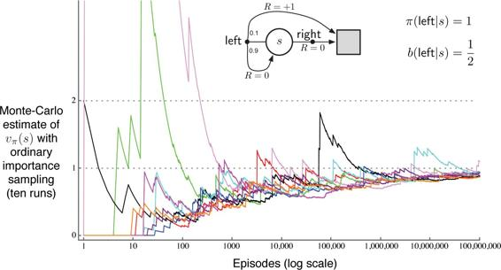

[Figure 5.4](part0013_split_005.html#C_fig5-4): Ordinary importance sampling produces surprisingly unstable estimates on the one-state MDP shown inset ([Example 5.5](part0013_split_005.html#sec1-38)). The correct estimate here is 1 (*γ* = 1), and, even though this is the expected value of a sample return (after importance sampling), the variance of the samples is infinite, and the estimates do not converge to this value. These results are for off-policy first-visit MC.

The lower part of [Figure 5.4](part0013_split_005.html#fig5-4) shows ten independent runs of the first-visit MC algorithm using ordinary importance sampling. Even after millions of episodes, the estimates fail to converge to the correct value of 1. In contrast, the weighted importance-sampling algorithm would give an estimate of exactly 1 forever after the first episode that ended with the `left` action. All returns not equal to 1 (that is, ending with the `right` action) would be inconsistent with the target policy and thus would have a 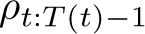 of zero and contribute neither to the numerator nor denominator of ([5.6](part0013_split_005.html#x1-52004r6)). The weighted importance-sampling algorithm produces a weighted average of only the returns consistent with the target policy, and all of these would be exactly 1.

We can verify that the variance of the importance-sampling-scaled returns is infinite in this example by a simple calculation. The variance of any random variable *X* is the expected value of the deviation from its mean 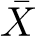, which can be written

Thus, if the mean is finite, as it is in our case, the variance is infinite if and only if the expectation of the square of the random variable is infinite. Thus, we need only show that the expected square of the importance-sampling-scaled return is infinite:

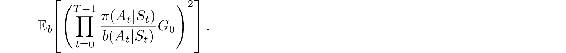

To compute this expectation, we break it down into cases based on episode length and termination. First note that, for any episode ending with the `right` action, the importance sampling ratio is zero, because the target policy would never take this action; these episodes thus contribute nothing to the expectation (the quantity in parenthesis will be zero) and can be ignored. We need only consider episodes that involve some number (possibly zero) of `left` actions that transition back to the nonterminal state, followed by a `left` action transitioning to termination. All of these episodes have a return of 1, so the G0 factor can be ignored. To get the expected square we need only consider each length of episode, multiplying the probability of the episode’s occurrence by the square of its importance-sampling ratio, and add these up:

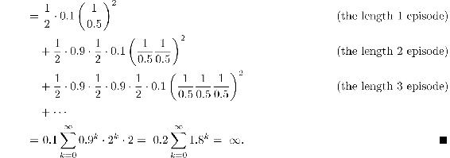

*Exercise 5.6* What is the equation analogous to ([5.6](part0013_split_005.html#x1-52004r6)) for *action* values *Q*(*s, a*) instead of state values *V*(*s*), again given returns generated using *b*?

□

*Exercise 5.7* In learning curves such as those shown in [Figure 5.3](part0013_split_005.html#fig5-3) error generally decreases with training, as indeed happened for the ordinary importance-sampling method. But for the weighted importance-sampling method error first increased and then decreased. Why do you think this happened?

□

*Exercise 5.8* The results with [Example 5.5](part0013_split_005.html#sec1-38)  and shown in [Figure 5.4](part0013_split_005.html#fig5-4) used a first-visit MC method. Suppose that instead an every-visit MC method was used on the same problem. Would the variance of the estimator still be infinite? Why or why not?

□
