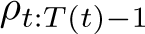
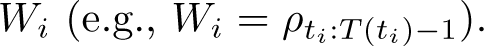
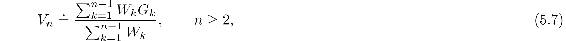
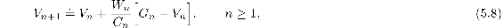
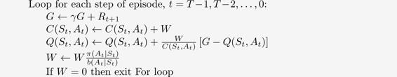

# 5.6  Incremental Implementation

Monte Carlo prediction methods can be implemented incrementally, on an episode-by-episode basis, using extensions of the techniques described in Chapter 2 (Section 2.4). Whereas in Chapter 2 we averaged *rewards*, in Monte Carlo methods we average *returns*. In all other respects exactly the same methods as used in Chapter 2 can be used for *on-policy* Monte Carlo methods. For *off-policy* Monte Carlo methods, we need to separately consider those that use *ordinary* importance sampling and those that use *weighted* importance sampling.

In ordinary importance sampling, the returns are scaled by the importance sampling ratio  ([5.3](part0013_split_005.html#x1-52001r3)), then simply averaged as in ([5.5](part0013_split_005.html#x1-52003r5)). For these methods we can again use the incremental methods of Chapter 2, but using the scaled returns in place of the rewards of that chapter. This leaves the case of off-policy methods using *weighted* importance sampling. Here we have to form a weighted average of the returns, and a slightly different incremental algorithm is required.

Suppose we have a sequence of returns G1*, G*2*, …, G**n*−1, all starting in the same state and each with a corresponding random weight . We wish to form the estimate

and keep it up-to-date as we obtain a single additional return G*n*. In addition to keeping track of *V**n*, we must maintain for each state the cumulative sum *C**n* of the weights given to the first *n* returns. The update rule for *V**n* is

and

where *C*0 ≐ 0 (and *V*1 is arbitrary and thus need not be specified). The following box contains a complete episode-by-episode incremental algorithm for Monte Carlo policy evaluation. The algorithm is nominally for the off-policy case, using weighted importance sampling, but applies as well to the on-policy case just by choosing the target and behavior policies as the same (in which case (*π* = *b*), *W* is always 1). The approximation *Q* converges to *q**π* (for all encountered state–action pairs) while actions are selected according to a potentially different policy, *b*.

*Exercise 5.9* Modify the algorithm for first-visit MC policy evaluation (Section 5.1) to use the incremental implementation for sample averages described in Section 2.4.

□

*Exercise 5.10* Derive the weighted-average update rule ([5.8](part0013_split_006.html#x1-53002r8)) from ([5.7](part0013_split_006.html#x1-53001r7)). Follow the pattern of the derivation of the unweighted rule (2.3).

□

**Off-policy MC prediction (policy evaluation) for estimating *Q* ≈ *qπ***

Input: an arbitrary target policy *π*

Initialize, for all *s* ∈ 𝒮, *a* ∈ 𝒜(*s*):

*Q*(*s, a*) ∈ ℝ (arbitrarily)

*C*(*s, a*) ← 0

Loop forever (for each episode):

*b* ← any policy with coverage of *π*

Generate an episode following *b*: *S*0*, A*0*, R*1*, …, S**T*−1*, A**T*−1*, R**T*

G ← 0

*W* ← 1

