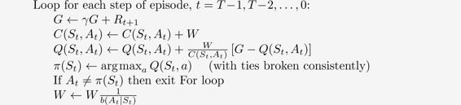
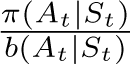
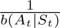
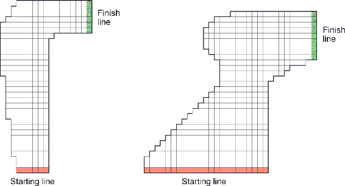

# 5.7  Off-policy Monte Carlo Control

We are now ready to present an example of the second class of learning control methods we consider in this book: off-policy methods. Recall that the distinguishing feature of on-policy methods is that they estimate the value of a policy while using it for control. In off-policy methods these two functions are separated. The policy used to generate behavior, called the *behavior* policy, may in fact be unrelated to the policy that is evaluated and improved, called the *target* policy. An advantage of this separation is that the target policy may be deterministic (e.g., greedy), while the behavior policy can continue to sample all possible actions.

Off-policy Monte Carlo control methods use one of the techniques presented in the preceding two sections. They follow the behavior policy while learning about and improving the target policy. These techniques require that the behavior policy has a nonzero probability of selecting all actions that might be selected by the target policy (coverage). To explore all possibilities, we require that the behavior policy be soft (i.e., that it select all actions in all states with nonzero probability).

The following box shows an off-policy Monte Carlo control method, based on GPI and weighted importance sampling, for estimating *π*\* and *q*\*. The target policy *π* ≈ *π*\* is the greedy policy with respect to *Q*, which is an estimate of *q**π*. The behavior policy *b* can be anything, but in order to assure convergence of *π* to the optimal policy, an infinite number of returns must be obtained for each pair of state and action. This can be assured by choosing *b* to be *ε*-soft. The policy *π* converges to optimal at all encountered states even though actions are selected according to a different soft policy *b*, which may change between or even within episodes.

**Off-policy MC control, for estimating *π* ≈ *π*\***

Initialize, for all *s* ∈ 𝒮, *a* ∈ 𝒜(*s*):

*Q*(*s, a*) ∈ ℝ (arbitrarily)

*C*(*s, a*) ← 0

*π*(*s*) ← *arg max**a**Q*(*s, a*) (with ties broken consistently)

Loop forever (for each episode):

*b* ← any soft policy

Generate an episode using *b*: *S*0*, A*0*, R*1*, …, S**T*−1*, A**T*−1*, R**T*

G ← 0

*W* ← 1

A potential problem is that this method learns only from the tails of episodes, when all of the remaining actions in the episode are greedy. If nongreedy actions are common, then learning will be slow, particularly for states appearing in the early portions of long episodes. Potentially, this could greatly slow learning. There has been insufficient experience with off-policy Monte Carlo methods to assess how serious this problem is. If it is serious, the most important way to address it is probably by incorporating temporal-difference learning, the algorithmic idea developed in the next chapter. Alternatively, if *γ* is less than 1, then the idea developed in the next section may also help significantly.

*Exercise 5.11* In the boxed algorithm for off-policy MC control, you may have been expecting the *W* update to have involved the importance-sampling ratio , but instead it involves . Why is this nevertheless correct?

□

*Exercise 5.12: Racetrack (programming)* Consider driving a race car around a turn like those shown in [Figure 5.5](part0013_split_007.html#fig5-5). You want to go as fast as possible, but not so fast as to run off the track. In our simplified racetrack, the car is at one of a discrete set of grid positions, the cells in the diagram. The velocity is also discrete, a number of grid cells moved horizontally and vertically per time step. The actions are increments to the velocity components. Each may be changed by +1, −1, or 0 in each step, for a total of nine (3 × 3) actions. Both velocity components are restricted to be nonnegative and less than 5, and they cannot both be zero except at the starting line. Each episode begins in one of the randomly selected start states with both velocity components zero and ends when the car crosses the finish line. The rewards are −1 for each step until the car crosses the finish line. If the car hits the track boundary, it is moved back to a random position on the starting line, both velocity components are reduced to zero, and the episode continues. Before updating the car’s location at each time step, check to see if the projected path of the car intersects the track boundary. If it intersects the finish line, the episode ends; if it intersects anywhere else, the car is considered to have hit the track boundary and is sent back to the starting line. To make the task more challenging, with probability 0.1 at each time step the velocity increments are both zero, independently of the intended increments. Apply a Monte Carlo control method to this task to compute the optimal policy from each starting state. Exhibit several trajectories following the optimal policy (but turn the noise off for these trajectories).

[Figure 5.5](part0013_split_007.html#C_fig5-5): A couple of right turns for the racetrack task.

□
