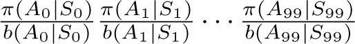
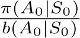
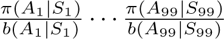
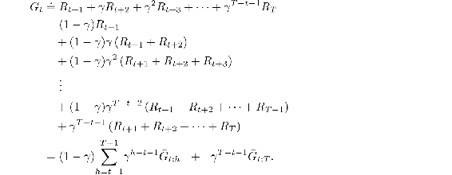
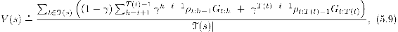
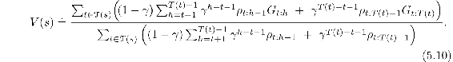

# 5.8  \*Discounting-aware Importance Sampling

The off-policy methods that we have considered so far are based on forming importance-sampling weights for returns considered as unitary wholes, without taking into account the returns’ internal structures as sums of discounted rewards. We now briefly consider cutting-edge research ideas for using this structure to significantly reduce the variance of off-policy estimators.

For example, consider the case where episodes are long and *γ* is significantly less than 1. For concreteness, say that episodes last 100 steps and that *γ* = 0. The return from time 0 will then be just G0 = *R*1, but its importance sampling ratio will be a product of 100 factors, . In ordinary importance sampling, the return will be scaled by the entire product, but it is really only necessary to scale by the first factor, by . The other 99 factors  are irrelevant because after the first reward the return has already been determined. These later factors are all independent of the return and of expected value 1; they do not change the expected update, but they add enormously to its variance. In some cases they could even make the variance infinite. Let us now consider an idea for avoiding this large extraneous variance.

The essence of the idea is to think of discounting as determining a probability of termination or, equivalently, a *degree* of partial termination. For any *γ* ∈ [0, 1), we can think of the return G0 as partly terminating in one step, to the degree 1 − *γ*, producing a return of just the first reward, *R*1, and as partly terminating after two steps, to the degree (1 −*γ* )*γ*, producing a return of *R*1 + *R*2, and so on. The latter degree corresponds to terminating on the second step, 1 −*γ*, and not having already terminated on the first step, *γ*. The degree of termination on the third step is thus (1 − *γ* )*γ*2, with the *γ*2 reflecting that termination did not occur on either of the first two steps. The partial returns here are called *flat partial returns*:

where “flat” denotes the absence of discounting, and “partial” denotes that these returns do not extend all the way to termination but instead stop at *h*, called the *horizon* (and *T* is the time of termination of the episode). The conventional full return G*t* can be viewed as a sum of flat partial returns as suggested above as follows:

Now we need to scale the flat partial returns by an importance sampling ratio that is similarly truncated. As *G**t*:*h* only involves rewards up to a horizon *h*, we only need the ratio of the probabilities up to *h*. We define an ordinary importance-sampling estimator, analogous to ([5.5](part0013_split_005.html#x1-52003r5)), as

and a weighted importance-sampling estimator, analogous to ([5.6](part0013_split_005.html#x1-52004r6)), as

We call these two estimators *discounting-aware* importance sampling estimators. They take into account the discount rate but have no effect (are the same as the off-policy estimators from Section 5.5) if *γ* = 1.
