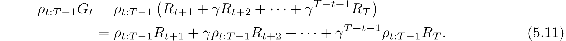
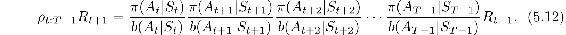
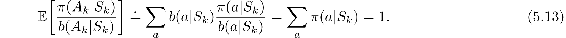
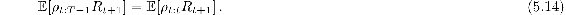
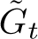
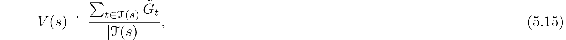

# 5.9  \*Per-decision Importance Sampling

There is one more way in which the structure of the return as a sum of rewards can be taken into account in off-policy importance sampling, a way that may be able to reduce variance even in the absence of discounting (that is, even if *γ* = 1). In the off-policy estimators ([5.5](part0013_split_005.html#x1-52003r5)) and ([5.6](part0013_split_005.html#x1-52004r6)), each term of the sum in the numerator is itself a sum:

The off-policy estimators rely on the expected values of these terms, which can be written in a simpler way. Note that each sub-term of ([5.11](part0013_split_009.html#x1-56001r11)) is a product of a random reward and a random importance-sampling ratio. For example, the first sub-term can be written, using ([5.3](part0013_split_005.html#x1-52001r3)), as

Of all these factors, one might suspect that only the first and the last (the reward) are related; all the others are for events that occurred after the reward. Moreover, the expected value of all these other factors is one:

With a few more steps, one can show that, as suspected, all of these other factors have no effect in expectation, in other words, that

If we repeat this process for the *k*th sub-term of ([5.11](part0013_split_009.html#x1-56001r11)), we get

It follows then that the expectation of our original term ([5.11](part0013_split_009.html#x1-56001r11)) can be written

where

We call this idea *per-decision* importance sampling. It follows immediately that there is an alternate importance-sampling estimator, with the same unbiased expectation (in the first-visit case) as the ordinary-importance-sampling estimator ([5.5](part0013_split_005.html#x1-52003r5)), using :

which we might expect to sometimes be of lower variance. Is there a per-decision version of *weighted* importance sampling? This is less clear. So far, all the estimators that have been proposed for this that we know of are not consistent (that is, they do not converge to the true value with infinite data).

**\*** *Exercise 5.13* Show the steps to derive ([5.14](part0013_split_009.html#x1-56004r14)) from ([5.12](part0013_split_009.html#x1-56002r12)).

□

**\*** *Exercise 5.14* Modify the algorithm for off-policy Monte Carlo control (page 111) to use the idea of the truncated weighted-average estimator ([5.10](part0013_split_008.html#x1-55002r10)). Note that you will first need to convert this equation to action values.

□
