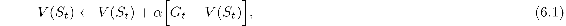
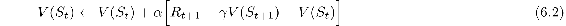
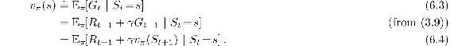
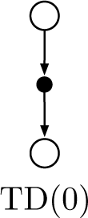
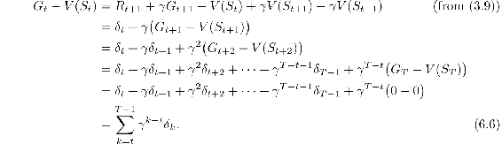
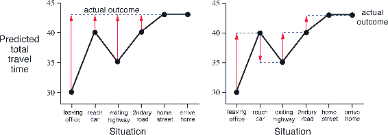

# 6.1  TD Prediction

Both TD and Monte Carlo methods use experience to solve the prediction problem. Given some experience following a policy *π*, both methods update their estimate *V* of *vπ* for the nonterminal states *S**t* occurring in that experience. Roughly speaking, Monte Carlo methods wait until the return following the visit is known, then use that return as a target for *V*(*S**t*). A simple every-visit Monte Carlo method suitable for nonstationary environments is

where G*t* is the actual return following time *t*, and *α* is a constant step-size parameter (c.f., [Equation 2.4](part0010_split_004.html#x1-19002r4)). Let us call this method *constant-α MC*. Whereas Monte Carlo methods must wait until the end of the episode to determine the increment to *V*(*S**t*) (only then is G*t* known), TD methods need to wait only until the next time step. At time *t* + 1 they immediately form a target and make a useful update using the observed reward *R**t*+1 and the estimate *V*(*S**t*+1). The simplest TD method makes the update

immediately on transition to *S**t*+1 and receiving *R**t*+1. In effect, the target for the Monte Carlo update is G*t*, whereas the target for the TD update is *R**t*+1 + *γV*(*S**t*+1). This TD method is called *TD(0)*, or *one-step TD*, because it is a special case of the TD(*λ*) and *n*-step TD methods developed in Chapter 12 and Chapter 7. The box below specifies TD(0) completely in procedural form.

**Tabular TD(0) for estimating *vπ***

Input: the policy *π* to be evaluated

Algorithm parameter: step size *α* ∈ (0, 1]

Initialize *V*(*s*), for all *s* ∈𝒮+, arbitrarily except that *V*(*terminal*) = 0

Loop for each episode:

Initialize *S*

Loop for each step of episode:

*A* ← action given by *π* for *S*

Take action *A*, observe *R*, *S*′

*V*(*S*) ← *V*(*S*) + *α*[*R* + *γV*(*S*′) − *V*(*S*)]

*S* ← *S*′

until *S* is terminal

Because TD(0) bases its update in part on an existing estimate, we say that it is a *bootstrapping* method, like DP. We know from Chapter 3 that

Roughly speaking, Monte Carlo methods use an estimate of ([6.3](part0014_split_001.html#x1-60003r3)) as a target, whereas DP methods use an estimate of (6.4) as a target. The Monte Carlo target is an estimate because the expected value in ([6.3](part0014_split_001.html#x1-60003r3)) is not known; a sample return is used in place of the real expected return. The DP target is an estimate not because of the expected values, which are assumed to be completely provided by a model of the environment, but because *vπ*(*S**t*+1) is not known and the current estimate, *V*(*S**t*+1), is used instead. The TD target is an estimate for both reasons: it samples the expected values in (6.4) *and* it uses the current estimate *V* instead of the true *vπ*. Thus, TD methods combine the sampling of Monte Carlo with the bootstrapping of DP. As we shall see, with care and imagination this can take us a long way toward obtaining the advantages of both Monte Carlo and DP methods.

Shown to the right is the backup diagram for tabular TD(0). The value estimate for the state node at the top of the backup diagram is updated on the basis of the one sample transition from it to the immediately following state. We refer to TD and Monte Carlo updates as *sample updates* because they involve looking ahead to a sample successor state (or state–action pair), using the value of the successor and the reward along the way to compute a backed-up value, and then updating the value of the original state (or state–action pair) accordingly. *Sample* updates differ from the *expected* updates of DP methods in that they are based on a single sample successor rather than on a complete distribution of all possible successors.

Finally, note that the quantity in brackets in the TD(0) update is a sort of error, measuring the difference between the estimated value of *S**t* and the better estimate *R**t*+1 + *γV*(*S**t*+1). This quantity, called the *TD error*, arises in various forms throughout reinforcement learning:

Notice that the TD error at each time is the error in the estimate *made at that time*. Because the TD error depends on the next state and next reward, it is not actually available until one time step later. That is, *δ**t* is the error in *V*(*S**t*), available at time *t* + 1. Also note that if the array *V* does not change during the episode (as it does not in Monte Carlo methods), then the Monte Carlo error can be written as a sum of TD errors:

This identity is not exact if *V* is updated during the episode (as it is in TD(0)), but if the step size is small then it may still hold approximately. Generalizations of this identity play an important role in the theory and algorithms of temporal-difference learning.

*Exercise 6.1* If *V* changes during the episode, then (6.6) only holds approximately; what would the difference be between the two sides? Let *V**t* denote the array of state values used at time *t* in the TD error ([6.5](part0014_split_001.html#x1-60009r5)) and in the TD update ([6.2](part0014_split_001.html#x1-60002r2)). Redo the derivation above to determine the additional amount that must be added to the sum of TD errors in order to equal the Monte Carlo error.

□

**Example 6.1: Driving Home** Each day as you drive home from work, you try to predict how long it will take to get home. When you leave your office, you note the time, the day of week, the weather, and anything else that might be relevant. Say on this Friday you are leaving at exactly 6 o’clock, and you estimate that it will take 30 minutes to get home. As you reach your car it is 6:05, and you notice it is starting to rain. Traffic is often slower in the rain, so you reestimate that it will take 35 minutes from then, or a total of 40 minutes. Fifteen minutes later you have completed the highway portion of your journey in good time. As you exit onto a secondary road you cut your estimate of total travel time to 35 minutes. Unfortunately, at this point you get stuck behind a slow truck, and the road is too narrow to pass. You end up having to follow the truck until you turn onto the side street where you live at 6:40. Three minutes later you are home. The sequence of states, times, and predictions is thus as follows:

|  |  |  |  |
| --- | --- | --- | --- |
| *State* | *Elapsed Time (minutes)* | *Predicted Time to Go* | *Predicted Total Time* |
| leaving office, friday at 6 | 0 | 30 | 30 |
| reach car, raining | 5 | 35 | 40 |
| exiting highway | 20 | 15 | 35 |
| 2ndary road, behind truck | 30 | 10 | 40 |
| entering home street | 40 | 3 | 43 |
| arrive home | 43 | 0 | 43 |

The rewards in this example are the elapsed times on each leg of the journey.[1](part0014_split_011.html#fn1x9) We are not discounting (*γ* = 1), and thus the return for each state is the actual time to go from that state. The value of each state is the *expected* time to go. The second column of numbers gives the current estimated value for each state encountered.

A simple way to view the operation of Monte Carlo methods is to plot the predicted total time (the last column) over the sequence, as in [Figure 6.1](part0014_split_001.html#fig6-1) (left). The red arrows show the changes in predictions recommended by the constant-*α* MC method (6.1), for *α* = 1. These are exactly the errors between the estimated value (predicted time to go) in each state and the actual return (actual time to go). For example, when you exited the highway you thought it would take only 15 minutes more to get home, but in fact it took 23 minutes. Equation 6.1 applies at this point and determines an increment in the estimate of time to go after exiting the highway. The error, G*t* − *V*(*S**t*), at this time is eight minutes. Suppose the step-size parameter, *α*, is 1/2. Then the predicted time to go after exiting the highway would be revised upward by four minutes as a result of this experience. This is probably too large a change in this case; the truck was probably just an unlucky break. In any event, the change can only be made off-line, that is, after you have reached home. Only at this point do you know any of the actual returns.

[Figure 6.1](part0014_split_001.html#C_fig6-1): Changes recommended in the driving home example by Monte Carlo methods (left) and TD methods (right).

Is it necessary to wait until the final outcome is known before learning can begin? Suppose on another day you again estimate when leaving your office that it will take 30 minutes to drive home, but then you become stuck in a massive traffic jam. Twenty-five minutes after leaving the office you are still bumper-to-bumper on the highway. You now estimate that it will take another 25 minutes to get home, for a total of 50 minutes. As you wait in traffic, you already know that your initial estimate of 30 minutes was too optimistic. Must you wait until you get home before increasing your estimate for the initial state? According to the Monte Carlo approach you must, because you don’t yet know the true return.

According to a TD approach, on the other hand, you would learn immediately, shifting your initial estimate from 30 minutes toward 50. In fact, each estimate would be shifted toward the estimate that immediately follows it. Returning to our first day of driving, [Figure 6.1](part0014_split_001.html#fig6-1) (right) shows the changes in the predictions recommended by the TD rule ([6.2](part0014_split_001.html#x1-60002r2)) (these are the changes made by the rule if *α* = 1). Each error is proportional to the change over time of the prediction, that is, to the *temporal differences* in predictions.

Besides giving you something to do while waiting in traffic, there are several computational reasons why it is advantageous to learn based on your current predictions rather than waiting until termination when you know the actual return. We briefly discuss some of these in the next section.

■

*Exercise 6.2* This is an exercise to help develop your intuition about why TD methods are often more efficient than Monte Carlo methods. Consider the driving home example and how it is addressed by TD and Monte Carlo methods. Can you imagine a scenario in which a TD update would be better on average than a Monte Carlo update? Give an example scenario—a description of past experience and a current state—in which you would expect the TD update to be better. Here’s a hint: Suppose you have lots of experience driving home from work. Then you move to a new building and a new parking lot (but you still enter the highway at the same place). Now you are starting to learn predictions for the new building. Can you see why TD updates are likely to be much better, at least initially, in this case? Might the same sort of thing happen in the original scenario?

□
