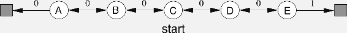
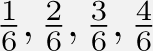
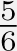
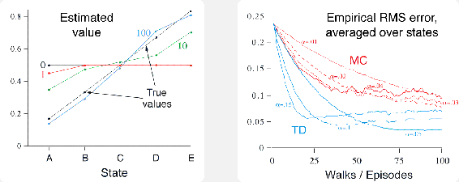
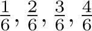
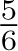

# 6.2  Advantages of TD Prediction Methods

TD methods update their estimates based in part on other estimates. They learn a guess from a guess—they *bootstrap*. Is this a good thing to do? What advantages do TD methods have over Monte Carlo and DP methods? Developing and answering such questions will take the rest of this book and more. In this section we briefly anticipate some of the answers.

Obviously, TD methods have an advantage over DP methods in that they do not require a model of the environment, of its reward and next-state probability distributions.

The next most obvious advantage of TD methods over Monte Carlo methods is that they are naturally implemented in an online, fully incremental fashion. With Monte Carlo methods one must wait until the end of an episode, because only then is the return known, whereas with TD methods one need wait only one time step. Surprisingly often this turns out to be a critical consideration. Some applications have very long episodes, so that delaying all learning until the end of the episode is too slow. Other applications are continuing tasks and have no episodes at all. Finally, as we noted in the previous chapter, some Monte Carlo methods must ignore or discount episodes on which experimental actions are taken, which can greatly slow learning. TD methods are much less susceptible to these problems because they learn from each transition regardless of what subsequent actions are taken.

But are TD methods sound? Certainly it is convenient to learn one guess from the next, without waiting for an actual outcome, but can we still guarantee convergence to the correct answer? Happily, the answer is yes. For any fixed policy *π*, TD(0) has been proved to converge to *vπ*, in the mean for a constant step-size parameter if it is sufficiently small, and with probability 1 if the step-size parameter decreases according to the usual stochastic approximation conditions ([2.7](part0010_split_005.html#x1-20003r7)). Most convergence proofs apply only to the table-based case of the algorithm presented above ([6.2](part0014_split_001.html#x1-60002r2)), but some also apply to the case of general linear function approx. These results are discussed in a more general setting in Chapter 9.

If both TD and Monte Carlo methods converge asymptotically to the correct predictions, then a natural next question is “Which gets there first?” In other words, which method learns faster? Which makes the more efficient use of limited data? At the current time this is an open question in the sense that no one has been able to prove mathematically that one method converges faster than the other. In fact, it is not even clear what is the most appropriate formal way to phrase this question! In practice, however, TD methods have usually been found to converge faster than constant-*α* MC methods on stochastic tasks, as illustrated in [Example 6.2](part0014_split_002.html#sec1-45) .

**Example 6.2   Random Walk**

In this example we empirically compare the prediction abilities of TD(0) and constant-*α* MC when applied to the following Markov reward process:

A *Markov reward process*, or MRP, is a Markov decision process without actions. We will often use MRPs when focusing on the prediction problem, in which there is no need to distinguish the dynamics due to the environment from those due to the agent. In this MRP, all episodes start in the center state, `C`, then proceed either left or right by one state on each step, with equal probability. Episodes terminate either on the extreme left or the extreme right. When an episode terminates on the right, a reward of + 1 occurs; all other rewards are zero. For example, a typical episode might consist of the following state-and-reward sequence: `C`, 0, `B`, 0, `C`, 0, `D`, 0, `E`, 1. Because this task is undiscounted, the true value of each state is the probability of terminating on the right if starting from that state. Thus, the true value of the center state is *vπ*(`C`) = 0.5. The true values of all the states, `A` through `E`, are , and .

The left graph above shows the values learned after various numbers of episodes on a single run of TD(0). The estimates after 100 episodes are about as close as they ever come to the true values—with a constant step-size parameter (*α* = 0.1 in this example), the values fluctuate indefinitely in response to the outcomes of the most recent episodes. The right graph shows learning curves for the two methods for various values of *α*. The performance measure shown is the root mean-squared (RMS) error between the value function learned and the true value function, averaged over the five states, then averaged over 100 runs. In all cases the approximate value function was initialized to the intermediate value *V*(*s*) = 0.5, for all *s*. The TD method was consistently better than the MC method on this task.

*Exercise 6.3* From the results shown in the left graph of the random walk example it appears that the first episode results in a change in only *V*(`A`). What does this tell you about what happened on the first episode? Why was only the estimate for this one state changed? By exactly how much was it changed?

□

*Exercise 6.4* The specific results shown in the right graph of the random walk example are dependent on the value of the step-size parameter, *α*. Do you think the conclusions about which algorithm is better would be affected if a wider range of *α* values were used? Is there a different, fixed value of *α* at which either algorithm would have performed significantly better than shown? Why or why not?

□

**\*** *Exercise 6.5* In the right graph of the random walk example, the RMS error of the TD method seems to go down and then up again, particularly at high *α*’s. What could have caused this? Do you think this always occurs, or might it be a function of how the approximate value function was initialized?

□

*Exercise 6.6* In [Example 6.2](part0014_split_002.html#sec1-45)  we stated that the true values for the random walk example are , and , for states `A` through `E`. Describe at least two different ways that these could have been computed. Which would you guess we actually used? Why?

□
