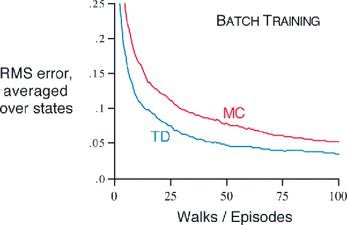
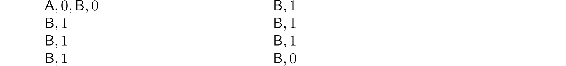
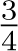
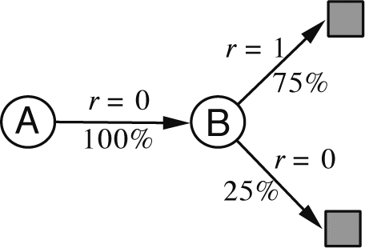
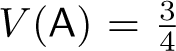

# 6.3  Optimality of TD(0)

Suppose there is available only a finite amount of experience, say 10 episodes or 100 time steps. In this case, a common approach with incremental learning methods is to present the experience repeatedly until the method converges upon an answer. Given an approximate value function, *V*, the increments specified by (6.1) or ([6.2](part0014_split_001.html#x1-60002r2)) are computed for every time step *t* at which a nonterminal state is visited, but the value function is changed only once, by the sum of all the increments. Then all the available experience is processed again with the new value function to produce a new overall increment, and so on, until the value function converges. We call this *batch updating* because updates are made only after processing each complete *batch* of training data.

Under batch updating, TD(0) converges deterministically to a single answer independent of the step-size parameter, *α*, as long as *α* is chosen to be sufficiently small. The constant-*α* MC method also converges deterministically under the same conditions, but to a different answer. Understanding these two answers will help us understand the difference between the two methods. Under normal updating the methods do not move all the way to their respective batch answers, but in some sense they take steps in these directions. Before trying to understand the two answers in general, for all possible tasks, we first look at a few examples.

**Example 6.3: Random walk under batch updating** Batch-updating versions of TD(0) and constant-*α* MC were applied as follows to the random walk prediction example ([Example 6.2](part0014_split_002.html#sec1-45)). After each new episode, all episodes seen so far were treated as a batch. They were repeatedly presented to the algorithm, either TD(0) or constant-*α* MC, with *α* sufficiently small that the value function converged. The resulting value function was then compared with *vπ*, and the average root mean-squared error across the five states (and across 100 independent repetitions of the whole experiment) was plotted to obtain the learning curves shown in [Figure 6.2](part0014_split_003.html#fig6-2). Note that the batch TD method was consistently better than the batch Monte Carlo method.

[Figure 6.2](part0014_split_003.html#C_fig6-2): Performance of TD(0) and constant-*α* MC under batch training on the random walk task.

Under batch training, constant-*α* MC converges to values, *V*(*s*), that are sample averages of the actual returns experienced after visiting each state *s*. These are optimal estimates in the sense that they minimize the mean-squared error from the actual returns in the training set. In this sense it is surprising that the batch TD method was able to perform better according to the root mean-squared error measure shown in the figure to the right. How is it that batch TD was able to perform better than this optimal method? The answer is that the Monte Carlo method is optimal only in a limited way, and that TD is optimal in a way that is more relevant to predicting returns.

■

**Example 6.4: You are the Predictor** Place yourself now in the role of the predictor of returns for an unknown Markov reward process. Suppose you observe the following eight episodes:

This means that the first episode started in state `A`, transitioned to `B` with a reward of 0, and then terminated from `B` with a reward of 0. The other seven episodes were even shorter, starting from `B` and terminating immediately. Given this batch of data, what would you say are the optimal predictions, the best values for the estimates *V*(`A`) and *V*(`B`)? Everyone would probably agree that the optimal value for *V*(`B`) is , because six out of the eight times in state `B` the process terminated immediately with a return of 1, and the other two times in `B` the process terminated immediately with a return of 0.

But what is the optimal value for the estimate *V*(`A`) given this data? Here there are two reasonable answers. One is to observe that 100% of the times the process was in state `A` it traversed immediately to `B` (with a reward of 0); and because we have already decided that `B` has value , therefore `A` must have value  as well. One way of viewing this answer is that it is based on first modeling the Markov process, in this case as shown to the right, and then computing the correct estimates given the model, which indeed in this case gives . This is also the answer that batch TD(0) gives.

The other reasonable answer is simply to observe that we have seen `A` once and the return that followed it was 0; we therefore estimate *V*(`A`) as 0. This is the answer that batch Monte Carlo methods give. Notice that it is also the answer that gives minimum squared error on the training data. In fact, it gives zero error on the data. But still we expect the first answer to be better. If the process is Markov, we expect that the first answer will produce lower error on *future* data, even though the Monte Carlo answer is better on the existing data.

■

[Example 6.4](part0014_split_003.html#sec1-46)  illustrates a general difference between the estimates found by batch TD(0) and batch Monte Carlo methods. Batch Monte Carlo methods always find the estimates that minimize mean-squared error on the training set, whereas batch TD(0) always finds the estimates that would be exactly correct for the maximum-likelihood model of the Markov process. In general, the *maximum-likelihood estimate* of a parameter is the parameter value whose probability of generating the data is greatest. In this case, the maximum-likelihood estimate is the model of the Markov process formed in the obvious way from the observed episodes: the estimated transition probability from *i* to *j* is the fraction of observed transitions from *i* that went to *j*, and the associated expected reward is the average of the rewards observed on those transitions. Given this model, we can compute the estimate of the value function that would be exactly correct if the model were exactly correct. This is called the *certainty-equivalence estimate* because it is equivalent to assuming that the estimate of the underlying process was known with certainty rather than being approximated. In general, batch TD(0) converges to the certainty-equivalence estimate.

This helps explain why TD methods converge more quickly than Monte Carlo methods. In batch form, TD(0) is faster than Monte Carlo methods because it computes the true certainty-equivalence estimate. This explains the advantage of TD(0) shown in the batch results on the random walk task ([Figure 6.2](part0014_split_003.html#fig6-2)). The relationship to the certainty-equivalence estimate may also explain in part the speed advantage of nonbatch TD(0) (e.g., [Example 6.2](part0014_split_002.html#sec1-45), page 125, right graph). Although the nonbatch methods do not achieve either the certainty-equivalence or the minimum squared-error estimates, they can be understood as moving roughly in these directions. Nonbatch TD(0) may be faster than constant-*α* MC because it is moving toward a better estimate, even though it is not getting all the way there. At the current time nothing more definite can be said about the relative efficiency of online TD and Monte Carlo methods.

Finally, it is worth noting that although the certainty-equivalence estimate is in some sense an optimal solution, it is almost never feasible to compute it directly. If *n* = |𝒮| is the number of states, then just forming the maximum-likelihood estimate of the process may require on the order of *n*2 memory, and computing the corresponding value function requires on the order of *n*3 computational steps if done conventionally. In these terms it is indeed striking that TD methods can approximate the same solution using memory no more than order *n* and repeated computations over the training set. On tasks with large state spaces, TD methods may be the only feasible way of approximating the certainty-equivalence solution.

**\*** *Exercise 6.7* Design an off-policy version of the TD(0) update that can be used with arbitrary target policy *π* and covering behavior policy *b*, using at each step *t* the importance sampling ratio *ρ**t*:*t* ([5.3](part0013_split_005.html#x1-52001r3)).

□
