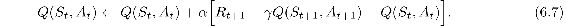
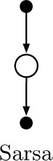
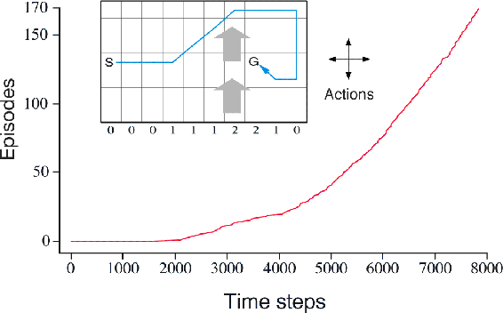

# 6.4  Sarsa: On-policy TD Control

We turn now to the use of TD prediction methods for the control problem. As usual, we follow the pattern of generalized policy iteration (GPI), only this time using TD methods for the evaluation or prediction part. As with Monte Carlo methods, we face the need to trade off exploration and exploitation, and again approaches fall into two main classes: on-policy and off-policy. In this section we present an on-policy TD control method.

The first step is to learn an action-value function rather than a state-value function. In particular, for an on-policy method we must estimate *qπ*(*s, a*) for the current behavior policy *π* and for all states *s* and actions *a*. This can be done using essentially the same TD method described above for learning *vπ*. Recall that an episode consists of an alternating sequence of states and state–action pairs:

In the previous section we considered transitions from state to state and learned the values of states. Now we consider transitions from state–action pair to state–action pair, and learn the values of state–action pairs. Formally these cases are identical: they are both Markov chains with a reward process. The theorems assuring the convergence of state values under TD(0) also apply to the corresponding algorithm for action values:

This update is done after every transition from a nonterminal state *S**t*. If *S**t*+1 is terminal, then *Q*(*S**t*+1*, A**t*+1) is defined as zero. This rule uses every element of the quintuple of events, (*S**t**, A**t**, R**t*+1*, S**t*+1*, A**t*+1), that make up a transition from one state–action pair to the next. This quintuple gives rise to the name *Sarsa* for the algorithm. The backup diagram for Sarsa is as shown to the right.

It is straightforward to design an on-policy control algorithm based on the Sarsa prediction method. As in all on-policy methods, we continually estimate *qπ* for the behavior policy *π*, and at the same time change *π* toward greediness with respect to *qπ*. The general form of the Sarsa control algorithm is given in the box on the next page.

The convergence properties of the Sarsa algorithm depend on the nature of the policy’s dependence on *Q*. For example, one could use *ε*-greedy or *ε*-soft policies. Sarsa converges with probability 1 to an optimal policy and action-value function as long as all state–action pairs are visited an infinite number of times and the policy converges in the limit to the greedy policy (which can be arranged, for example, with *ε*-greedy policies by setting *ε* = 1*/t*).

*Exercise 6.8* Show that an action-value version of (6.6) holds for the action-value form of the TD error *δ**t* = *R**t*+1 + *γ Q*(*S**t*+1*, A**t*+1) − *Q*(*S**t**, A**t*), again assuming that the values don’t change from step to step.

□

**Sarsa (on-policy TD control) for estimating *Q* ≈ *q*\***

Algorithm parameters: step size *α* ∈ (0, 1], small *ε >* 0

Initialize *Q*(*s, a*), for all *s* ∈𝒮+*, a* ∈𝒜(*s*), arbitrarily except that *Q*(*terminal*, ·) = 0

Loop for each episode:

Initialize *S*

Choose *A* from *S* using policy derived from *Q* (e.g., *ε*-greedy)

Loop for each step of episode:

Take action *A*, observe *R*, *S*′

Choose *A*′ from *S*′ using policy derived from *Q* (e.g., *ε*-greedy)

*Q*(*S, A*) ← *Q*(*S, A*) + *α*[*R* + *γQ*(*S*′*, A*′) − *Q*(*S, A*)]

*S* ← *S*′; *A* ← *A*′;

until *S* is terminal

**Example 6.5: Windy Gridworld** Shown inset below is a standard gridworld, with start and goal states, but with one difference: there is a crosswind running upward through the middle of the grid. The actions are the standard four—up, down, right, and left—but in the middle region the resultant next states are shifted upward by a “wind,” the strength of which varies from column to column. The strength of the wind is given below each column, in number of cells shifted upward. For example, if you are one cell to the right of the goal, then the action left takes you to the cell just above the goal. This is an undiscounted episodic task, with constant rewards of − 1 until the goal state is reached.

The graph to the right shows the results of applying *ε*-greedy Sarsa to this task, with *ε* = 0.1, *α* = 0.5, and the initial values *Q*(*s, a*) = 0 for all *s, a*. The increasing slope of the graph shows that the goal was reached more quickly over time. By 8000 time steps, the greedy policy was long since optimal (a trajectory from it is shown inset); continued *ε*-greedy exploration kept the average episode length at about 17 steps, two more than the minimum of 15. Note that Monte Carlo methods cannot easily be used on this task because termination is not guaranteed for all policies. If a policy was ever found that caused the agent to stay in the same state, then the next episode would never end. Step-by-step learning methods such as Sarsa do not have this problem because they quickly learn *during the episode* that such policies are poor, and switch to something else.

■

*Exercise 6.9: Windy Gridworld with King’s Moves* Re-solve the windy gridworld assuming eight possible actions, including the diagonal moves, rather than the usual four. How much better can you do with the extra actions? Can you do even better by including a ninth action that causes no movement at all other than that caused by the wind?

□

*Exercise 6.10: Stochastic Wind* Re-solve the windy gridworld task with King’s moves, assuming that the effect of the wind, if there is any, is stochastic, sometimes varying by 1 from the mean values given for each column. That is, a third of the time you move exactly according to these values, as in the previous exercise, but also a third of the time you move one cell above that, and another third of the time you move one cell below that. For example, if you are one cell to the right of the goal and you move left, then one-third of the time you move one cell above the goal, one-third of the time you move two cells above the goal, and one-third of the time you move to the goal.

□
