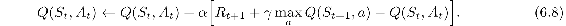
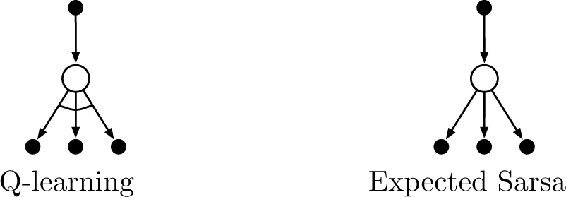
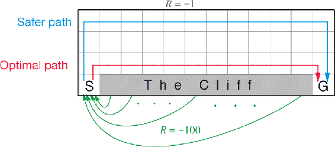
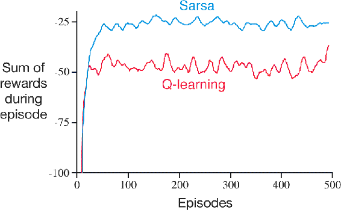

# 6.5  Q-learning: Off-policy TD Control

One of the early breakthroughs in reinforcement learning was the development of an off-policy TD control algorithm known as *Q-learning* (Watkins, 1989), defined by

In this case, the learned action-value function, *Q*, directly approximates *q*\*, the optimal action-value function, independent of the policy being followed. This dramatically simplifies the analysis of the algorithm and enabled early convergence proofs. The policy still has an effect in that it determines which state–action pairs are visited and updated. However, all that is required for correct convergence is that all pairs continue to be updated. As we observed in Chapter 5, this is a minimal requirement in the sense that any method guaranteed to find optimal behavior in the general case must require it. Under this assumption and a variant of the usual stochastic approximation conditions on the sequence of step-size parameters, *Q* has been shown to converge with probability 1 to *q*\*. The Q-learning algorithm is shown below in procedural form.

**Q-learning (off-policy TD control) for estimating *π* ≈ *π*\***

Algorithm parameters: step size *α* ∈ (0, 1], small *ε >* 0

Initialize *Q*(*s, a*), for all *s* ∈𝒮+*, a* ∈𝒜(*s*), arbitrarily except that *Q*(*terminal*, ·) = 0

Loop for each episode:

Initialize *S*

Loop for each step of episode:

Choose *A* from *S* using policy derived from *Q* (e.g., *ε*-greedy)

Take action *A*, observe *R*, *S*′

*Q*(*S, A*) ← *Q*(*S, A*) + *α*[*R* + *γ* max*a* *Q*(*S*′*, a*) − *Q*(*S, A*)]

*S* ← *S*′

until *S* is terminal

What is the backup diagram for Q-learning? The rule (6.8) updates a state–action pair, so the top node, the root of the update, must be a small, filled action node. The update is also *from* action nodes, maximizing over all those actions possible in the next state. Thus the bottom nodes of the backup diagram should be all these action nodes. Finally, remember that we indicate taking the maximum of these “next action” nodes with an arc across them ([Figure 3.4](part0011_split_006.html#fig3-4)-right). Can you guess now what the diagram is? If so, please do make a guess before turning to the answer in [Figure 6.4](part0014_split_005.html#fig6-4) on page 134.

[Figure 6.4](part0014_split_005.html#C_fig6-4): The backup diagrams for Q-learning and Expected Sarsa.

**Example 6.6: Cliff Walking** This gridworld example compares Sarsa and Q-learning, highlighting the difference between on-policy (Sarsa) and off-policy (Q-learning) methods. Consider the gridworld shown to the right. This is a standard undiscounted, episodic task, with start and goal states, and the usual actions causing movement up, down, right, and left. Reward is − 1 on all transitions except those into the region marked “The Cliff.” Stepping into this region incurs a reward of − 100 and sends the agent instantly back to the start.

The graph to the right shows the performance of the Sarsa and Q-learning methods with *ε*-greedy action selection, *ε* = 0.1. After an initial transient, Q-learning learns values for the optimal policy, that which travels right along the edge of the cliff. Unfortunately, this results in its occasionally falling off the cliff because of the *ε*-greedy action selection. Sarsa, on the other hand, takes the action selection into account and learns the longer but safer path through the upper part of the grid. Although Q-learning actually learns the values of the optimal policy, its online performance is worse than that of Sarsa, which learns the roundabout policy. Of course, if *ε* were gradually reduced, then both methods would asymptotically converge to the optimal policy.

■

*Exercise 6.11* Why is Q-learning considered an *off-policy* control method?

□

*Exercise 6.12* Suppose action selection is greedy. Is Q-learning then exactly the same algorithm as Sarsa? Will they make exactly the same action selections and weight updates?

□
