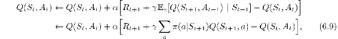
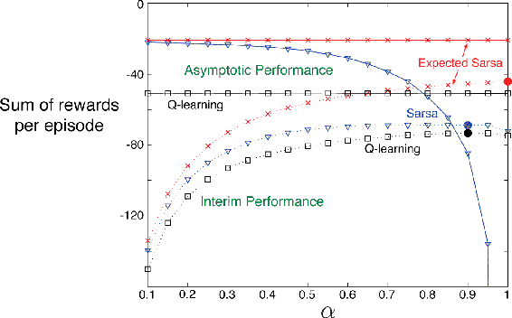

# 6.6  Expected Sarsa

Consider the learning algorithm that is just like Q-learning except that instead of the maximum over next state–action pairs it uses the expected value, taking into account how likely each action is under the current policy. That is, consider the algorithm with the update rule

but that otherwise follows the schema of Q-learning. Given the next state, *S**t*+1, this algorithm moves *deterministically* in the same direction as Sarsa moves *in expectation*, and accordingly it is called *Expected Sarsa*. Its backup diagram is shown on the right in [Figure 6.4](part0014_split_005.html#fig6-4).

Expected Sarsa is more complex computationally than Sarsa but, in return, it eliminates the variance due to the random selection of *A**t*+1. Given the same amount of experience we might expect it to perform slightly better than Sarsa, and indeed it generally does. [Figure 6.3](part0014_split_006.html#fig6-3) shows summary results on the cliff-walking task with Expected Sarsa compared to Sarsa and Q-learning. Expected Sarsa retains the significant advantage of Sarsa over Q-learning on this problem. In addition, Expected Sarsa shows a significant improvement over Sarsa over a wide range of values for the step-size parameter *α*. In cliff walking the state transitions are all deterministic and all randomness comes from the policy. In such cases, Expected Sarsa can safely set *α* = 1 without suffering any degradation of asymptotic performance, whereas Sarsa can only perform well in the long run at a small value of *α*, at which short-term performance is poor. In this and other examples there is a consistent empirical advantage of Expected Sarsa over Sarsa.

[Figure 6.3](part0014_split_006.html#C_fig6-3): Interim and asymptotic performance of TD control methods on the cliff-walking task as a function of *α*. All algorithms used an *ε*-greedy policy with *ε* = 0.1. Asymptotic performance is an average over 100,000 episodes whereas interim performance is an average over the first 100 episodes. These data are averages of over 50,000 and 10 runs for the interim and asymptotic cases respectively. The solid circles mark the best interim performance of each method. Adapted from van Seijen et al. (2009).

In these cliff walking results Expected Sarsa was used on-policy, but in general it might use a policy different from the target policy *π* to generate behavior, in which case it becomes an off-policy algorithm. For example, suppose *π* is the greedy policy while behavior is more exploratory; then Expected Sarsa is exactly Q-learning. In this sense Expected Sarsa subsumes and generalizes Q-learning while reliably improving over Sarsa. Except for the small additional computational cost, Expected Sarsa may completely dominate both of the other more-well-known TD control algorithms.
