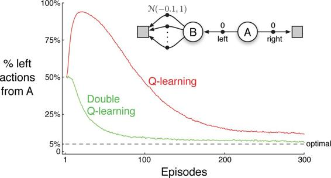
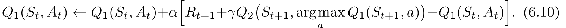

# 6.7  Maximization Bias and Double Learning

All the control algorithms that we have discussed so far involve maximization in the construction of their target policies. For example, in Q-learning the target policy is the greedy policy given the current action values, which is defined with a max, and in Sarsa the policy is often *ε*-greedy, which also involves a maximization operation. In these algorithms, a maximum over estimated values is used implicitly as an estimate of the maximum value, which can lead to a significant positive bias. To see why, consider a single state *s* where there are many actions *a* whose true values, *q*(*s, a*), are all zero but whose estimated values, *Q*(*s, a*), are uncertain and thus distributed some above and some below zero. The maximum of the true values is zero, but the maximum of the estimates is positive, a positive bias. We call this *maximization bias*.

**Example 6.7: Maximization Bias Example** The small MDP shown inset in [Figure 6.5](part0014_split_007.html#fig6-5) provides a simple example of how maximization bias can harm the performance of TD control algorithms. The MDP has two non-terminal states `A` and `B`. Episodes always start in `A` with a choice between two actions, `left` and `right`. The `right` action transitions immediately to the terminal state with a reward and return of zero. The `left` action transitions to `B`, also with a reward of zero, from which there are many possible actions all of which cause immediate termination with a reward drawn from a normal distribution with mean − 0.1 and variance 1.0. Thus, the expected return for any trajectory starting with `left` is − 0.1, and thus taking `left` in state `A` is always a mistake. Nevertheless, our control methods may favor `left` because of maximization bias making `B` appear to have a positive value. [Figure 6.5](part0014_split_007.html#fig6-5) shows that Q-learning with *ε*-greedy action selection initially learns to strongly favor the `left` action on this example. Even at asymptote, Q-learning takes the `left` action about 5% more often than is optimal at our parameter settings (*ε* = 0.1, *α* = 0.1, and *γ* = 1).

[Figure 6.5](part0014_split_007.html#C_fig6-5): Comparison of Q-learning and Double Q-learning on a simple episodic MDP (shown inset). Q-learning initially learns to take the `left` action much more often than the `right` action, and always takes it significantly more often than the 5% minimum probability enforced by *ε*-greedy action selection with *ε* = 0.1. In contrast, Double Q-learning is essentially unaffected by maximization bias. These data are averaged over 10,000 runs. The initial action-value estimates were zero. Any ties in *ε*-greedy action selection were broken randomly.

■

Are there algorithms that avoid maximization bias? To start, consider a bandit case in which we have noisy estimates of the value of each of many actions, obtained as sample averages of the rewards received on all the plays with each action. As we discussed above, there will be a positive maximization bias if we use the maximum of the estimates as an estimate of the maximum of the true values. One way to view the problem is that it is due to using the same samples (plays) both to determine the maximizing action and to estimate its value. Suppose we divided the plays in two sets and used them to learn two independent estimates, call them *Q*1(*a*) and *Q*2(*a*), each an estimate of the true value *q*(*a*), for all *a* ∈𝒜. We could then use one estimate, say *Q*1, to determine the maximizing action *A*\* = arg max*a* *Q*1(*a*), and the other, *Q*2, to provide the estimate of its value, *Q*2(*A*\*) = *Q*2(arg max*a* *Q*1(*a*)). This estimate will then be unbiased in the sense that 𝔼[*Q*2(*A*\*)] = *q*(*A*\*). We can also repeat the process with the role of the two estimates reversed to yield a second unbiased estimate *Q*1(arg max*a* *Q*2(*a*)). This is the idea of *double learning*. Note that although we learn two estimates, only one estimate is updated on each play; double learning doubles the memory requirements, but does not increase the amount of computation per step.

The idea of double learning extends naturally to algorithms for full MDPs. For example, the double learning algorithm analogous to Q-learning, called Double Q-learning, divides the time steps in two, perhaps by flipping a coin on each step. If the coin comes up heads, the update is

If the coin comes up tails, then the same update is done with *Q*1 and *Q*2 switched, so that *Q*2 is updated. The two approximate value functions are treated completely symmetrically. The behavior policy can use both action-value estimates. For example, an *ε*-greedy policy for Double Q-learning could be based on the average (or sum) of the two action-value estimates. A complete algorithm for Double Q-learning is given in the box below. This is the algorithm used to produce the results in [Figure 6.5](part0014_split_007.html#fig6-5). In that example, double learning seems to eliminate the harm caused by maximization bias. Of course there are also double versions of Sarsa and Expected Sarsa.

**Double Q-learning, for estimating *Q*1 ≈ *Q*2 ≈ *q*\***

Algorithm parameters: step size *α* ∈ (0, 1], small *ε >* 0

Initialize *Q*1(*s, a*) and *Q*2(*s, a*), for all *s* ∈𝒮+*, a* ∈𝒜(*s*), such that *Q*(*terminal*, ·) = 0

Loop for each episode:

Initialize *S*

Loop for each step of episode:

Choose *A* from *S* using the policy *ε*-greedy in *Q*1 + *Q*2

Take action *A*, observe *R*, *S*′

With 0.5 probabilility:

*Q*1(*S, A*) ← *Q*1(*S, A*) + *α*(*R* + *γ Q*2(*S*′, arg max*a* *Q*1(*S*′*, a*)) − *Q*1(*S, A*))

else:

*Q*2(*S, A*) ← *Q*2(*S, A*) + *α*(*R* + *γ Q*1(*S*′, arg max*a* *Q*2(*S*′*, a*)) − *Q*2(*S, A*))

*S* ← *S*′

until *S* is terminal

**\*** *Exercise 6.13* What are the update equations for Double Expected Sarsa with an *ε*-greedy target policy?

□
