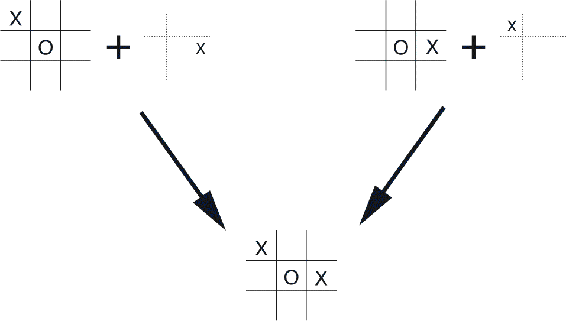

# 6.8  Games, Afterstates, and Other Special Cases

In this book we try to present a uniform approach to a wide class of tasks, but of course there are always exceptional tasks that are better treated in a specialized way. For example, our general approach involves learning an *action*-value function, but in Chapter 1 we presented a TD method for learning to play tic-tac-toe that learned something much more like a *state*-value function. If we look closely at that example, it becomes apparent that the function learned there is neither an action-value function nor a state-value function in the usual sense. A conventional state-value function evaluates states in which the agent has the option of selecting an action, but the state-value function used in tic-tac-toe evaluates board positions *after* the agent has made its move. Let us call these *afterstates*, and value functions over these, *afterstate value functions*. Afterstates are useful when we have knowledge of an initial part of the environment’s dynamics but not necessarily of the full dynamics. For example, in games we typically know the immediate effects of our moves. We know for each possible chess move what the resulting position will be, but not how our opponent will reply. Afterstate value functions are a natural way to take advantage of this kind of knowledge and thereby produce a more efficient learning method.

The reason it is more efficient to design algorithms in terms of afterstates is apparent from the tic-tac-toe example. A conventional action-value function would map from positions *and* moves to an estimate of the value. But many position—move pairs produce the same resulting position, as in the example below: In such cases the positionŮmove pairs are different but produce the same “afterposition," and thus must have the same value. A conventional action-value function would have to separately assess both pairs, whereas an afterstate value function would immediately assess both equally. Any learning about the position–move pair on the left would immediately transfer to the pair on the right.

Afterstates arise in many tasks, not just games. For example, in queuing tasks there are actions such as assigning customers to servers, rejecting customers, or discarding information. In such cases the actions are in fact defined in terms of their immediate effects, which are completely known.

It is impossible to describe all the possible kinds of specialized problems and corresponding specialized learning algorithms. However, the principles developed in this book should apply widely. For example, afterstate methods are still aptly described in terms of generalized policy iteration, with a policy and (afterstate) value function interacting in essentially the same way. In many cases one will still face the choice between on-policy and off-policy methods for managing the need for persistent exploration.

*Exercise 6.14* Describe how the task of Jack’s Car Rental ([Example 4.1](part0012_split_003.html#sec1-28)) could be reformulated in terms of afterstates. Why, in terms of this specific task, would such a reformulation be likely to speed convergence?

□
