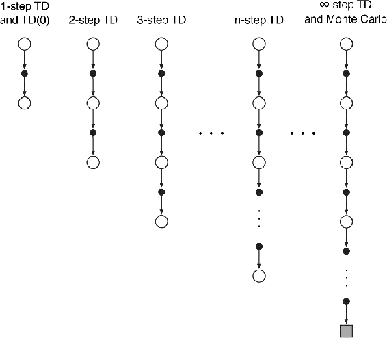
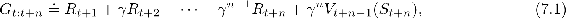
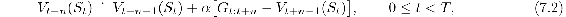
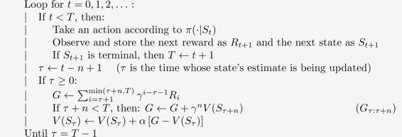
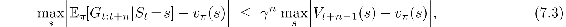
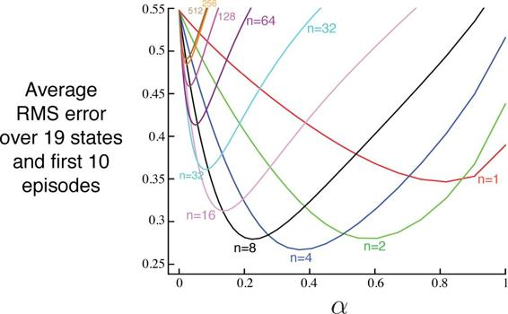

# 7.1  *n*-step TD Prediction

What is the space of methods lying between Monte Carlo and TD methods? Consider estimating *vπ* from sample episodes generated using *π*. Monte Carlo methods perform an update for each state based on the entire sequence of observed rewards from that state until the end of the episode. The update of one-step TD methods, on the other hand, is based on just the one next reward, bootstrapping from the value of the state one step later as a proxy for the remaining rewards. One kind of intermediate method, then, would perform an update based on an intermediate number of rewards: more than one, but less than all of them until termination. For example, a two-step update would be based on the first two rewards and the estimated value of the state two steps later. Similarly, we could have three-step updates, four-step updates, and so on. [Figure 7.1](part0015_split_001.html#fig7-1) shows the backup diagrams of the spectrum of *n-step updates* for *vπ*, with the one-step TD update on the left and the up-until-termination Monte Carlo update on the right.

[Figure 7.1](part0015_split_001.html#C_fig7-1): The backup diagrams of *n*-step methods. These methods form a spectrum ranging from one-step TD methods to Monte Carlo methods.

The methods that use *n*-step updates are still TD methods because they still change an earlier estimate based on how it differs from a later estimate. Now the later estimate is not one step later, but *n* steps later. Methods in which the temporal difference extends over *n* steps are called *n-step TD methods*. The TD methods introduced in the previous chapter all used one-step updates, which is why we called them one-step TD methods.

More formally, consider the update of the estimated value of state *S**t* as a result of the state–reward sequence, *S**t**, R**t*+1*, S**t*+1*, R**t*+2*, …, R**T**, S**T* (omitting the actions). We know that in Monte Carlo updates the estimate of *vπ*(*S**t*) is updated in the direction of the complete return:

where *T* is the last time step of the episode. Let us call this quantity the *target* of the update. Whereas in Monte Carlo updates the target is the return, in one-step updates the target is the first reward plus the discounted estimated value of the next state, which we call the *one-step return*:

where *V**t* : 𝒮 *→* ℝ here is the estimate at time *t* of *vπ*. The subscripts on G*t*:*t*+1 indicate that it is a truncated return for time *t* using rewards up until time *t* + 1, with the discounted estimate *γ V**t*(*S**t*+1) taking the place of the other terms *γ R**t*+2 + *γ*2*R**t*+3 + ⋯ + *γ**T* − *t* − 1*R**T* of the full return, as discussed in the previous chapter. Our point now is that this idea makes just as much sense after two steps as it does after one. The target for a two-step update is the *two-step return*:

where now *γ*2*V**t*+1(*S**t*+2) corrects for the absence of the terms *γ*2*R**t*+3 + *γ*3*R**t*+4 + ⋯ + *γ**T* − *t* − 1*R**T*. Similarly, the target for an arbitrary *n*-step update is the *n-step return*:

for all *n, t* such that *n* ≥ 1 and 0 ≤ *t < T* − *n*. All *n*-step returns can be considered approximations to the full return, truncated after *n* steps and then corrected for the remaining missing terms by *V**t*+*n*−1(*S**t*+*n*). If *t* + *n* ≥ *T* (if the *n*-step return extends to or beyond termination), then all the missing terms are taken as zero, and the *n*-step return defined to be equal to the ordinary full return (G*t*:*t*+*n* ≐ *G**t* if *t* + *n* ≥ *T*).

Note that *n*-step returns for *n >* 1 involve future rewards and states that are not available at the time of transition from *t* to *t* + 1. No real algorithm can use the *n*-step return until after it has seen *R**t*+*n* and computed *V**t*+*n*−1. The first time these are available is *t* + *n*. The natural state-value learning algorithm for using *n*-step returns is thus

while the values of all other states remain unchanged: *V**t*+*n*(*s*) = *V**t*+*n*−1(*s*), for all *s* ≠ *S**t*. We call this algorithm *n-step TD*. Note that no changes at all are made during the first *n*− 1 steps of each episode. To make up for that, an equal number of additional updates are made at the end of the episode, after termination and before starting the next episode. Complete pseudocode is given in the box on the next page.

*Exercise 7.1* In Chapter 6 we noted that the Monte Carlo error can be written as the sum of TD errors (6.6) if the value estimates don’t change from step to step. Show that the *n*-step error used in ([7.2](part0015_split_001.html#x1-71003r2)) can also be written as a sum TD errors (again if the value estimates don’t change) generalizing the earlier result.

□

*Exercise 7.2 (programming)* With an *n*-step method, the value estimates *do* change from step to step, so an algorithm that used the sum of TD errors (see previous exercise) in place of the error in ([7.2](part0015_split_001.html#x1-71003r2)) would actually be a slightly different algorithm. Would it be a better algorithm or a worse one? Devise and program a small experiment to answer this question empirically.

□

***n*-step TD for estimating *V*≈ *vπ***

Input: a policy *π*

Algorithm parameters: step size *α* ∈ (0, 1], a positive integer *n*

Initialize *V*(*s*) arbitrarily, for all *s* ∈𝒮

All store and access operations (for *S**t* and *R**t*) can take their index mod *n* + 1

Loop for each episode:

Initialize and store *S*0 ≠ terminal

*T* ← ∞

The *n*-step return uses the value function *V**t*+*n*−1 to correct for the missing rewards beyond *R**t*+*n*. An important property of *n*-step returns is that their expectation is guaranteed to be a better estimate of *vπ* than *V**t*+*n*−1 is, in a worst-state sense. That is, the worst error of the expected *n*-step return is guaranteed to be less than or equal to *γ**n* times the worst error under *V**t*+*n*−1:

for all *n* ≥ 1. This is called the *error reduction property* of *n*-step returns. Because of the error reduction property, one can show formally that all *n*-step TD methods converge to the correct predictions under appropriate technical conditions. The *n*-step TD methods thus form a family of sound methods, with one-step TD methods and Monte Carlo methods as extreme members.

**Example 7.1:** ***n*****-step TD Methods on the Random Walk** Consider using *n*-step TD methods on the 5-state random walk task described in [Example 6.2](part0014_split_002.html#sec1-45)  (page 125). Suppose the first episode progressed directly from the center state, `C`, to the right, through `D` and `E`, and then terminated on the right with a return of 1. Recall that the estimated values of all the states started at an intermediate value, *V*(*s*) = 0.5. As a result of this experience, a one-step method would change only the estimate for the last state, *V*(`E`), which would be incremented toward 1, the observed return. A two-step method, on the other hand, would increment the values of the two states preceding termination: *V*(`D`) and *V*(`E`) both would be incremented toward 1. A three-step method, or any *n*-step method for *n >* 2, would increment the values of all three of the visited states toward 1, all by the same amount.

Which value of *n* is better? [Figure 7.2](part0015_split_001.html#fig7-2) shows the results of a simple empirical test for a larger random walk process, with 19 states instead of 5 (and with a − 1 outcome on the left, all values initialized to 0), which we use as a running example in this chapter. Results are shown for *n*-step TD methods with a range of values for *n* and *α*. The performance measure for each parameter setting, shown on the vertical axis, is the square-root of the average squared error between the predictions at the end of the episode for the 19 states and their true values, then averaged over the first 10 episodes and 100 repetitions of the whole experiment (the same sets of walks were used for all parameter settings). Note that methods with an intermediate value of *n* worked best. This illustrates how the generalization of TD and Monte Carlo methods to *n*-step methods can potentially perform better than either of the two extreme methods.

[Figure 7.2](part0015_split_001.html#C_fig7-2): Performance of *n*-step TD methods as a function of *α*, for various values of *n*, on a 19-state random walk task ([Example 7.1](part0015_split_001.html#sec1-53)).

■

*Exercise 7.3* Why do you think a larger random walk task (19 states instead of 5) was used in the examples of this chapter? Would a smaller walk have shifted the advantage to a different value of *n*? How about the change in left-side outcome from 0 to −1 made in the larger walk? Do you think that made any difference in the best value of *n*?

□
