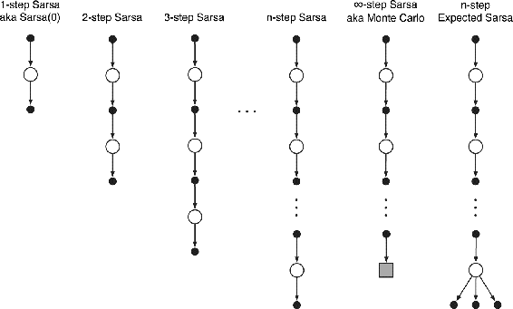
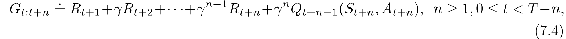
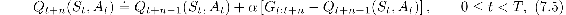
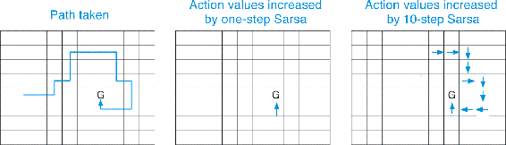
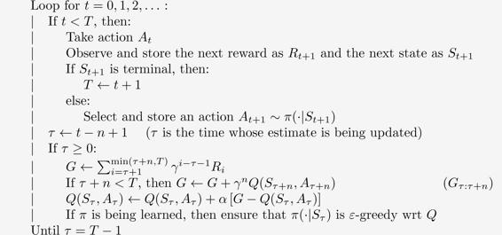
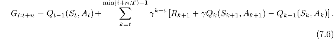
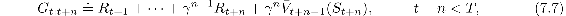
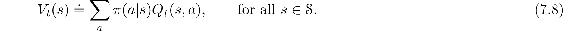

# 7.2  *n*-step Sarsa

How can *n*-step methods be used not just for prediction, but for control? In this section we show how *n*-step methods can be combined with Sarsa in a straightforward way to produce an on-policy TD control method. The *n*-step version of Sarsa we call *n*-step Sarsa, and the original version presented in the previous chapter we henceforth call *one-step Sarsa*, or *Sarsa(0)*.

The main idea is to simply switch states for actions (state–action pairs) and then use an *ε*-greedy policy. The backup diagrams for *n*-step Sarsa (shown in [Figure 7.3](part0015_split_002.html#fig7-3)), like those of *n*-step TD ([Figure 7.1](part0015_split_001.html#fig7-1)), are strings of alternating states and actions, except that the Sarsa ones all start and end with an action rather a state. We redefine *n*-step returns (update targets) in terms of estimated action values:

[Figure 7.3](part0015_split_002.html#C_fig7-3): The backup diagrams for the spectrum of *n*-step methods for state–action values. They range from the one-step update of Sarsa(0) to the up-until-termination update of the Monte Carlo method. In between are the *n*-step updates, based on *n* steps of real rewards and the estimated value of the *n*th next state–action pair, all appropriately discounted. On the far right is the backup diagram for *n*-step Expected Sarsa.

with G*t*:*t*+*n* ≐ G*t* if *t* + *n* ≥ *T*. The natural algorithm is then

while the values of all other states remain unchanged: *Q**t*+*n*(*s, a*) = *Q**t*+*n*−1(*s, a*), for all *s, a* such that *s* ≠ *S**t* or *a* ≠ *A**t*. This is the algorithm we call *n-step Sarsa*. Pseudocode is shown in the box on the next page, and an example of why it can speed up learning compared to one-step methods is given in [Figure 7.4](part0015_split_002.html#fig7-4).

[Figure 7.4](part0015_split_002.html#C_fig7-4): Gridworld example of the speedup of policy learning due to the use of *n*-step methods. The first panel shows the path taken by an agent in a single episode, ending at a location of high reward, marked by the `G`. In this example the values were all initially 0, and all rewards were zero except for a positive reward at `G`. The arrows in the other two panels show which action values were strengthened as a result of this path by one-step and *n*-step Sarsa methods. The one-step method strengthens only the last action of the sequence of actions that led to the high reward, whereas the *n*-step method strengthens the last *n* actions of the sequence, so that much more is learned from the one episode.

***n*-step Sarsa for estimating *Q* ≈ *q*\* or *qπ***

Initialize *Q*(*s, a*) arbitrarily, for all *s* ∈𝒮*, a* ∈𝒜

Initialize *π* to be *ε*-greedy with respect to *Q*, or to a fixed given policy

Algorithm parameters: step size *α* ∈ (0, 1], small *ε >* 0, a positive integer *n*

All store and access operations (for *S**t*, *A**t*, and *R**t*) can take their index mod *n* + 1

Loop for each episode:

Initialize and store *S*0 ≠ terminal

Select and store an action *A*0 *∼ π*(·|*S*0)

*T* ← ∞

*Exercise 7.4* Prove that the *n*-step return of Sarsa ([7.4](part0015_split_002.html#x1-72002r4)) can be written exactly in terms of a novel TD error, as

□

What about Expected Sarsa? The backup diagram for the *n*-step version of Expected Sarsa is shown on the far right in [Figure 7.3](part0015_split_002.html#fig7-3). It consists of a linear string of sample actions and states, just as in *n*-step Sarsa, except that its last element is a branch over all action possibilities weighted, as always, by their probability under *π*. This algorithm can be described by the same equation as *n*-step Sarsa (above) except with the *n*-step return redefined as

(with G*t*:*t*+*n* ≐ G*t* for *t* + *n* ≥ *T*) where *V**t*(*s*) is the *expected approximate value* of state *s*, using the estimated action values at time *t*, under the target policy:

Expected approximate values are used in developing many of the action-value methods in the rest of this book. If *s* is terminal, then its expected approximate value is defined to be 0.
