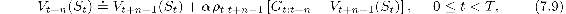
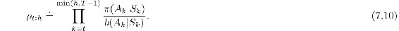
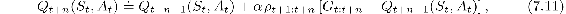
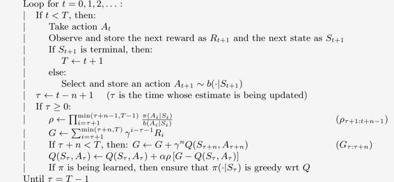

# 7.3  *n*-step Off-policy Learning

Recall that off-policy learning is learning the value function for one policy, *π*, while following another policy, *b*. Often, *π* is the greedy policy for the current action-value-function estimate, and *b* is a more exploratory policy, perhaps *ε*-greedy. In order to use the data from *b* we must take into account the difference between the two policies, using their relative probability of taking the actions that were taken (see Section 5.5). In *n*-step methods, returns are constructed over *n* steps, so we are interested in the relative probability of just those *n* actions. For example, to make a simple off-policy version of *n*-step TD, the update for time *t* (actually made at time *t* + *n*) can simply be weighted by *ρ**t*:*t*+*n*−1:

where *ρ**t*:*t*+*n*−1, called the *importance sampling ratio*, is the relative probability under the two policies of taking the *n* actions from *A**t* to *A**t*+*n*−1 (cf. [Eq. 5.3](part0013_split_005.html#x1-52001r3)):

For example, if any one of the actions would never be taken by *π* (i.e., *π*(*A**k*|*S**k*) = 0) then the *n*-step return should be given zero weight and be totally ignored. On the other hand, if by chance an action is taken that *π* would take with much greater probability than *b* does, then this will increase the weight that would otherwise be given to the return. This makes sense because that action is characteristic of *π* (and therefore we want to learn about it) but is selected only rarely by *b* and thus rarely appears in the data. To make up for this we have to over-weight it when it does occur. Note that if the two policies are actually the same (the on-policy case) then the importance sampling ratio is always 1. Thus our new update ([7.9](part0015_split_003.html#x1-73001r9)) generalizes and can completely replace our earlier *n*-step TD update. Similarly, our previous *n*-step Sarsa update can be completely replaced by a simple off-policy form:

for 0 ≤ *t < T*. Note that the importance sampling ratio here starts and ends one step later than for *n*-step TD ([7.11](part0015_split_003.html#x1-73003r11)). This is because here we are updating a state–action pair. We do not have to care how likely we were to select the action; now that we have selected it we want to learn fully from what happens, with importance sampling only for subsequent actions. Pseudocode for the full algorithm is shown in the box below.

**Off-policy *n*-step Sarsa for estimating *Q* ≈*q*\* or *qπ***

Input: an arbitrary behavior policy *b* such that *b*(*a*|*s*) > 0, for all *s* ∈𝒮*, a* ∈𝒜

Initialize *Q*(*s, a*) arbitrarily, for all *s* ∈𝒮*, a* ∈𝒜

Initialize *π* to be greedy with respect to *Q*, or as a fixed given policy

Algorithm parameters: step size *α* ∈(0, 1], a positive integer *n*

All store and access operations (for *S**t*, *A**t*, and *R**t*) can take their index mod *n* + 1

Loop for each episode:

Initialize and store *S*0 ⁄= terminal

Select and store an action *A*0 *∼ b*(·|*S*0)

*T* ← ∞

The off-policy version of *n*-step Expected Sarsa would use the same update as above for *n*-step Sarsa except that the importance sampling ratio would have one less factor in it. That is, the above equation would use *ρ**t*+1:*t*+*n*−1 instead of *ρ**t*+1:*t*+*n*, and of course it would use the Expected Sarsa version of the *n*-step return ([7.7](part0015_split_002.html#x1-72006r7)). This is because in Expected Sarsa all possible actions are taken into account in the last state; the one actually taken has no effect and does not have to be corrected for.
