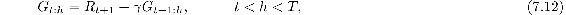
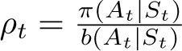
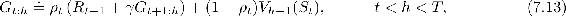
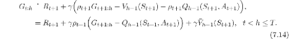

# 7.4  \*Per-decision Methods with Control Variates

The multi-step off-policy methods presented in the previous section are simple and conceptually clear, but are probably not the most efficient. A more sophisticated approach would use per-decision importance sampling ideas such as were introduced in Section 5.9. To understand this approach, first note that the ordinary *n*-step return ([7.1](part0015_split_001.html#x1-71002r1)), like all returns, can be written recursively. For the *n* steps ending at horizon *h*, the *n*-step return can be written

where G*h*:*h* ≐ *V**h*−1(*S**h*). (Recall that this return is used at time *h*, previously denoted *t* + *n*.) Now consider the effect of following a behavior policy *b* that is not the same as the target policy *π*. All of the resulting experience, including the first reward *R**t*+1 and the next state *S**t*+1 must be weighted by the importance sampling ratio for time *t*, . One might be tempted to simply weight the righthand side of the above equation, but one can do better. Suppose the action at time *t* would never be selected by *π*, so that *ρ**t* is zero. Then a simple weighting would result in the *n*-step return being zero, which could result in high variance when it was used as a target. Instead, in this more sophisticated approach, one uses an alternate, *off-policy* definition of the *n*-step return ending at horizon *h*, as

where again G*h*:*h* ≐ *V**h*−1(*S**h*). In this approach, if *ρ**t* is zero, then instead of the target being zero and causing the estimate to shrink, the target is the same as the estimate and causes no change. The importance sampling ratio being zero means we should ignore the sample, so leaving the estimate unchanged seems appropriate. The second, additional term in ([7.13](part0015_split_004.html#x1-74002r13)) is called a *control variate* (for obscure reasons). Notice that the control variate does not change the expected update; the importance sampling ratio has expected value one (Section 5.9) and is uncorrelated with the estimate, so the expected value of the control variate is zero. Also note that the off-policy definition ([7.13](part0015_split_004.html#x1-74002r13)) is a strict generalization of the earlier on-policy definition of the *n*-step return ([7.1](part0015_split_001.html#x1-71002r1)), as the two are identical in the on-policy case, in which *ρ**t* is always 1.

For a conventional *n*-step method, the learning rule to use in conjunction with ([7.13](part0015_split_004.html#x1-74002r13)) is the *n*-step TD update ([7.2](part0015_split_001.html#x1-71003r2)), which has no explicit importance sampling ratios other than those embedded in the return.

*Exercise 7.5* Write the pseudocode for the off-policy state-value prediction algorithm described above.

□

For action values, the off-policy definition of the *n*-step return is a little different because the first action does not play a role in the importance sampling. That first action is the one being learned; it does not matter if it was unlikely or even impossible under the target policy—it has been taken and now full unit weight must be given to the reward and state that follows it. Importance sampling will apply only to the actions that follow it.

First note that for action values the *n*-step *on-policy* return ending at horizon *h*, expectation form ([7.7](part0015_split_002.html#x1-72006r7)), can be written recursively just as in ([7.12](part0015_split_004.html#x1-74001r12)), except that for action values the recursion ends with G*h*:*h* ≐ *V**h*−1(*S**h*) as in ([7.8](part0015_split_002.html#x1-72007r8)). An off-policy form with control variates is

If *h* ≥ *T*, then the recursion ends with G*h*:*h* ≐ *Q**h*−1(*S**h**, A**h*), whereas, if *h* ≥ *T*, the recursion ends with and G*T*−1:*h* ≐ *R**T*. The resultant prediction algorithm (after combining with ([7.5](part0015_split_002.html#x1-72003r5))) is analogous to Expected Sarsa.

*Exercise 7.6* Prove that the control variate in the above equations does not change the expected value of the return.

□

**\*** *Exercise 7.7* Write the pseudocode for the off-policy action-value prediction algorithm described immediately above. Pay particular attention to the termination conditions for the recursion upon hitting the horizon or the end of episode.

□

*Exercise 7.8* Show that the general (off-policy) version of the *n*-step return ([7.13](part0015_split_004.html#x1-74002r13)) can still be written exactly and compactly as the sum of state-based TD errors ([6.5](part0014_split_001.html#x1-60009r5)) if the approximate state value function does not change.

□

*Exercise 7.9* Repeat the above exercise for the action version of the off-policy *n*-step return ([7.14](part0015_split_004.html#x1-74003r14)) and the Expected Sarsa TD error (the quantity in brackets in [Equation 6.9](part0014_split_006.html#x1-64001r9)).

□

*Exercise 7.10 (programming)* Devise a small off-policy prediction problem and use it to show that the off-policy learning algorithm using ([7.13](part0015_split_004.html#x1-74002r13)) and ([7.2](part0015_split_001.html#x1-71003r2)) is more data efficient than the simpler algorithm using ([7.1](part0015_split_001.html#x1-71002r1)) and ([7.9](part0015_split_003.html#x1-73001r9)).

□

The importance sampling that we have used in this section, the previous section, and in Chapter 5, enables sound off-policy learning, but also results in high variance updates, forcing the use of a small step-size parameter and thereby causing learning to be slow. It is probably inevitable that off-policy training is slower than on-policy training—after all, the data is less relevant to what is being learned. However, it is probably also true that these methods can be improved on. The control variates are one way of reducing the variance. Another is to rapidly adapt the step sizes to the observed variance, as in the Autostep method (Mahmood, Sutton, Degris and Pilarski, 2012). Yet another promising approach is the invariant updates of Karampatziakis and Langford (2010) as extended to TD by Tian (in preparation). The usage technique of Mahmood (2017; Mahmood and Sutton, 2015) may also be part of the solution. In the next section we consider an off-policy learning method that does not use importance sampling.
