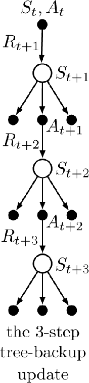
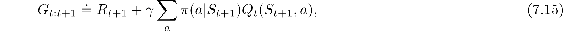
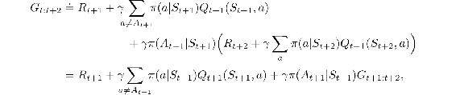
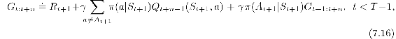
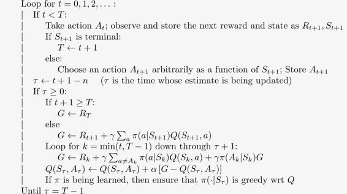

# 7.5  Off-policy Learning Without Importance Sampling: The *n*-step Tree Backup Algorithm

Is off-policy learning possible without importance sampling? Q-learning and Expected Sarsa from Chapter 6 do this for the one-step case, but is there a corresponding multi-step algorithm? In this section we present just such an *n*-step method, called the *tree-backup algorithm*.

The idea of the algorithm is suggested by the 3-step tree-backup backup diagram shown to the right. Down the central spine and labeled in the diagram are three sample states and rewards, and two sample actions. These are the random variables representing the events occurring after the initial state–action pair *S**t**, A**t*. Hanging off to the sides of each state are the actions that were *not* selected. (For the last state, all the actions are considered to have not (yet) been selected.) Because we have no sample data for the unselected actions, we bootstrap and use the estimates of their values in forming the target for the update. This slightly extends the idea of a backup diagram. So far we have always updated the estimated value of the node at the top of the diagram toward a target combining the rewards along the way (appropriately discounted) and the estimated values of the nodes at the bottom. In the tree-backup update, the target includes all these things *plus* the estimated values of the dangling action nodes hanging off the sides, at all levels. This is why it is called a *tree-backup* update; it is an update from the entire tree of estimated action values.

More precisely, the update is from the estimated action values of the *leaf nodes* of the tree. The action nodes in the interior, corresponding to the actual actions taken, do not participate. Each leaf node contributes to the target with a weight proportional to its probability of occurring under the target policy *π*. Thus each first-level action *a* contributes with a weight of *π*(*a*|*S**t*+1), except that the action actually taken, *A**t*+1, does not contribute at all. Its probability, *π*(*A**t*+1|*S**t*+1), is used to weight all the second-level action values. Thus, each non-selected second-level action *a*′ contributes with weight *π*(*A**t*+1|*S**t*+1)*π*(*a*′|*S**t*+2). Each third-level action contributes with weight *π*(*A**t*+1|*S**t*+1)*π*(*A**t*+2|*S**t*+2)*π*(*a*′′|*S**t*+3), and so on. It is as if each arrow to an action node in the diagram is weighted by the action’s probability of being selected under the target policy and, if there is a tree below the action, then that weight applies to all the leaf nodes in the tree.

We can think of the 3-step tree-backup update as consisting of 6 half-steps, alternating between sample half-steps from an action to a subsequent state, and expected half-steps considering from that state all possible actions with their probabilities of occuring under the policy.

Now let us develop the detailed equations for the *n*-step tree-backup algorithm. The one-step return (target) is the same as that of Expected Sarsa,

for *t < T* − 1 and the two-step tree-backup return is

for *t < T* − 2. The latter form suggests the general recursive definition of the tree-backup *n*-step return:

for *t < T* − 1*, n* ≥ 2, with the *n* = 1 case handled by ([7.15](part0015_split_005.html#x1-75001r15)) except for G*T*−1:*t*+*n* ≐ *R**T*. This target is then used with the usual action-value update rule from *n*-step Sarsa:

for 0 ≤ *t < T*, while the values of all other state–action pairs remain unchanged: *Q**t*+*n*(*s, a*) = *Q**t*+*n*−1(*s, a*), for all *s, a* such that *s* ≠ *S**t* or *a* ≠ *A**t*. Pseudocode for this algorithm is shown in the box on the next page.

*Exercise 7.11* Show that if the approximate action values are unchanging, then the tree-backup return ([7.16](part0015_split_005.html#x1-75002r16)) can be written as a sum of expectation-based TD errors:

where *δ**t* ≐ *R**t*+1 + *γ* *V**t*(*S**t*+1) − *Q*(*S**t**, A**t*) and *V**t* is given by ([7.8](part0015_split_002.html#x1-72007r8)).

□

***n*-step Tree Backup for estimating *Q* ≈ *q*\* or *qπ***

Initialize *Q*(*s, a*) arbitrarily, for all *s* ∈𝒮*, a* ∈𝒜

Initialize *π* to be greedy with respect to *Q*, or as a fixed given policy

Algorithm parameters: step size *α* ∈ (0, 1], a positive integer *n*

All store and access operations can take their index mod *n* + 1

Loop for each episode:

Initialize and store *S*0 ≠ terminal

Choose an action *A*0 arbitrarily as a function of *S*0; Store *A*0

*T* ← ∞

