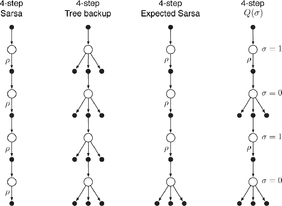
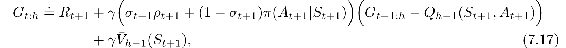
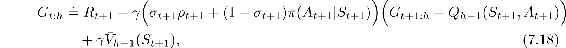
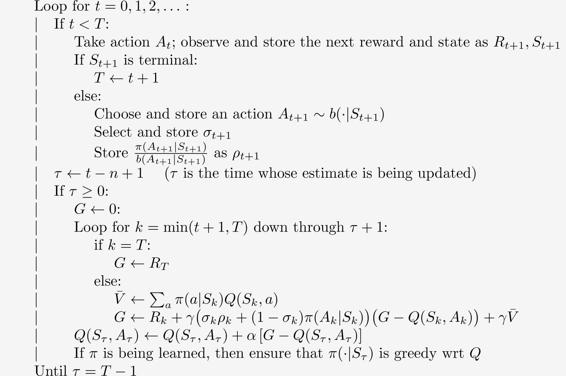

# 7.6  \*A Unifying Algorithm: *n*-step *Q*(*σ*)

So far in this chapter we have considered three different kinds of action-value algorithms, corresponding to the first three backup diagrams shown in [Figure 7.5](part0015_split_006.html#fig7-5). *n*-step Sarsa has all sample transitions, the tree-backup algorithm has all state-to-action transitions fully branched without sampling, and *n*-step Expected Sarsa has all sample transitions except for the last state-to-action one, which is fully branched with an expected value. To what extent can these algorithms be unified?

[Figure 7.5](part0015_split_006.html#C_fig7-5): The backup diagrams of the three kinds of *n*-step action-value updates considered so far in this chapter (4-step case) plus the backup diagram of a fourth kind of update that unifies them all. The ‘*ρ*’ s indicate half transitions on which importance sampling is required in the off-policy case. The fourth kind of update unifies all the others by choosing on a state-by-state basis whether to sample (*σ**t* = 1) or not (*σ**t* = 0).

One idea for unification is suggested by the fourth backup diagram in [Figure 7.5](part0015_split_006.html#fig7-5). This is the idea that one might decide on a step-by-step basis whether one wanted to take the action as a sample, as in Sarsa, or consider the expectation over all actions instead, as in the tree-backup update. Then, if one chose always to sample, one would obtain Sarsa, whereas if one chose never to sample, one would get the tree-backup algorithm. Expected Sarsa would be the case where one chose to sample for all steps except for the last one. And of course there would be many other possibilities, as suggested by the last diagram in the figure. To increase the possibilities even further we can consider a continuous variation between sampling and expectation. Let *σ**t* ∈ [0, 1] denote the degree of sampling on step *t*, with *σ* = 1 denoting full sampling and *σ* = 0 denoting a pure expectation with no sampling. The random variable *σ**t* might be set as a function of the state, action, or state–action pair at time *t*. We call this proposed new algorithm *n*-step *Q*(*σ*).

Now let us develop the equations of *n*-step *Q*(*σ*). First we write the tree-backup *n*-step return ([7.16](part0015_split_005.html#x1-75002r16)) in terms of the horizon *h* = *t* + *n* and then in terms of the expected approximate value *V* ([7.8](part0015_split_002.html#x1-72007r8)):

after which it is exactly like the *n*-step return for Sarsa with control variates ([7.14](part0015_split_004.html#x1-74003r14)) except with the action probability *π*(*A**t*+1|*S**t*+1) substituted for the importance-sampling ratio *ρ**t*+1. For *Q*(*σ*), we slide linearly between these two cases:

for *t < h* ≤ *T*. The recursion ends with G*h*:*h* ≐ *Q**h*−1(*S**h**, A**h*) if *h < T*, or with G*T*−1:*T* ≐ *R**T* if *h* = *T*. Then we use the general (off-policy) update for *n*-step Sarsa ([7.11](part0015_split_003.html#x1-73003r11)). A complete algorithm is given in the box.

**Off-policy *n*-step *Q*(*σ*) for estimating *Q* ≈ *q*\* or *qπ***

Input: an arbitrary behavior policy *b* such that *b*(*a*|*s*) > 0, for all *s* ∈𝒮*, a* ∈𝒜

Initialize *Q*(*s, a*) arbitrarily, for all *s* ∈𝒮*, a* ∈𝒜

Initialize *π* to be *ε*-greedy with respect to *Q*, or as a fixed given policy

Algorithm parameters: step size *α* ∈ (0, 1], small *ε >* 0, a positive integer *n*

All store and access operations can take their index mod *n* + 1

Loop for each episode:

Initialize and store *S*0 ≠ terminal

Choose and store an action *A*0 *∼ b*(·|*S*0)

*T* ← ∞

