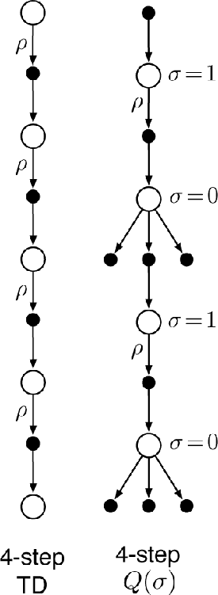

# 7.7  Summary

In this chapter we have developed a range of temporal-difference learning methods that lie in between the one-step TD methods of the previous chapter and the Monte Carlo methods of the chapter before. Methods that involve an intermediate amount of bootstrapping are important because they will typically perform better than either extreme.

Our focus in this chapter has been on *n*-step methods, which look ahead to the next *n* rewards, states, and actions. The two 4-step backup diagrams to the right together summarize most of the methods introduced. The state-value update shown is for *n*-step TD with importance sampling, and the action-value update is for *n*-step *Q*(*σ*), which generalizes Expected Sarsa and Q-learning. All *n*-step methods involve a delay of *n* time steps before updating, as only then are all the required future events known. A further drawback is that they involve more computation per time step than previous methods. Compared to one-step methods, *n*-step methods also require more memory to record the states, actions, rewards, and sometimes other variables over the last *n* time steps. Eventually, in Chapter 12, we will see how multi-step TD methods can be implemented with minimal memory and computational complexity using eligibility traces, but there will always be some additional computation beyond one-step methods. Such costs can be well worth paying to escape the tyranny of the single time step.

Although *n*-step methods are more complex than those using eligibility traces, they have the great benefit of being conceptually clear. We have sought to take advantage of this by developing two approaches to off-policy learning in the *n*-step case. One, based on importance sampling is conceptually simple but can be of high variance. If the target and behavior policies are very different it probably needs some new algorithmic ideas before it can be efficient and practical. The other, based on tree-backup updates, is the natural extension of Q-learning to the multi-step case with stochastic target policies. It involves no importance sampling but, again if the target and behavior policies are substantially different, the bootstrapping may span only a few steps even if *n* is large.
