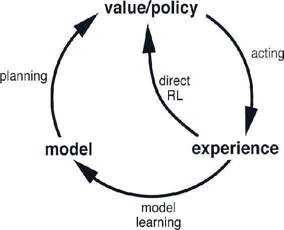
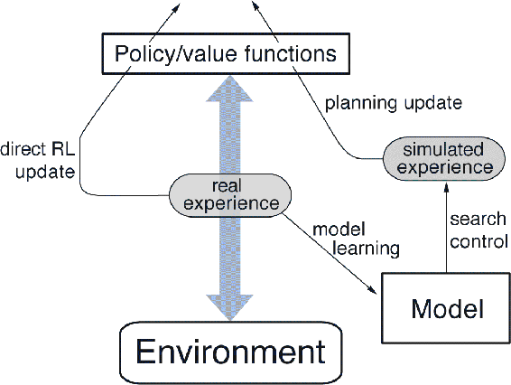
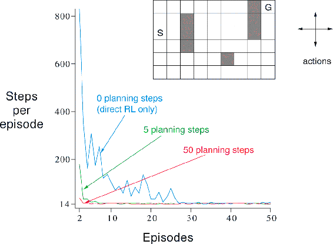
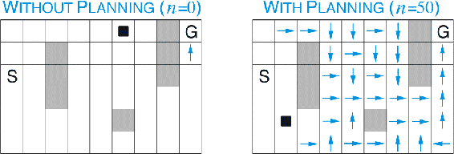

# 8.2  Dyna: Integrated Planning, Acting, and Learning

When planning is done online, while interacting with the environment, a number of interesting issues arise. New information gained from the interaction may change the model and thereby interact with planning. It may be desirable to customize the planning process in some way to the states or decisions currently under consideration, or expected in the near future. If decision making and model learning are both computation-intensive processes, then the available computational resources may need to be divided between them. To begin exploring these issues, in this section we present Dyna-Q, a simple architecture integrating the major functions needed in an online planning agent. Each function appears in Dyna-Q in a simple, almost trivial, form. In subsequent sections we elaborate some of the alternate ways of achieving each function and the trade-offs between them. For now, we seek merely to illustrate the ideas and stimulate your intuition.

Within a planning agent, there are at least two roles for real experience: it can be used to improve the model (to make it more accurately match the real environment) and it can be used to directly improve the value function and policy using the kinds of reinforcement learning methods we have discussed in previous chapters. The former we call *model-learning*, and the latter we call *direct reinforcement learning* (direct RL). The possible relationships between experience, model, values, and policy are summarized in the diagram to the right. Each arrow shows a relationship of influence and presumed improvement. Note how experience can improve value functions and policies either directly or indirectly via the model. It is the latter, which is sometimes called *indirect reinforcement learning*, that is involved in planning.

Both direct and indirect methods have advantages and disadvantages. Indirect methods often make fuller use of a limited amount of experience and thus achieve a better policy with fewer environmental interactions. On the other hand, direct methods are much simpler and are not affected by biases in the design of the model. Some have argued that indirect methods are always superior to direct ones, while others have argued that direct methods are responsible for most human and animal learning. Related debates in psychology and artificial intelligence concern the relative importance of cognition as opposed to trial-and-error learning, and of deliberative planning as opposed to reactive decision making (see Chapter 14 for discussion of some of these issues from the perspective of psychology). Our view is that the contrast between the alternatives in all these debates has been exaggerated, that more insight can be gained by recognizing the similarities between these two sides than by opposing them. For example, in this book we have emphasized the deep similarities between dynamic programming and temporal-difference methods, even though one was designed for planning and the other for model-free learning.

Dyna-Q includes all of the processes shown in the diagram above—planning, acting, model-learning, and direct RL—all occurring continually. The planning method is the random-sample one-step tabular Q-planning method on [page 161](part0016_split_001.html#pg161). The direct RL method is one-step tabular Q-learning. The model-learning method is also table-based and assumes the environment is deterministic. After each transition *S**t**, A**t* *→ R**t*+1*, S**t*+1, the model records in its table entry for *S**t**, A**t* the prediction that *R**t*+1*, S**t*+1 will deterministically follow. Thus, if the model is queried with a state–action pair that has been experienced before, it simply returns the last-observed next state and next reward as its prediction. During planning, the Q-planning algorithm randomly samples only from state–action pairs that have previously been experienced (in Step 1), so the model is never queried with a pair about which it has no information.

The overall architecture of Dyna agents, of which the Dyna-Q algorithm is one example, is shown in [Figure 8.1](part0016_split_002.html#fig8-1). The central column represents the basic interaction between agent and environment, giving rise to a trajectory of real experience. The arrow on the left of the figure represents direct reinforcement learning operating on real experience to improve the value function and the policy. On the right are model-based processes. The model is learned from real experience and gives rise to simulated experience. We use the term *search control* to refer to the process that selects the starting states and actions for the simulated experiences generated by the model. Finally, planning is achieved by applying reinforcement learning methods to the simulated experiences just as if they had really happened. Typically, as in Dyna-Q, the same reinforcement learning method is used both for learning from real experience and for planning from simulated experience. The reinforcement learning method is thus the “final common path” for both learning and planning. Learning and planning are deeply integrated in the sense that they share almost all the same machinery, differing only in the source of their experience.

[Figure 8.1](part0016_split_002.html#C_fig8-1): The general Dyna Architecture. Real experience, passing back and forth between the environment and the policy, affects policy and value functions in much the same way as does simulated experience generated by the model of the environment.

Conceptually, planning, acting, model-learning, and direct RL occur simultaneously and in parallel in Dyna agents. For concreteness and implementation on a serial computer, however, we fully specify the order in which they occur within a time step. In Dyna-Q, the acting, model-learning, and direct RL processes require little computation, and we assume they consume just a fraction of the time. The remaining time in each step can be devoted to the planning process, which is inherently computation-intensive. Let us assume that there is time in each step, after acting, model-learning, and direct RL, to complete *n* iterations (Steps 1–3) of the Q-planning algorithm. In the pseudocode algorithm for Dyna-Q in the box below, *Model*(*s, a*) denotes the contents of the (predicted next state and reward) for state–action pair (*s, a*). Direct reinforcement learning, model-learning, and planning are implemented by steps (d), (e), and (f), respectively. If (e) and (f) were omitted, the remaining algorithm would be one-step tabular Q-learning.

**Tabular Dyna-Q**

Initialize *Q*(*s, a*) and *Model*(*s, a*) for all *s* ∈𝒮 and *a* ∈𝒜(*s*)

Loop forever:

(a) *S* ← current (nonterminal) state

(b) *A* ← *ε*-greedy(*S, Q*)

(c) Take action *A*; observe resultant reward, *R*, and state, *S*′

(d) *Q*(*S, A*) ← *Q*(*S, A*) + *α*[*R* + *γ* max*a* *Q*(*S*′*, a*) − *Q*(*S, A*)]

(e) *Model*(*S, A*) ← *R, S*′ (assuming deterministic environment)

(f) Loop repeat *n* times:

*S* ← random previously observed state

*A* ← random action previously taken in *S*

*R, S*′ ← *Model*(*S, A*)

*Q*(*S, A*) ← *Q*(*S, A*) + *α*[*R* + *γ* max*a* *Q*(*S*′*, a*) − *Q*(*S, A*)]

**Example 8.1: Dyna Maze** Consider the simple maze shown inset in [Figure 8.2](part0016_split_002.html#fig8-2). In each of the 47 states there are four actions, up, down, right, and left, which take the agent deterministically to the corresponding neighboring states, except when movement is blocked by an obstacle or the edge of the maze, in which case the agent remains where it is. Reward is zero on all transitions, except those into the goal state, on which it is + 1. After reaching the goal state (`G`), the agent returns to the start state (`S`) to begin a new episode. This is a discounted, episodic task with *γ* = 0.95.

[Figure 8.2](part0016_split_002.html#C_fig8-2): A simple maze (inset) and the average learning curves for Dyna-Q agents varying in their number of planning steps (*n*) per real step. The task is to travel from `S` to `G` as quickly as possible.

The main part of [Figure 8.2](part0016_split_002.html#fig8-2) shows average learning curves from an experiment in which Dyna-Q agents were applied to the maze task. The initial action values were zero, the step-size parameter was *α* = 0.1, and the exploration parameter was *ε* = 0.1. When selecting greedily among actions, ties were broken randomly. The agents varied in the number of planning steps, *n*, they performed per real step. For each *n*, the curves show the number of steps taken by the agent to reach the goal in each episode, averaged over 30 repetitions of the experiment. In each repetition, the initial seed for the random number generator was held constant across algorithms. Because of this, the first episode was exactly the same (about 1700 steps) for all values of *n*, and its data are not shown in the figure. After the first episode, performance improved for all values of *n*, but much more rapidly for larger values. Recall that the *n* = 0 agent is a nonplanning agent, using only direct reinforcement learning (one-step tabular Q-learning). This was by far the slowest agent on this problem, despite the fact that the parameter values (*α* and *ε*) were optimized for it. The nonplanning agent took about 25 episodes to reach (*ε*-)optimal performance, whereas the *n* = 5 agent took about five episodes, and the *n* = 50 agent took only three episodes.

[Figure 8.3](part0016_split_002.html#fig8-3) shows why the planning agents found the solution so much faster than the nonplanning agent. Shown are the policies found by the *n* = 0 and *n* = 50 agents halfway through the second episode. Without planning (*n* = 0), each episode adds only one additional step to the policy, and so only one step (the last) has been learned so far. With planning, again only one step is learned during the first episode, but here during the second episode an extensive policy has been developed that by the end of the episode will reach almost back to the start state. This policy is built by the planning process while the agent is still wandering near the start state. By the end of the third episode a complete optimal policy will have been found and perfect performance attained.

[Figure 8.3](part0016_split_002.html#C_fig8-3): Policies found by planning and nonplanning Dyna-Q agents halfway through the second episode. The arrows indicate the greedy action in each state; if no arrow is shown for a state, then all of its action values were equal. The black square indicates the location of the agent.

■

In Dyna-Q, learning and planning are accomplished by exactly the same algorithm, operating on real experience for learning and on simulated experience for planning. Because planning proceeds incrementally, it is trivial to intermix planning and acting. Both proceed as fast as they can. The agent is always reactive and always deliberative, responding instantly to the latest sensory information and yet always planning in the background. Also ongoing in the background is the model-learning process. As new information is gained, the model is updated to better match reality. As the model changes, the ongoing planning process will gradually compute a different way of behaving to match the new model.

*Exercise 8.1* The nonplanning method looks particularly poor in [Figure 8.3](part0016_split_002.html#fig8-3) because it is a one-step method; a method using multi-step bootstrapping would do better. Do you think one of the multi-step bootstrapping methods from Chapter 7 could do as well as the Dyna method? Explain why or why not.

□
