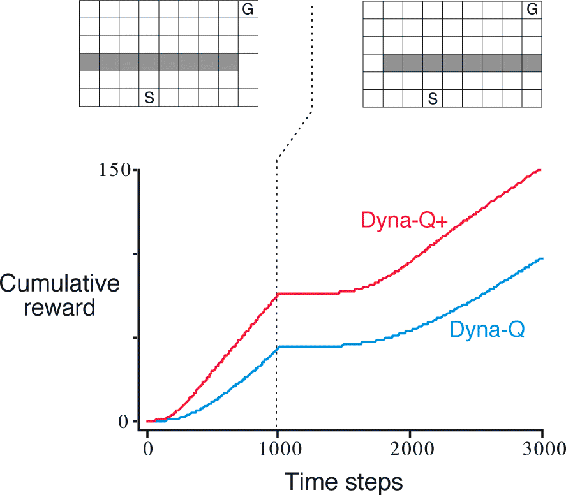
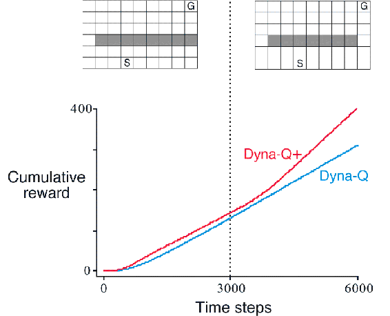
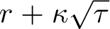
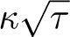
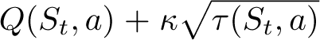

# 8.3  When the Model Is Wrong

In the maze example presented in the previous section, the changes in the model were relatively modest. The model started out empty, and was then filled only with exactly correct information. In general, we cannot expect to be so fortunate. Models may be incorrect because the environment is stochastic and only a limited number of samples have been observed, or because the model was learned using function approximation that has generalized imperfectly, or simply because the environment has changed and its new behavior has not yet been observed. When the model is incorrect, the planning process is likely to compute a suboptimal policy.

In some cases, the suboptimal policy computed by planning quickly leads to the discovery and correction of the modeling error. This tends to happen when the model is optimistic in the sense of predicting greater reward or better state transitions than are actually possible. The planned policy attempts to exploit these opportunities and in doing so discovers that they do not exist.

**Example 8.2: Blocking Maze** A maze example illustrating this relatively minor kind of modeling error and recovery from it is shown in [Figure 8.4](part0016_split_003.html#fig8-4). Initially, there is a short path from start to goal, to the right of the barrier, as shown in the upper left of the figure. After 1000 time steps, the short path is “blocked,” and a longer path is opened up along the left-hand side of the barrier, as shown in upper right of the figure. The graph shows average cumulative reward for a Dyna-Q agent and an enhanced Dyna-Q+ agent to be described shortly. The first part of the graph shows that both Dyna agents found the short path within 1000 steps. When the environment changed, the graphs become flat, indicating a period during which the agents obtained no reward because they were wandering around behind the barrier. After a while, however, they were able to find the new opening and the new optimal behavior.

[Figure 8.4](part0016_split_003.html#C_fig8-4): Average performance of Dyna agents on a blocking task. The left environment was used for the first 1000 steps, the right environment for the rest. Dyna-Q+ is Dyna-Q with an exploration bonus that encourages exploration.

■

Greater difficulties arise when the environment changes to become *better* than it was before, and yet the formerly correct policy does not reveal the improvement. In these cases the modeling error may not be detected for a long time, if ever.

**Example 8.3: Shortcut Maze** The problem caused by this kind of environmental change is illustrated by the maze example shown in [Figure 8.5](part0016_split_003.html#fig8-5). Initially, the optimal path is to go around the left side of the barrier (upper left). After 3000 steps, however, a shorter path is opened up along the right side, without disturbing the longer path (upper right). The graph shows that the regular Dyna-Q agent never switched to the shortcut. In fact, it never realized that it existed. Its model said that there was no shortcut, so the more it planned, the less likely it was to step to the right and discover it. Even with an *ε*-greedy policy, it is very unlikely that an agent will take so many exploratory actions as to discover the shortcut.

[Figure 8.5](part0016_split_003.html#C_fig8-5): Average performance of Dyna agents on a shortcut task. The left environment was used for the first 3000 steps, the right environment for the rest.

■

The general problem here is another version of the conflict between exploration and exploitation. In a planning context, exploration means trying actions that improve the model, whereas exploitation means behaving in the optimal way given the current model. We want the agent to explore to find changes in the environment, but not so much that performance is greatly degraded. As in the earlier exploration/exploitation conflict, there probably is no solution that is both perfect and practical, but simple heuristics are often effective.

The Dyna-Q+ agent that did solve the shortcut maze uses one such heuristic. This agent keeps track for each state–action pair of how many time steps have elapsed since the pair was last tried in a real interaction with the environment. The more time that has elapsed, the greater (we might presume) the chance that the dynamics of this pair has changed and that the model of it is incorrect. To encourage behavior that tests long-untried actions, a special “bonus reward” is given on simulated experiences involving these actions. In particular, if the modeled reward for a transition is *r*, and the transition has not been tried in *τ* time steps, then planning updates are done as if that transition produced a reward of , for some small *κ*. This encourages the agent to keep testing all accessible state transitions and even to find long sequences of actions in order to carry out such tests.[1](part0016_split_015.html#fn1x11) Of course all this testing has its cost, but in many cases, as in the shortcut maze, this kind of computational curiosity is well worth the extra exploration.

*Exercise 8.2* Why did the Dyna agent with exploration bonus, Dyna-Q+, perform better in the first phase as well as in the second phase of the blocking and shortcut experiments?

□

*Exercise 8.3* Careful inspection of [Figure 8.5](part0016_split_003.html#fig8-5) reveals that the difference between Dyna-Q+ and Dyna-Q narrowed slightly over the first part of the experiment. What is the reason for this?

□

*Exercise 8.4 (programming)* The exploration bonus described above actually changes the estimated values of states and actions. Is this necessary? Suppose the bonus  was used not in updates, but solely in action selection. That is, suppose the action selected was always that for which  was maximal. Carry out a gridworld experiment that tests and illustrates the strengths and weaknesses of this alternate approach.

□

*Exercise 8.5* How might the tabular Dyna-Q algorithm shown on [page 164](part0016_split_002.html#pg164) be modified to handle stochastic environments? How might this modification perform poorly on changing environments such as considered in this section? How could the algorithm be modified to handle stochastic environments *and* changing environments?

□
