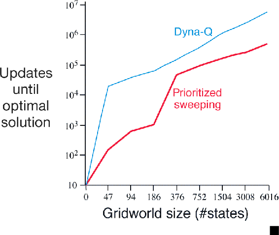
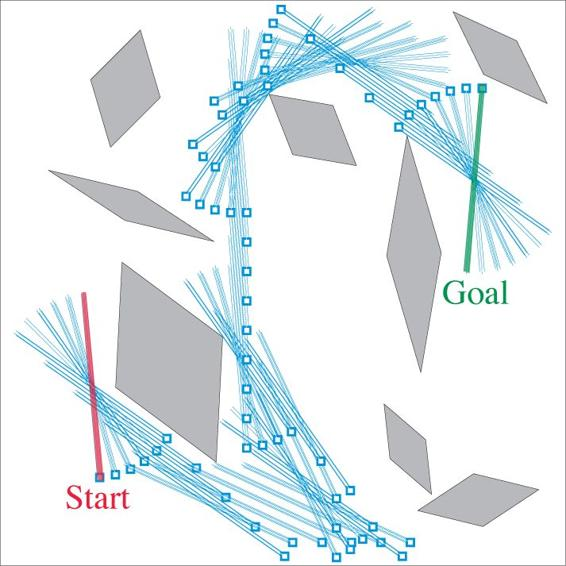

# 8.4  Prioritized Sweeping

In the Dyna agents presented in the preceding sections, simulated transitions are started in state–action pairs selected uniformly at random from all previously experienced pairs. But a uniform selection is usually not the best; planning can be much more efficient if simulated transitions and updates are focused on particular state–action pairs. For example, consider what happens during the second episode of the first maze task ([Figure 8.3](part0016_split_002.html#fig8-3)). At the beginning of the second episode, only the state–action pair leading directly into the goal has a positive value; the values of all other pairs are still zero. This means that it is pointless to perform updates along almost all transitions, because they take the agent from one zero-valued state to another, and thus the updates would have no effect. Only an update along a transition into the state just prior to the goal, or from it, will change any values. If simulated transitions are generated uniformly, then many wasteful updates will be made before stumbling onto one of these useful ones. As planning progresses, the region of useful updates grows, but planning is still far less efficient than it would be if focused where it would do the most good. In the much larger problems that are our real objective, the number of states is so large that an unfocused search would be extremely inefficient.

This example suggests that search might be usefully focused by working *backward* from goal states. Of course, we do not really want to use any methods specific to the idea of “goal state.” We want methods that work for general reward functions. Goal states are just a special case, convenient for stimulating intuition. In general, we want to work back not just from goal states but from any state whose value has changed. Suppose that the values are initially correct given the model, as they were in the maze example prior to discovering the goal. Suppose now that the agent discovers a change in the environment and changes its estimated value of one state, either up or down. Typically, this will imply that the values of many other states should also be changed, but the only useful one-step updates are those of actions that lead directly into the one state whose value has been changed. If the values of these actions are updated, then the values of the predecessor states may change in turn. If so, then actions leading into them need to be updated, and then *their* predecessor states may have changed. In this way one can work backward from arbitrary states that have changed in value, either performing useful updates or terminating the propagation. This general idea might be termed *backward focusing* of planning computations.

As the frontier of useful updates propagates backward, it often grows rapidly, producing many state–action pairs that could usefully be updated. But not all of these will be equally useful. The values of some states may have changed a lot, whereas others may have changed little. The predecessor pairs of those that have changed a lot are more likely to also change a lot. In a stochastic environment, variations in estimated transition probabilities also contribute to variations in the sizes of changes and in the urgency with which pairs need to be updated. It is natural to prioritize the updates according to a measure of their urgency, and perform them in order of priority. This is the idea behind *prioritized sweeping*. A queue is maintained of every state–action pair whose estimated value would change nontrivially if updated, prioritized by the size of the change. When the top pair in the queue is updated, the effect on each of its predecessor pairs is computed. If the effect is greater than some small threshold, then the pair is inserted in the queue with the new priority (if there is a previous entry of the pair in the queue, then insertion results in only the higher priority entry remaining in the queue). In this way the effects of changes are efficiently propagated backward until quiescence. The full algorithm for the case of deterministic environments is given in the box on the next page.

**Prioritized sweeping for a deterministic environment**

Initialize *Q*(*s, a*), *Model*(*s, a*), for all *s, a*, and *PQueue* to empty

Loop forever:

(a) *S* ← current (nonterminal) state

(b) *A* ← *policy*(*S, Q*)

(c) Take action *A*; observe resultant reward, *R*, and state, *S*′

(d) *Model*(*S, A*) ← *R, S*′

(e) *P* ← |*R* + *γ* max*a* *Q*(*S*′*, a*) − *Q*(*S, A*)|.

(f) if *P > θ*, then insert *S, A* into *PQueue* with priority *P*

(g) Loop repeat *n* times, while *PQueue* is not empty:

*S, A* ← *first*(*PQueue*)

*R, S*′ ← *Model*(*S, A*)

*Q*(*S, A*) ← *Q*(*S, A*) + *α*[*R* + *γ* max*a* *Q*(*S*′*, a*) − *Q*(*S, A*)]

Loop for all *S*, *A* predicted to lead to *S*:

*R* ← predicted reward for *S*, *A**, S*

*P* ← |*R* + *γ* max*a* *Q*(*S, a*) − *Q*(*S*, *A*)|.

if *P > θ* then insert *S*, *A* into *PQueue* with priority *P*

**Example 8.4: Prioritized Sweeping on Mazes** Prioritized sweeping has been found to dramatically increase the speed at which optimal solutions are found in maze tasks, often by a factor of 5 to 10. A typical example is shown to the right. These data are for a sequence of maze tasks of exactly the same structure as the one shown in [Figure 8.2](part0016_split_002.html#fig8-2), except that they vary in the grid resolution. Prioritized sweeping maintained a decisive advantage over unprioritized Dyna-Q. Both systems made at most *n* = 5 updates per environmental interaction. Adapted from Peng and Williams (1993).

■

Extensions of prioritized sweeping to stochastic environments are straightforward. The model is maintained by keeping counts of the number of times each state–action pair has been experienced and of what the next states were. It is natural then to update each pair not with a sample update, as we have been using so far, but with an expected update, taking into account all possible next states and their probabilities of occurring.

Prioritized sweeping is just one way of distributing computations to improve planning efficiency, and probably not the best way. One of prioritized sweeping’s limitations is that it uses *expected* updates, which in stochastic environments may waste lots of computation on low-probability transitions. As we show in the following section, sample updates can in many cases get closer to the true value function with less computation despite the variance introduced by sampling. Sample updates can win because they break the overall backing-up computation into smaller pieces—those corresponding to individual transitions—which then enables it to be focused more narrowly on the pieces that will have the largest impact. This idea was taken to what may be its logical limit in the “small backups” introduced by van Seijen and Sutton (2013). These are updates along a single transition, like a sample update, but based on the probability of the transition without sampling, as in an expected update. By selecting the order in which small updates are done it is possible to greatly improve planning efficiency beyond that possible with prioritized sweeping.

**Example 8.5 Prioritized Sweeping for Rod Maneuvering**

The objective in this task is to maneuver a rod around some awkwardly placed obstacles within a limited rectangular work space to a goal position in the fewest number of steps. The rod can be translated along its long axis or perpendicular to that axis, or it can be rotated in either direction around its center. The distance of each movement is approximately 1/20 of the work space, and the rotation increment is 10 degrees. Translations are deterministic and quantized to one of 20 × 20 positions. To the right is shown the obstacles and the shortest solution from start to goal, found by prioritized sweeping. This problem is deterministic, but has four actions and 14,400 potential states (some of these are unreachable because of the obstacles). This problem is probably too large to be solved with unprioritized methods. Figure reprinted from Moore and Atkeson (1993).

We have suggested in this chapter that all kinds of state-space planning can be viewed as sequences of value updates, varying only in the type of update, expected or sample, large or small, and in the order in which the updates are done. In this section we have emphasized backward focusing, but this is just one strategy. For example, another would be to focus on states according to how easily they can be reached from the states that are visited frequently under the current policy, which might be called *forward focusing*. Peng and Williams (1993) and Barto, Bradtke and Singh (1995) have explored versions of forward focusing, and the methods introduced in the next few sections take it to an extreme form.
