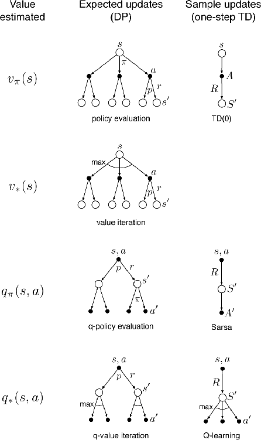
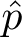
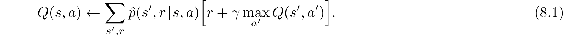
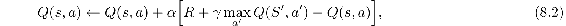
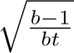
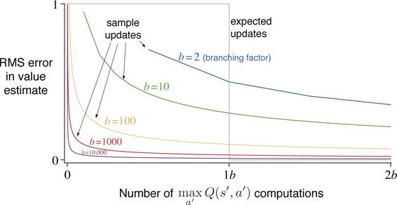

# 8.5  Expected vs. Sample Updates

The examples in the previous sections give some idea of the range of possibilities for combining methods of learning and planning. In the rest of this chapter, we analyze some of the component ideas involved, starting with the relative advantages of expected and sample updates.

Much of this book has been about different kinds of value-function updates, and we have considered a great many varieties. Focusing for the moment on one-step updates, they vary primarily along three binary dimensions. The first two dimensions are whether they update state values or action values and whether they estimate the value for the optimal policy or for an arbitrary given policy. These two dimensions give rise to four classes of updates for approximating the four value functions, *q*\*, *v*\*, *qπ*, and *vπ*. The other binary dimension is whether the updates are *expected* updates, considering all possible events that might happen, or *sample* updates, considering a single sample of what might happen. These three binary dimensions give rise to eight cases, seven of which correspond to specific algorithms, as shown in the figure to the right. (The eighth case does not seem to correspond to any useful update.) Any of these one-step updates can be used in planning methods. The Dyna-Q agents discussed earlier use *q*\* sample updates, but they could just as well use *q*\* expected updates, or either expected or sample *qπ* updates. The Dyna-AC system uses *vπ* sample updates together with a learning policy structure (as in Chapter 13). For stochastic problems, prioritized sweeping is always done using one of the expected updates.

Figure 8.6: Backup diagrams for all the one-step updates considered in this book.

When we introduced one-step sample updates in Chapter 6, we presented them as substitutes for expected updates. In the absence of a distribution model, expected updates are not possible, but sample updates can be done using sample transitions from the environment or a sample model. Implicit in that point of view is that expected updates, if possible, are preferable to sample updates. But are they? Expected updates certainly yield a better estimate because they are uncorrupted by sampling error, but they also require more computation, and computation is often the limiting resource in planning. To properly assess the relative merits of expected and sample updates for planning we must control for their different computational requirements.

For concreteness, consider the expected and sample updates for approximating *q*\*, and the special case of discrete states and actions, a table-lookup representation of the approximate value function, *Q*, and a model in the form of estimated dynamics,  (*s*′*, r* | *s, a*). The expected update for a state–action pair, *s, a*, is:

The corresponding sample update for *s, a*, given a sample next state and reward, *S*′ and *R* (from the model), is the Q-learning-like update:

where *α* is the usual positive step-size parameter.

The difference between these expected and sample updates is significant to the extent that the environment is stochastic, specifically, to the extent that, given a state and action, many possible next states may occur with various probabilities. If only one next state is possible, then the expected and sample updates given above are identical (taking *α* = 1). If there are many possible next states, then there may be significant differences. In favor of the expected update is that it is an exact computation, resulting in a new *Q*(*s, a*) whose correctness is limited only by the correctness of the *Q*(*s*′*, a*′) at successor states. The sample update is in addition affected by sampling error. On the other hand, the sample update is cheaper computationally because it considers only one next state, not all possible next states. In practice, the computation required by update operations is usually dominated by the number of state–action pairs at which *Q* is evaluated. For a particular starting pair, *s, a*, let *b* be the *branching factor* (i.e., the number of possible next states, *s*′, for which  (*s*′ | *s, a*) > 0). Then an expected update of this pair requires roughly *b* times as much computation as a sample update.

If there is enough time to complete an expected update, then the resulting estimate is generally better than that of *b* sample updates because of the absence of sampling error. But if there is insufficient time to complete an expected update, then sample updates are always preferable because they at least make some improvement in the value estimate with fewer than *b* updates. In a large problem with many state–action pairs, we are often in the latter situation. With so many state–action pairs, expected updates of all of them would take a very long time. Before that we may be much better off with a few sample updates at many state–action pairs than with expected updates at a few pairs. Given a unit of computational effort, is it better devoted to a few expected updates or to *b* times as many sample updates?

[Figure 8.7](part0016_split_005.html#fig8-7) shows the results of an analysis that suggests an answer to this question. It shows the estimation error as a function of computation time for expected and sample updates for a variety of branching factors, *b*. The case considered is that in which all *b* successor states are equally likely and in which the error in the initial estimate is 1. The values at the next states are assumed correct, so the expected update reduces the error to zero upon its completion. In this case, sample updates reduce the error according to  where *t* is the number of sample updates that have been performed (assuming sample averages, i.e., *α* = 1*/t*). The key observation is that for moderately large *b* the error falls dramatically with a tiny fraction of *b* updates. For these cases, many state–action pairs could have their values improved dramatically, to within a few percent of the effect of an expected update, in the same time that a single state–action pair could undergo an expected update.

[Figure 8.7](part0016_split_005.html#C_fig8-7): Comparison of efficiency of expected and sample updates.

The advantage of sample updates shown in [Figure 8.7](part0016_split_005.html#fig8-7) is probably an underestimate of the real effect. In a real problem, the values of the successor states would be estimates that are themselves updated. By causing estimates to be more accurate sooner, sample updates will have a second advantage in that the values backed up from the successor states will be more accurate. These results suggest that sample updates are likely to be superior to expected updates on problems with large stochastic branching factors and too many states to be solved exactly.

*Exercise 8.6* The analysis above assumed that all of the *b* possible next states were equally likely to occur. Suppose instead that the distribution was highly skewed, that some of the *b* states were much more likely to occur than most. Would this strengthen or weaken the case for sample updates over expected updates? Support your answer.

□
