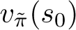
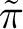
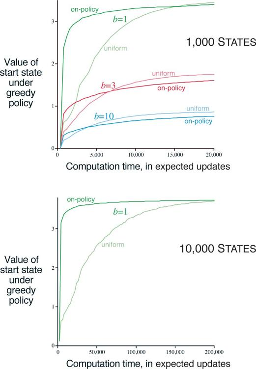

# 8.6  Trajectory Sampling

In this section we compare two ways of distributing updates. The classical approach, from dynamic programming, is to perform sweeps through the entire state (or state–action) space, updating each state (or state–action pair) once per sweep. This is problematic on large tasks because there may not be time to complete even one sweep. In many tasks the vast majority of the states are irrelevant because they are visited only under very poor policies or with very low probability. Exhaustive sweeps implicitly devote equal time to all parts of the state space rather than focusing where it is needed. As we discussed in Chapter 4, exhaustive sweeps and the equal treatment of all states that they imply are not necessary properties of dynamic programming. In principle, updates can be distributed any way one likes (to assure convergence, all states or state–action pairs must be visited in the limit an infinite number of times; although an exception to this is discussed in Section 8.7 below), but in practice exhaustive sweeps are often used.

The second approach is to sample from the state or state–action space according to some distribution. One could sample uniformly, as in the Dyna-Q agent, but this would suffer from some of the same problems as exhaustive sweeps. More appealing is to distribute updates according to the on-policy distribution, that is, according to the distribution observed when following the current policy. One advantage of this distribution is that it is easily generated; one simply interacts with the model, following the current policy. In an episodic task, one starts in a start state (or according to the starting-state distribution) and simulates until the terminal state. In a continuing task, one starts anywhere and just keeps simulating. In either case, sample state transitions and rewards are given by the model, and sample actions are given by the current policy. In other words, one simulates explicit individual trajectories and performs updates at the state or state–action pairs encountered along the way. We call this way of generating experience and updates *trajectory sampling*.

It is hard to imagine any efficient way of distributing updates according to the on-policy distribution other than by trajectory sampling. If one had an explicit representation of the on-policy distribution, then one could sweep through all states, weighting the update of each according to the on-policy distribution, but this leaves us again with all the computational costs of exhaustive sweeps. Possibly one could sample and update individual state–action pairs from the distribution, but even if this could be done efficiently, what benefit would this provide over simulating trajectories? Even knowing the on-policy distribution in an explicit form is unlikely. The distribution changes whenever the policy changes, and computing the distribution requires computation comparable to a complete policy evaluation. Consideration of such other possibilities makes trajectory sampling seem both efficient and elegant.

Is the on-policy distribution of updates a good one? Intuitively it seems like a good choice, at least better than the uniform distribution. For example, if you are learning to play chess, you study positions that might arise in real games, not random positions of chess pieces. The latter may be valid states, but to be able to accurately value them is a different skill from evaluating positions in real games. We will also see in Part II that the on-policy distribution has significant advantages when function approximation is used. Whether or not function approximation is used, one might expect on-policy focusing to significantly improve the speed of planning.

Focusing on the on-policy distribution could be beneficial because it causes vast, uninteresting parts of the space to be ignored, or it could be detrimental because it causes the same old parts of the space to be updated over and over. We conducted a small experiment to assess the effect empirically. To isolate the effect of the update distribution, we used entirely one-step expected tabular updates, as defined by ([8.1](part0016_split_005.html#x1-84002r1)). In the *uniform* case, we cycled through all state–action pairs, updating each in place, and in the *on-policy* case we simulated episodes, all starting in the same state, updating each state–action pair that occurred under the current *ε*-greedy policy (*ε* = 0.1). The tasks were undiscounted episodic tasks, generated randomly as follows. From each of the |𝒮| states, two actions were possible, each of which resulted in one of *b* next states, all equally likely, with a different random selection of *b* states for each state–action pair. The branching factor, *b*, was the same for all state–action pairs. In addition, on all transitions there was a 0.1 probability of transition to the terminal state, ending the episode. The expected reward on each transition was selected from a Gaussian distribution with mean 0 and variance 1. At any point in the planning process one can stop and exhaustively compute , the true value of the start state under the greedy policy, , given the current action-value function *Q*, as an indication of how well the agent would do on a new episode on which it acted greedily (all the while assuming the model is correct).

The upper part of the figure to the right shows results averaged over 200 sample tasks with 1000 states and branching factors of 1, 3, and 10. The quality of the policies found is plotted as a function of the number of expected updates completed. In all cases, sampling according to the on-policy distribution resulted in faster planning initially and retarded planning in the long run. The effect was stronger, and the initial period of faster planning was longer, at smaller branching factors. In other experiments, we found that these effects also became stronger as the number of states increased. For example, the lower part of the figure shows results for a branching factor of 1 for tasks with 10,000 states. In this case the advantage of on-policy focusing is large and long-lasting.

All of these results make sense. In the short term, sampling according to the on-policy distribution helps by focusing on states that are near descendants of the start state. If there are many states and a small branching factor, this effect will be large and long-lasting. In the long run, focusing on the on-policy distribution may hurt because the commonly occurring states all already have their correct values. Sampling them is useless, whereas sampling other states may actually perform some useful work. This presumably is why the exhaustive, unfocused approach does better in the long run, at least for small problems. These results are not conclusive because they are only for problems generated in a particular, random way, but they do suggest that sampling according to the on-policy distribution can be a great advantage for large problems, in particular for problems in which a small subset of the state–action space is visited under the on-policy distribution.

*Exercise 8.7* Some of the graphs in [Figure 8.8](part0016_split_006.html#fig8-8) seem to be scalloped in their early portions, particularly the upper graph for *b* = 1 and the uniform distribution. Why do you think this is? What aspects of the data shown support your hypothesis?

[Figure 8.8](part0016_split_006.html#C_fig8-8): Relative efficiency of updates distributed uniformly across the state space versus focused on simulated on-policy trajectories, each starting in the same state. Results are for randomly generated tasks of two sizes and various branching factors, *b*.

□

*Exercise 8.8 (programming)* Replicate the experiment whose results are shown in the lower part of [Figure 8.8](part0016_split_006.html#fig8-8), then try the same experiment but with *b* = 3. Discuss the meaning of your results.

□
