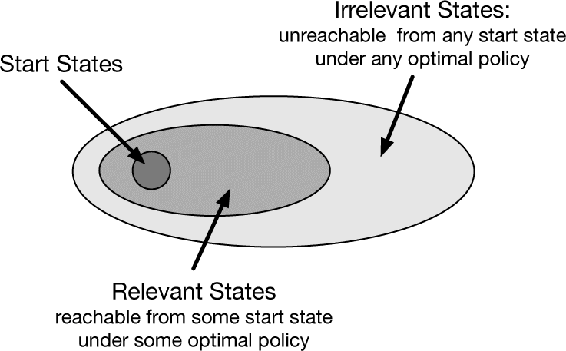

# 8.7  Real-time Dynamic Programming

*Real-time dynamic programming*, or RTDP, is an on-policy trajectory-sampling version of the value-iteration algorithm of dynamic programming (DP). Because it is closely related to conventional sweep-based policy iteration, RTDP illustrates in a particularly clear way some of the advantages that on-policy trajectory sampling can provide. RTDP updates the values of states visited in actual or simulated trajectories by means of expected tabular value-iteration updates as defined by (4.10). It is basically the algorithm that produced the on-policy results shown in [Figure 8.8](part0016_split_006.html#fig8-8).

The close connection between RTDP and conventional DP makes it possible to derive some theoretical results by adapting existing theory. RTDP is an example of an *asynchronous* DP algorithm as described in Section 4.5. Asynchronous DP algorithms are not organized in terms of systematic sweeps of the state set; they update state values in any order whatsoever, using whatever values of other states happen to be available. In RTDP, the update order is dictated by the order states are visited in real or simulated trajectories.

If trajectories can start only from a designated set of start states, and if you are interested in the prediction problem for a given policy, then on-policy trajectory sampling allows the algorithm to completely skip states that cannot be reached by the given policy from any of the start states: such states are *irrelevant* to the prediction problem. For a control problem, where the goal is to find an optimal policy instead of evaluating a given policy, there might well be states that cannot be reached by any optimal policy from any of the start states, and there is no need to specify optimal actions for these irrelevant states. What is needed is an *optimal partial policy*, meaning a policy that is optimal for the relevant states but can specify arbitrary actions, or even be undefined, for the irrelevant states.

But *finding* such an optimal partial policy with an on-policy trajectory-sampling control method, such as Sarsa (Section 6.4), in general requires visiting all state–action pairs—even those that will turn out to be irrelevant—an infinite number of times. This can be done, for example, by using exploring starts (Section 5.3). This is true for RTDP as well: for episodic tasks with exploring starts, RTDP is an asynchronous value-iteration algorithm that converges to optimal polices for discounted finite MDPs (and for the undiscounted case under certain conditions). Unlike the situation for a prediction problem, it is generally not possible to stop updating any state or state–action pair if convergence to an optimal policy is important.

The most interesting result for RTDP is that for certain types of problems satisfying reasonable conditions, RTDP is guaranteed to find a policy that is optimal on the relevant states without visiting every state infinitely often, or even without visiting some states at all. Indeed, in some problems, only a small fraction of the states need to be visited. This can be a great advantage for problems with very large state sets, where even a single sweep may not be feasible.

The tasks for which this result holds are undiscounted episodic tasks for MDPs with absorbing goal states that generate zero rewards, as described in Section 3.4. At every step of a real or simulated trajectory, RTDP selects a greedy action (breaking ties randomly) and applies the expected value-iteration update operation to the current state. It can also update the values of an arbitrary collection of other states at each step; for example, it can update the values of states visited in a limited-horizon look-ahead search from the current state.

For these problems, with each episode beginning in a state randomly chosen from the set of start states and ending at a goal state, RTDP converges with probability one to a policy that is optimal for all the relevant states provided: 1) the initial value of every goal state is zero, 2) there exists at least one policy that guarantees that a goal state will be reached with probability one from any start state, 3) all rewards for transitions from non-goal states are strictly negative, and 4) all the initial values are equal to, or greater than, their optimal values (which can be satisfied by simply setting the initial values of all states to zero). This result was proved by Barto, Bradtke, and Singh (1995) by combining results for asynchronous DP with results about a heuristic search algorithm known as *learning real-time A\** due to Korf (1990).

Tasks having these properties are examples of *stochastic optimal path problems*, which are usually stated in terms of cost minimization instead of as reward maximization as we do here. Maximizing the negative returns in our version is equivalent to minimizing the costs of paths from a start state to a goal state. Examples of this kind of task are minimum-time control tasks, where each time step required to reach a goal produces a reward of −1, or problems like the Golf example in Section 3.5, whose objective is to hit the hole with the fewest strokes.

**Example 8.6: RTDP on the Racetrack** The racetrack problem of [Exercise 5.12](part0013_split_007.html#sec1-40)  (page 111) is a stochastic optimal path problem. Comparing RTDP and the conventional DP value iteration algorithm on an example racetrack problem illustrates some of the advantages of on-policy trajectory sampling.

Recall from the exercise that an agent has to learn how to drive a car around a turn like those shown in [Figure 5.5](part0013_split_007.html#fig5-5) and cross the finish line as quickly as possible while staying on the track. Start states are all the zero-speed states on the starting line; the goal states are all the states that can be reached in one time step by crossing the finish line from inside the track. Unlike [Exercise 5.12](part0013_split_007.html#sec1-40), here there is no limit on the car’s speed, so the state set is potentially infinite. However, the set of states that can be reached from the set of start states via any policy is finite and can be considered to be the state set of the problem. Each episode begins in a randomly selected start state and ends when the car crosses the finish line. The rewards are − 1 for each step until the car crosses the finish line. If the car hits the track boundary, it is moved back to a random start state, and the episode continues.

A racetrack similar to the small racetrack on the left of [Figure 5.5](part0013_split_007.html#fig5-5) has 9,115 states reachable from start states by any policy, only 599 of which are relevant, meaning that they are reachable from some start state via some optimal policy. (The number of relevant states was estimated by counting the states visited while executing optimal actions for 107 episodes.)

The table below compares solving this task by conventional DP and by RTDP. These results are averages over 25 runs, each begun with a different random number seed. Conventional DP in this case is value iteration using exhaustive sweeps of the state set, with values updated one state at a time in place, meaning that the update for each state uses the most recent values of the other states (This is the Gauss-Seidel version of value iteration, which was found to be approximately twice as fast as the Jacobi version on this problem. See Section 4.8.) No special attention was paid to the ordering of the updates; other orderings could have produced faster convergence. Initial values were all zero for each run of both methods. DP was judged to have converged when the maximum change in a state value over a sweep was less than 10−4, and RTDP was judged to have converged when the average time to cross the finish line over 20 episodes appeared to stabilize at an asymptotic number of steps. This version of RTDP updated only the value of the current state on each step.

|  |  |  |
| --- | --- | --- |
|  | DP | RTDP |
| Average computation to convergence | 28 sweeps | 4000 episodes |
| Average number of updates to convergence | 252,784 | 127,600 |
| Average number of updates per episode | — | 31.9 |
| % of states updated ≤ 100 times | — | 98.45 |
| % of states updated ≤ 10 times | — | 80.51 |
| % of states updated 0 times | — | 3.18 |

Both methods produced policies averaging between 14 and 15 steps to cross the finish line, but RTDP required only roughly half of the updates that DP did. This is the result of RTDP’s on-policy trajectory sampling. Whereas the value of every state was updated in each sweep of DP, RTDP focused updates on fewer states. In an average run, RTDP updated the values of 98.45% of the states no more than 100 times and 80.51% of the states no more than 10 times; the values of about 290 states were not updated at all in an average run.

■

Another advantage of RTDP is that as the value function approaches the optimal value function *v*\*, the policy used by the agent to generate trajectories approaches an optimal policy because it is always greedy with respect to the current value function. This is in contrast to the situation in conventional value iteration. In practice, value iteration terminates when the value function changes by only a small amount in a sweep, which is how we terminated it to obtain the results in the table above. At this point, the value function closely approximates *v*\*, and a greedy policy is close to an optimal policy. However, it is possible that policies that are greedy with respect to the latest value function were optimal, or nearly so, long before value iteration terminates. (Recall from Chapter 4 that optimal policies can be greedy with respect to many different value functions, not just *v*\*.) Checking for the emergence of an optimal policy before value iteration converges is not a part of the conventional DP algorithm and requires considerable additional computation.

In the racetrack example, by running many test episodes after each DP sweep, with actions selected greedily according to the result of that sweep, it was possible to estimate the earliest point in the DP computation at which the approximated optimal evaluation function was good enough so that the corresponding greedy policy was nearly optimal. For this racetrack, a close-to-optimal policy emerged after 15 sweeps of value iteration, or after 136,725 value-iteration updates. This is considerably less than the 252,784 updates DP needed to converge to *v*\*, but sill more than the 127,600 updates RTDP required.

Although these simulations are certainly not definitive comparisons of the RTDP with conventional sweep-based value iteration, they illustrate some of advantages of on-policy trajectory sampling. Whereas conventional value iteration continued to update the value of all the states, RTDP strongly focused on subsets of the states that were relevant to the problem’s objective. This focus became increasingly narrow as learning continued. Because the convergence theorem for RTDP applies to the simulations, we know that RTDP eventually would have focused only on relevant states, i.e., on states making up optimal paths. RTDP achieved nearly optimal control with about 50% of the computation required by sweep-based value iteration.
